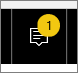
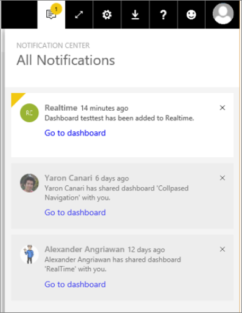

# View Power BI notifications
The Notification Center is a sequential feed of information related to your Power BI experience. Open it to see messages about new dashboards that have been shared with you, changes to your Group space, information about Power BI events and meetings, alerts you've set, and more. You can [set alerts in the Power BI service](../service-set-data-alerts.md) and also in the Power BI mobile apps.

Watch Amanda review, manage, and respond to notifications. Then follow the instructions below the video to try it out yourself.

<iframe width="560" height="315" src="https://www.youtube.com/embed/bZMSv5KAlcE" frameborder="0" allowfullscreen></iframe>

1. When you log in to Power BI, any new notifications that were sent to you while you were offline are added to your feed. If you do have new notifications, Power BI displays a yellow bubble with the number of new items.
   
   
2. In the Power BI menubar, select the Notifications icon.
   
   
3. Notifications are displayed with the most-recent on top and unread messages highlighted. Notifications are retained for 90 days, unless you delete them sooner or reach the maximum limit of 100.
   
   
4. To dismiss a notification, select the X icon.

### Next steps
* [Data alerts in Power BI service](../service-set-data-alerts.md)
* [Create a Microsoft Flow that is triggered by a Power BI data alert](../service-flow-integration.md)
* [Set data alerts in the iPhone app (Power BI for iOS)](mobile/mobile-set-data-alerts-in-the-mobile-apps.md)
* [Set data alerts in the Power BI mobile app for Windows 10](mobile/mobile-set-data-alerts-in-the-mobile-apps.md)
* More questions? [Try the Power BI Community](http://community.powerbi.com/)

