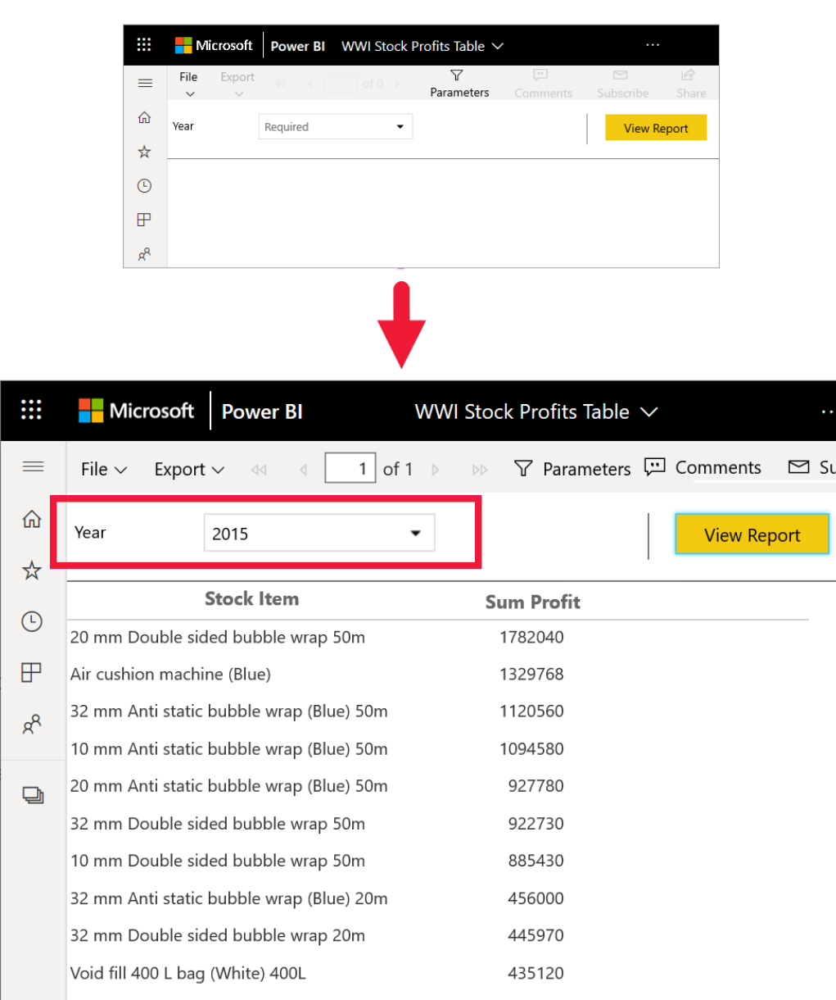

# Paginated reports in the Power BI service

[!INCLUDE[consumer-appliesto-yyny](../includes/consumer-appliesto-yyny.md)]

You've learned about [Power BI reports](end-user-reports.md), and those are the types of report you're most likely to encounter. Power BI reports are optimized for exploration and interactivity. A sales report where different salespeople want to slice the data in the same report for their specific region/industry/customer and see how the numbers change would be best served by a Power BI report.

However, there is another type of report called a *paginated report*. Receiving and viewing paginated reports requires a Power BI Pro license of for the report to be saved in Premium capacity.  [Learn about licenses](end-user-license.md).  

## Identify a paginated report

In content lists and on your Home landing page, paginated reports can be identified by their icon .  A paginated report can be shared with you directly, or as part of a [Power BI app](end-user-apps.md). If the report *designer* gave you permissions, you'll be able to re-share the paginated report and subscribe yourself and others.

## What is a paginated report?

These reports are called *paginated* because they're formatted to fit well on a printed page. One advantage is that they display all the data in a table, even if the table spans multiple pages. Paginated reports are sometimes called "pixel perfect" because report *designers* control the report page layout exactly.

Paginated reports are best for scenarios that require a highly formatted, pixel-perfect output optimized for printing or PDF generation. A profit and loss statement is a good example of the type of report you would probably want to see as a paginated report.

## How do paginated reports work?

When report *designers* create a paginated report, they're really creating a *report definition*. It doesn't contain the data. It specifies where to get the data, which data to get, and how to display the data. When you run the report, the report processor takes the report definition, retrieves the data, and combines it with the report layout to generate the report. Sometimes, the report displays default data. Other times you need to enter parameters before the report can display any data. 

Select a paginated report to open it in the Power BI service. If it has parameters, you need to select them before you can view the report.

   

And that's typically the extent of the interaction - setting the parameters. If you're a billing analyst, you may use paginated reports to create or print invoices. If you're a sales manager, you may use paginated reports to view orders by store or sales person. 

This simple paginated report generates profit by year, after you select the **Year** parameter. 

Compared to paginated reports, Power BI reports are much more interactive. Power BI reports allow for ad hoc reporting, and support many more types of visuals, including custom visuals.

## Interact with a paginated report

The way you interact with a paginated report is different from other reports. You can do things like print, bookmark, export, and comment, but there is less interactivity. Often, paginated reports require input from you to populate the report canvas.  Other times the report displays default data and you can enter parameters to see different data.

### Print a paginated report

*Paginated* reports are formatted to fit well on a page and to print well. What you see in the browser is what you see when you print. Plus, if the report has a long table, the entire table prints, even if it spans multiple pages. 

Paginated reports can have many pages. For example, this report has 563 pages. Each page is laid out exactly, with one page per invoice and repeating headers and footers. When you print this report, you'll get page breaks between invoices.

   

### Navigate the paginated report

In this sales order report, there are three parameters: Business type, Reseller, and Order number. 

To change the information being displayed, enter new values for the three parameters and select **View report**. Here, we've selected **Specialty bike shop**, **Alpine Ski House**, and order number **SO46085**. Selecting **View report** refreshes our report canvas with this new sales order.

The new sales order displays, using the parameters we selected. 

Some paginated reports have many pages.  Use the page controls to navigate through the report. 

### Export the paginated report
You have a variety of options for exporting paginated reports, including PDF, Word, XML, PowerPoint, Excel, and more. When exporting, as much of the formatting as possible is preserved. Paginated reports exported to Excel, Word, PowerPoint, MHTML, and PDF, for example, keep the "pixel perfect" formatting. 

### Subscribe to the paginated report
When you subscribe to a paginated report, Power BI sends you an email with the report as an attachment. In setting up your subscription, you choose how often you want to receive the emails: daily, weekly, hourly, or monthly. The subscription contains an attachment of the entire report output, up to 25MB in size. Export the entire report or choose the parameters ahead of time. Choose from many different attachment types, including Excel, PDF, PowerPoint, and more.  

## Considerations and troubleshooting

- A paginated report can appear blank until you select parameters and choose **View report**.

- If you don't have any paginated reports, it could be because nobody has shared this type of report with you. It could also mean that your system administrator hasn't enabled paginated reports for you. 

 

## Next steps
- [Power BI reports](end-user-reports.md)
- [Paginated reports in Power BI: FAQ](../paginated-reports/paginated-reports-faq.yml)
- More questions? Try the [Power BI Community](https://community.powerbi.com/).
