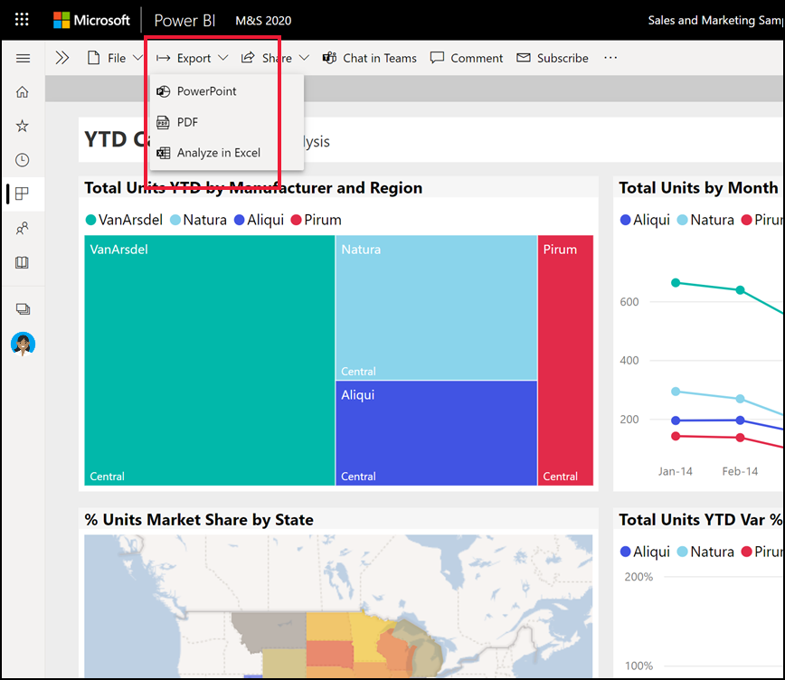
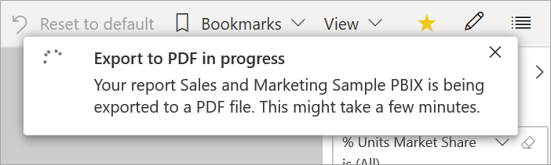

# Export reports from Power BI to PDF

[!INCLUDE[consumer-appliesto-yyn](../includes/consumer-appliesto-yyn.md)]

With Power BI, you can publish your report to PDF format and easily create a document based on your Power BI report. When you export to PDF, each page in the Power BI report becomes an individual page in your PDF document.

## Export your Power BI report to PDF
In the Power BI service, select a report to display it on the canvas. You can also select a report from your **Home** page, **Apps**, or any other container from the nav pane.

1. Select **Export** > **PDF** from the menu bar.

    

    A pop-up appears where you have the option to select **Current values** or **Default values**. **Current values** exports the report in the current state, which includes the active changes you made to slicer and filter values. Most users select this option. Alternatively, selecting **Default values** exports the report in its original state, as the *designer* shared it, and doesn't reflect any changes you've made to that original state.
    
    Additionally, there's a check box to select whether or not to export the hidden tabs of a report. Select this check box if you want to export only report tabs that are visible to you in your browser. If you prefer to get all the hidden tabs as part of your export, you can leave this check box cleared. If the check box is grayed out, there are no hidden tabs in the report. After you make your selections, select **Export** to continue.
    
    You may also choose to export only the current page you're viewing in a report by checking the **Only export current page** option.  By default, this is unchecked and all pages will be exported from your report.
    
    A progress bar displays in the upper-right corner. Exporting might take a few minutes. You can continue to work in Power BI while the report is being exported.

    

    After the Power BI service finishes the export process, the notification banner changes to let you know.

2. Your file is then available where your browser displays downloaded files. In the following image, it's shown as a download banner along the bottom of the browser window.

    

And that's all there is to it. You can download the file and open it with any PDF viewer, like the one available in Microsoft Edge.

## Considerations and limitations
There are a few considerations and limitations to keep in mind when you work with the **Export to PDF** feature.

* The PDF will include the data and visualizations visible on your Power BI canvas. If the visual includes scrollbars, the PDF will include the visual in its unscrolled default state.  
* R and Python visuals aren't currently supported. In the PDF, these visuals are blank and display an error message. 
* Power BI visuals that have been certified are supported. For more information on certified Power BI visuals, including how to get a Power BI visual certified, see [Get a Power BI visual certified](../developer/visuals/power-bi-custom-visuals-certified.md). Power BI visuals that haven't been certified aren't supported. In the PDF, they display with an error message.
* The ESRI visual is not supported.
* Power BI reports with more than 50 report pages currently can't be exported. Paginated reports don't have this limitation. See [Print a paginated report](end-user-paginated-report.md#interact-with-a-paginated-report) for details. 
* Reports larger than 500 MB currently can't be exported. 
* The process of exporting the report to PDF might take a few minutes to complete, so be patient. Factors that can affect the time required include the structure of the report and the current load on the Power BI service.
* If the **Export to PDF** menu item isn't available in the Power BI service, it's likely because your Power BI admin disabled the feature. Contact your admin for details.
* Background images are cropped with the chart's bounding area. We recommend that you remove background images before you export to PDF.
* Reports that are owned by a user outside your Power BI tenant domain, such as a report owned by someone outside your organization and shared with you, can't be published to PDF.
* If you share a dashboard with someone outside of your organization, and thereby, a user who isn't in your Power BI tenant, that user can't export the shared dashboard's associated reports to PDF. For example, if you're aaron@contoso.com, you can share with cassie@northwinds.com. But cassie@northwinds.com can't export the associated reports to PDF.
* When you export to PDF with reports that contain a background image, you might see a distorted image in the export if you use the **Normal** or **Fill** options for the **Page Background**. For best results, use the **Fit** option to avoid issues with your exported document.
* The Power BI service uses your Power BI language setting as the language for the PDF export. To see or set your language preference, select the cog icon  > **Settings** > **General** > **Language**.
* URL filters aren't currently respected when you choose **Current Values** for your export.
* Reports with unusual custom page sizes may experience issues in export scenarios. For best results, consider switching to a standard page size for your report.
* When exporting to PDF, reports using themes with custom fonts will have the custom font replaced with a default font.
* While we look to provide a consistent experience, we can't guarantee the exported PDF from the Power BI service will always match the exported PDF from a local Power BI Desktop file.
* When exporting to PDF, we cannot guarantee pixel perfect fidelity for PBIX reports.

## Next steps
[Print a report](end-user-print.md)
