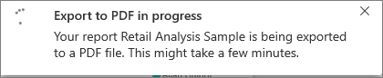
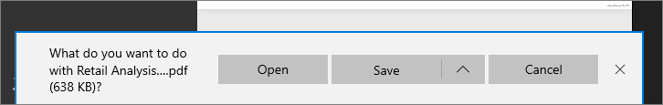

# Export reports from Power BI to PDF
With Power BI, you can publish your report to PDF format, and easily create a document based on your Power BI report. When you **export to PDF**, each page in the Power BI report becomes an individual page in your PDF document.

## How to export your Power BI report to PDF
In Power BI service, select a report to display it on the canvas. You can also select a report from your Home page, Apps, or any other section on your left nav pane.

1. Select **File** > **Export to PDF** from the menu bar.

    

    A pop-up will appear where you have the option to select **Current view** or **Default view**.  **Current view** exports the report in the current state, which includes the active changes you made to slicer and filter values.  Most users select this option.  Alternately, selecting the **Default view** exports the report in its original state (as the author shared it), and doesn't reflect any changes you made to that original state.
    
    Additionally, there is a checkbox to select whether or not to export the hidden tabs of a report.  Simply check this box if you would like to only export report tabs that are visibile to you in your browser.  If you'd prefer to get all the hidden tabs as part of your export, you may leave this unchecked.  If the checkbox is greyed out, there are no hidden tabs in the report.  Once you have made your selections, click the Export button to continue.
    
    A progress bar displays in the upper right corner. Exporting might take a few minutes, and you can continue to work in Power BI while the report is being exported.

    

    Once complete, the notification banner changes to let you know that the Power BI service has finished the export process.

2. Your file is then available where your browser displays downloaded files. In the following image, it's shown as a download banner along the bottom of the browser window.

    

And that's all there is to it. You can download the file and open it with any PDF viewer, like the one available in Microsoft Edge.

## Limitations and considerations
There are a few considerations and limitations to keep in mind when working with the **Export to PDF** feature.

* **R visuals** are not currently supported. In the PDF, these visuals will be blank and display an error message.  

* **Custom visuals** that have been **certified** are supported. For more information on certified custom visuals, including how to get a custom visual certified, see [getting a custom visual certified](../power-bi-custom-visuals-certified.md). Custom visuals that have not been certified are not supported. In the PDF, they'll display with an error message.   

* Reports with more than 30 report pages can't currently be exported.

* The process of exporting the report to PDF may take a few minutes to complete, so be patient. Factors that can impact the time required include the structure of the report, and the current load on the Power BI service.

* If the **Export to PDF** menu item isn't available in the Power BI service, it's likely because your tenant administrator has disabled the feature. Contact your tenant administrator for details.

* Background images will be cropped with the chart's bounding area. It's highly recommended that you remove background images before exporting to PDF.

* Reports that are owned by a user outside your Power BI tenant domain (such as, a report owned by someone outside your organization, and shared with you) cannot be published to PDF.

* If you share a dashboard with someone outside of your organization (and thereby, a user who is not in your Power BI tenant), that user will not be able to export the shared dashboard's associated reports to PDF. For example, if you are aaron@contoso.com, you can share with cassie@cohowinery.com. But cassie@cohowinery.com cannot export the associated reports to PDF.

* When exporting to PDF with reports that contain a background image, you may see a distorted image in the export if you are using the "Normal" or "Fill" options for the Page Background.  For best results, it is recommended you use the "Fit" option to avoid issues with your exported document.

* The Power BI service uses your Power BI language setting as the language for the PDF export. To see or set your language preference, select the cog icon > **Settings** > **General** > **Language**.

## Next steps
[Print a report](end-user-print.md)
