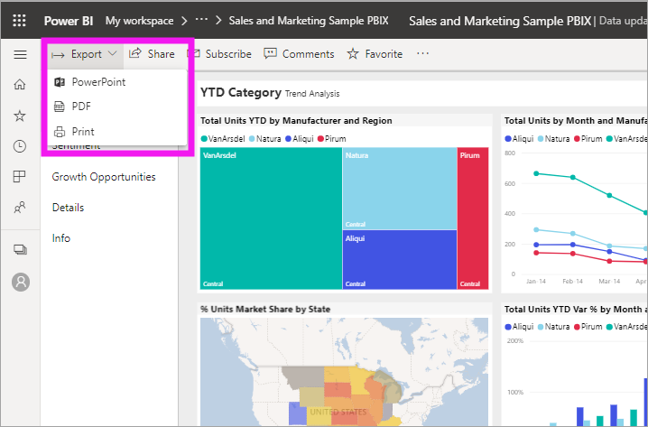
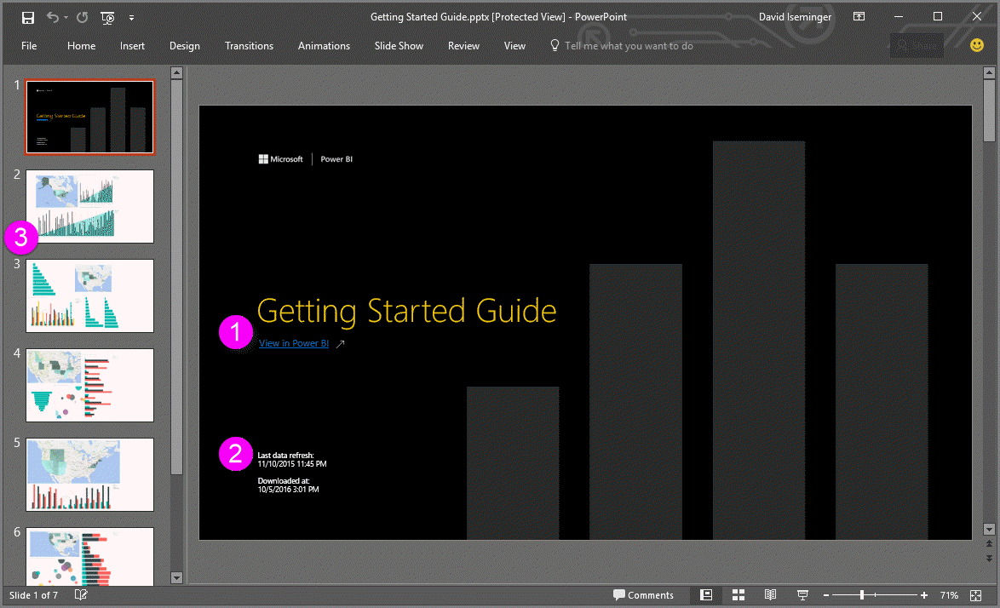

# Export reports from Power BI to PDF
With Power BI, you can publish your report to PDF format, and easily create a a document based on your Power BI report. When you **export to PDF**, each page in the Power BI report becomes an individual page in your PDF document.

## How to export your Power BI report to PDF
In the Power BI service, select a report to display it on the canvas. You can also select a report from your Home page, Apps, or any other section on your left navpane.

When the report you want to export to PowerPoint is displayed on the canvas, select File > Export to PDF from the menu bar in the Power BI service.

You'll see a notification banner in the upper right corner of the Power BI service browser window that the report is being exported to PDF. This might take a few minutes, and you can continue to work in Power BI while the report is being exported.

Once complete, the notification banner changes to let you know that the Power BI service has finished the export process.

Your file is then available where your browser displays downloaded files. In the following image, it's shown as a download banner along the bottom of the browser window.

And that's all there is to it. You can download the file and open it with any PDF viewer, like the one available in Microsoft Edge.

## Checking out your exported PDF file
When you open the PowerPoint file that Power BI exported, you find a few cool and useful elements. Take a look at the following image, then check out the numbered elements below that describe some of those cool features.

1. The first page of the slide deck includes the name of your report, and a link so that you can **View in Power BI** the report on which the slide deck is based.
2. You get some useful information about the report, too, including the *last data refresh* on which the exported report is based, and the *downloaded at* time and date, which is the time and date when the Power BI report was exported into a PowerPoint file.
3. Each report page is a separate slide, as shown in the left navigation pane. 
4. Your published report is rendered in the language according to your Power BI settings, or otherwise by the locale setting of your browser. To see or set your language preference, select the cog icon  **> Settings > General > Language**. For locale information, see [Supported languages and countries/regions for Power BI](../supported-languages-countries-regions.md).
5. The PowerPoint presentation includes a cover slide with the exported time in the correct time zone.

When you go into an individual slide, you'll notice that each report page is an independent image.

## Limitations and considerations
There are a few considerations and limitations to keep in mind when working with the **Export to PDF** feature.

In-session interactivity such as highlighting and filtering, drill-down, and so on, are not yet supported when exporting to PDF. The exported PDF shows the original visuals as they were saved in the report. If you've applied filters and slicers and want this preserved in the export, save the report and then do the export.

* R visuals are not currently supported. Any such visuals are exported as a blank image into PowerPoint with an error message that states the visual is not supported.

* Custom visuals that have been certified are supported. For more information on certified custom visuals, including how to get a custom visual certified, see getting a custom visual certified. Custom visuals that have not been certified are not supported, and are exported as a blank image into PowerPoint with an error message that states the visual is not supported.

* Reports with more than 30 report pages can't currently be exported.

* The process of exporting the report to PDF may take a few minutes to complete, so please be patient. Factors that can impact the time required include the structure of the report, and the current load on the Power BI service.

* If the Export to PDF menu item isn't available in the Power BI service, it's likely because your tenant administrator has disabled the feature. Please contact your tenant administrator for details.

* Background images will be cropped with the chart's bounding area. It's highly recommended that you remove background images before exporting to PDF.

* Reports that are owned by a user outside your Power BI tenant domain (such as, a report owned by someone outside your organization, and shared with you) cannot be published to PDF.

* If you share a dashboard with someone outside of your organization (and thereby, a user who is not in your Power BI tenant), that user will not be able to export the shared dashboard's associated reports to PDF. For example, if you are aaron@contoso.com, you can share with david@cohowinery.com. But david@cohowinery.com cannot export the associated reports to PowerPoint.

* The Power BI service uses your Power BI language setting as the language for the PDF export. To see or set your language preference, select the cog icon > Settings > General > Language.

## Next steps
[Print a report](end-user-print.md)