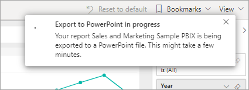
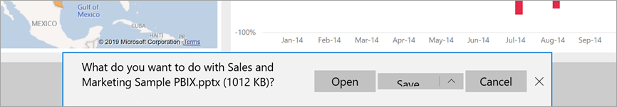

# Export reports to PowerPoint

[!INCLUDE[consumer-appliesto-yyn](../includes/consumer-appliesto-yyn.md)]

With the Power BI service (app.powerbi.com), you can publish your report to Microsoft PowerPoint and easily create a slide deck based on your Power BI report. When you export to PowerPoint, the following occurs:

* Each page in the Power BI report becomes an individual slide in PowerPoint.
* Each page in the Power BI report is exported as a single high-resolution image in PowerPoint.
* You can preserve the filters and slicers settings that you've added to the report.
* A link is created in PowerPoint that links back to the Power BI report.

Getting your **Power BI report** exported into **PowerPoint** is quick. Follow the steps outlined in the next section.

You can also copy one visual at a time from the Power BI service and paste it into PowerPoint (or any other program that supports pasting). Select the **Copy as image** icon to copy the visual to your clipboard. Then, open PowerPoint and paste the visual. For more information, see [Copy visuals as static images](../visuals/power-bi-visualization-copy-paste.md).

## Export your Power BI report to PowerPoint
In the **Power BI service**, select a report to display it on the canvas. You can also select a report from **Home**, **Apps**, or any other container from the nav pane.

When the report you want to export to PowerPoint is displayed on the canvas, select **Export** > **PowerPoint** from the menu bar.

A pop-up appears where you have the option to select **Current values** or **Default values**. **Current values** exports the report in the current state, which includes the active changes you made to slicer and filter values.  Most users select this option. If you've scrolled, **Current values** does not include the scroll state of the visual, but instead exports the top portion of the data. Alternatively, selecting **Default values** exports the report in the original state, as the *designer* shared it, and doesn't reflect any changes you've made to the original state.

 
Additionally, there's a check box to select whether or not to export the hidden tabs of a report. Select this check box if you want to export only report tabs that are visible to you in your browser. If you prefer to get all the hidden tabs as part of your export, leave this check box cleared. If the check box is grayed out, there are no hidden tabs in the report. An example of a hidden tab would be a tooltip tab. [Custom tooltips](../create-reports/desktop-tooltips.md) are created by report *designers* and don't display as report tabs in the Power BI service for *business users*. 

You may also choose to export only the current page you're viewing in a report by checking the **Only export current page** option.  By default, this is unchecked and all pages will be exported from your report.

After you make your selections, select **Export** to continue. You'll see a notification banner in the upper-right corner of the Power BI service browser window that the report is being exported to PowerPoint. 

Exporting might take a few minutes. Factors that can affect the time required include the structure of the report and the current load on the Power BI service. You can continue to work in Power BI while the report is being exported.

After the Power BI service has finished the export process, the notification banner changes to let you know. Your file is then available where your browser displays downloaded files. In the following image, it's shown as a download banner along the bottom of the browser window.

And that's all there is to it. You can download the file, open it with PowerPoint, and then modify or enhance it like you would any other PowerPoint deck.

## Open the PowerPoint file
When you open the PowerPoint file that Power BI exported, you find a few cool and useful elements. Take a look at the following image, and check out the numbered elements that describe some of those cool features. Pages in PowerPoint are always created in the standard 9:16 size, regardless of the original page sizes or dimensions in the Power BI report.

1. The first page of the slide deck includes the name of your report and a link so that you can **View in Power BI** the report on which the slide deck is based.
2. You get some useful information about the report, too. **Last data refresh** shows the date and time on which the exported report is based. **Downloaded at** shows the date and time when the Power BI report was exported into a PowerPoint file. The **Downloaded at** time is the time of the export in UTC (Universal Coordinated Time).

3. Each report page is a separate slide, as shown in the nav pane. 

    > [!NOTE]
    > PowerPoint includes the name of each visual on the page and adds alt text for each item. The report creator can include alt text when designing the report. Otherwise, the default is "No alt text provided."

5. Your published report is rendered in the language according to your Power BI settings, or otherwise by the locale setting of your browser. To see or set your language preference in your browser, select the cog icon  > **Settings** > **General** > **Language**. For locale information, see [Supported languages and countries or regions for Power BI](../fundamentals/supported-languages-countries-regions.md).

When you view an individual slide, you see that each report page is an independent image. Scrolling in PowerPoint is not available since each slide is a static image.

What you do with your PowerPoint deck from there, or any of the high-resolution images, is up to you.

## Considerations and troubleshooting
There are a few considerations and limitations to keep in mind when you work with the **Export to PowerPoint** feature.
 

* If you don't see the **Export** option, make sure that you are viewing a report (not a dashboard).

* [URL filters](../collaborate-share/service-url-filters.md) aren't currently respected when you choose **Current Values** for your export.

* When exporting to PowerPoint, if the report uses a custom font, that font will be replaced with a default font.

* The following visual types are not supported, and will not be exported to PowerPoint:
   - [Custom visuals that haven't been certified](../developer/visuals/power-bi-custom-visuals-certified.md)) aren't supported. 
   - The [ESRI ArcGIS visual](../visuals/power-bi-visualizations-arcgis.md) is not supported
   - R and Python visuals are not supported.
   - Background images are cropped with the chart's bounding area. We recommend that you remove background images before you export to PowerPoint.

* Some reports cannot be exported. These include:
    - If you share a dashboard with someone outside of your organization, and thereby, a user who isn't in your Power BI tenant, that user can't export the shared dashboard's associated reports to PowerPoint. For example, if you're aaron@contoso.com, you can share with david@cohowinery.com. But david@cohowinery.com can't export the associated reports to PowerPoint.
    - Reports with more than 50 report pages. Paginated reports don't have this limitation. See [Print a paginated report](end-user-paginated-report.md#interact-with-a-paginated-report) for details.
    - Reports larger than 500 MB when exported. 
    - Reports being exported to older versions of PowerPoint.
    - Reports that take longer than an hour to process. 
    - Report pages that take longer than 6 minutes to load. 

* If the **Export to PowerPoint** menu item isn't available in the Power BI service, it's likely because your Power BI admin or report owner disabled the feature. Contact your admin or the owner for details.
* The Power BI service uses your Power BI language setting as the language for the PowerPoint export. To see or set your language preference, in your browser, select the cog icon  > **Settings** > **General** > **Language**.

## Next steps
[Copy visuals as static images](../visuals/power-bi-visualization-copy-paste.md)    
[Print a report](end-user-print.md)
