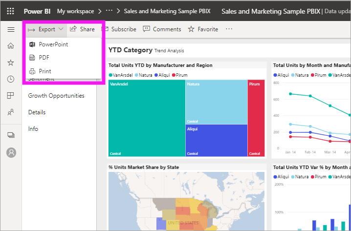
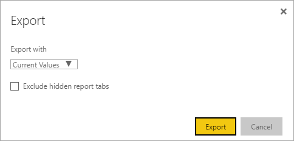

# Export reports from Power BI to PowerPoint

[!INCLUDE [power-bi-service-new-look-include](../includes/power-bi-service-new-look-include.md)]

With Power BI, you can publish your report to Microsoft PowerPoint and easily create a slide deck based on your Power BI report. When you export to PowerPoint, the following occurs:

* Each page in the Power BI report becomes an individual slide in PowerPoint.
* Each page in the Power BI report is exported as a single high-resolution image in PowerPoint.
* You have the option to preserve the filters and slicers settings that you added to the report.
* A link is created in PowerPoint that links to the Power BI report.

Getting your **Power BI report** exported into **PowerPoint** is quick. Follow the steps outlined in the next section.

## Export your Power BI report to PowerPoint
In the **Power BI service**, select a report to display it on the canvas. You can also select a report from your **Home** page, **Apps**, or any other container from the nav pane.

When the report you want to export to PowerPoint is displayed on the canvas, select **Export** > **PowerPoint** from the menu bar.

A pop-up appears where you have the option to select **Current values** or **Default values**. **Current values** exports the report in the current state, which includes the active changes you made to slicer and filter values. Most users select this option. Alternatively, selecting **Default values** exports the report in the original state, as the *designer* shared it, and doesn't reflect any changes you made to the original state.

 
Additionally, there's a check box to select whether or not to export the hidden tabs of a report. Select this check box if you want to export only report tabs that are visible to you in your browser. If you prefer to get all the hidden tabs as part of your export, leave this check box cleared. If the check box is grayed out, there are no hidden tabs in the report. An example of a hidden tab might be a *tooltip*. [Custom tooltips](../desktop-tooltips.md) are created by report *designers* and don't display as a report page in the Power BI service for *consumers*. 

After you make your selections, select **Export** to continue. You'll see a notification banner in the upper-right corner of the Power BI service browser window that the report is being exported to PowerPoint. Exporting might take a few minutes. You can continue to work in Power BI while the report is being exported.

After the Power BI service has finished the export process, the notification banner changes to let you know. Your file is then available where your browser displays downloaded files. In the following image, it's shown as a download banner along the bottom of the browser window.

And that's all there is to it. You can download the file, open it with PowerPoint, and then modify or enhance it like you would any other PowerPoint deck.

## Check out your exported PowerPoint file
When you open the PowerPoint file that Power BI exported, you find a few cool and useful elements. Take a look at the following image, and check out the numbered elements that describe some of those cool features.

1. The first page of the slide deck includes the name of your report and a link so that you can **View in Power BI** the report on which the slide deck is based.
2. You get some useful information about the report, too. **Last data refresh** shows the date and time on which the exported report is based. **Downloaded at** shows the date and time when the Power BI report was exported into a PowerPoint file.
3. Each report page is a separate slide, as shown in the nav pane. 
4. The PowerPoint presentation includes a cover slide with the exported (downloaded) time in the correct time zone.

5. Your published report is rendered in the language according to your Power BI settings, or otherwise by the locale setting of your browser. To see or set your language preference, select the cog icon  > **Settings** > **General** > **Language**. For locale information, see [Supported languages and countries or regions for Power BI](../supported-languages-countries-regions.md).

When you go into an individual slide, you see that each report page is an independent image.

What you do with your PowerPoint deck from there, or any of the high-resolution images, is up to you.

## Considerations and troubleshooting
There are a few considerations and limitations to keep in mind when you work with the **Export to PowerPoint** feature.

* R visuals aren't currently supported. Any such visuals are exported as a blank image into PowerPoint with an error message that states the visual isn't supported.
* Custom visuals that have been certified are supported. For more information on certified custom visuals, including how to get a custom visual certified, see [Get a custom visual certified](../developer/power-bi-custom-visuals-certified.md). Custom visuals that haven't been certified aren't supported. They're exported as a blank image into PowerPoint with an error message that states the visual isn't supported.
* Reports with more than 30 report pages can't currently be exported.
* Visuals with scroll bars are exported in their current state. If you haven't scrolled, the visual in PowerPoint will show the top portion of the data. If you've scrolled before exporting, the visual in PowerPoint will show that visual at the current scroll point. Scrolling in PowerPoint is not available since each slide is an image. 
* The process of exporting the report to PowerPoint might take a few minutes to complete, so be patient. Factors that can affect the time required include the structure of the report and the current load on the Power BI service.
* If the **Export to PowerPoint** menu item isn't available in the Power BI service, it's likely because your tenant administrator disabled the feature. Contact your tenant administrator for details.
* Background images are cropped with the chart's bounding area. We recommend that you remove background images before you export to PowerPoint.
* Pages in PowerPoint are always created in the standard 9:16 size, regardless of the original page sizes or dimensions in the Power BI report.
* Reports that are owned by a user outside your Power BI tenant domain, such as a report owned by someone outside your organization and shared with you, can't be published to PowerPoint.
* If you share a dashboard with someone outside of your organization, and thereby, a user who isn't in your Power BI tenant, that user can't export the shared dashboard's associated reports to PowerPoint. For example, if you're aaron@contoso.com, you can share with david@cohowinery.com. But david@cohowinery.com can't export the associated reports to PowerPoint.
* Export might not work with older versions of PowerPoint.
* As previously mentioned, each report page is exported as a single image in the PowerPoint file.
* The Power BI service uses your Power BI language setting as the language for the PowerPoint export. To see or set your language preference, select the cog icon  > **Settings** > **General** > **Language**.
* The **Downloaded at** time on the cover slide for the exported PowerPoint file is set to your computer's time zone at the time of the export.
* URL filters aren't currently respected when you choose **Current Values** for your export.

## Next steps
[Print a report](end-user-print.md)
