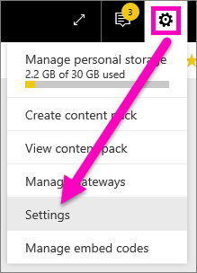

# Opt-in for Power BI service preview features
## What are *preview features*?
As we make improvements to Power BI service, we'll release some new functionality as *preview features*. Preview features can be turned on and off, giving you the opportunity to try them out.

> [!TIP]
> Preview features are also available for Power BI Desktop, for more information [visit the Power BI Desktop community forum](https://community.powerbi.com/t5/Desktop/bd-p/power-bi-designer).
> 
> 

## Find previews and turn them on (and off)
1. Open your Settings menu by selecting the gear icon in the top right corner of your Power BI screen and choosing **Settings**.
   
   .
2. Select the **General** tab. If previews exist, you'll either see an option for **Preview features** or you'll see a preview feature listed on the left.  In this example, there is a preview listed for ArcGIS Maps. 
   
   
3. Select the **On** radio button, or mark the checkbox, to try out the new experience. Then select **Apply**.
4. To turn preview features off, follow steps 1-3 above, and in step 3, choose **Off**, or remove the checkmark, and select **Apply**.

Have questions or feedback? [Visit the Power BI community forum](http://community.powerbi.com/t5/Navigation-Preview-Forum/bd-p/NavigationPreview).

