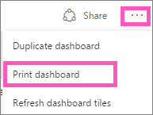
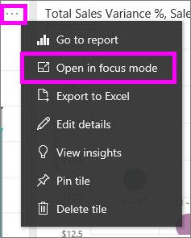
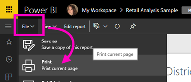

# Printing from Power BI service
Print an entire dashboard, a dashboard tile, a report page, or a report visual from Power BI service. Reports can only be printed one page at a time -- you can't print the entire report at once.

> [!NOTE]
> Printing is only available in Power BI service and not Power BI Desktop.
> 
> 

Watch Amanda print from her dashboard and report. Then follow the step-by-step instructions below the video to try it out yourself.

<iframe width="560" height="315" src="https://www.youtube.com/embed/jtlLGRKBvXY" frameborder="0" allowfullscreen></iframe>

## Print a dashboard
1. Open the dashboard that you'd like to print.
2. In the top right corner, select the ellipses (...) and choose **Print dashboard**.
   
    
3. The Print window for your browser opens. Choose the settings and print destination, and select **Print**.
   
   > [!NOTE]
   > The print dialog you see will depend on which browser you are using.
   > 
   
    

## Print a dashboard tile
1. [Open the tile in Focus mode](end-user-focus.md) by selecting the ellipses and choosing the Focus icon .
   
    
2. Open the tile in [full screen mode](end-user-focus.md) by selecting the full screen icon  from the top navbar.
3. Hover over the tile to reveal the Options menu.
   
    
4. Select the Print icon
     .     
   
   > [!NOTE]
   > The print dialog you see will depend on which browser you are using.
   > 
   > 

## Print a report page
Reports can be printed one page at a time.

1. Open the report in either Reading View or Editing View.
2. Select **File** > **Print** to print the current report page.
   
    
3. The Print window for your browser opens.
   
   > [!NOTE]
   > The print dialog you see will depend on which browser you are using.
   > 
   > 

## Print a report visual
1. [Open the visual in Focus mode](end-user-focus.md) by hovering over the tile and selecting the Focus icon  from the top-right corner.
2. Follow steps 2-3 under *Print a report page* above.

## Considerations and troubleshooting
* Q: I cannot find the **Print** button.    
* A: If you are using Power BI Desktop, printing is not supported.  Printing only works in Power BI service.
* Q: I cannot print all the report pages at once.    
* A: That is correct. Report pages can only be printed one page at a time.
* Q: I cannot print to PDF.    
* A: You will only see this option if you've already configured the PDF driver in your browser.    
* Q: What I see when I select **Print** doesn't match what you're showing me here.    
* A: The Print screens vary by browser and software version.
* Q: My printout isn't scaled correctly.  My dashboard doesn't fit on the page. Other scaling and orientation questions.    
* A: We cannot guarantee that the printed copy will be exactly the same as it appears in Power BI service. Things like scaling, margins, visual details, orientation, and size are not controlled by Power BI. For help with issues like this, refer to the documentation for your specific browser.      

## Next steps
[Share dashboards and reports with colleagues and others](../service-share-dashboards.md)

More questions? [Try the Power BI Community](http://community.powerbi.com/)

