# Printing from the Power BI service

[!INCLUDE[consumer-appliesto-yynn](../includes/consumer-appliesto-yynn.md)]
## What can be printed

Print an entire dashboard, a dashboard tile, a report page, or a report visual from the Power BI service. If your report has more than one page, you'll need to print each page separately. 

## Printing considerations

Most Power BI dashboards and reports are created by report *designers* to be used online and to look amazing when displayed on a variety of devices. When you print a report, how that content displays on paper is controlled by your browser. 

There are browser settings you can use to adjust the printout, but even then you still may not get the result you want. Consider [exporting to PDF](end-user-pdf.md) first and printing the PDF instead. 

## Adjust your browser print settings
When you print from Power BI, your browser opens a Print window. Each browser's Print window is different from the others. But, you'll find that they all have similar options available for you to use to control the look of your printout. 

Here are a few quick tips you can use to format your printout.

   > 
1. If your dashboard, report, or visual is more wide than it is tall, consider using the **Landscape** layout. 

   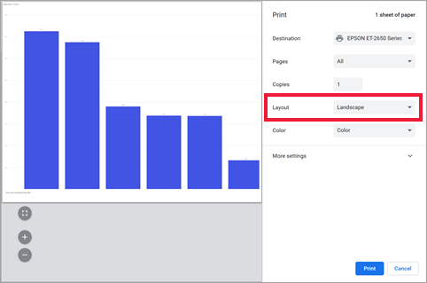

2. To fit more onto a printed page, adjust things like margins and scale. 

    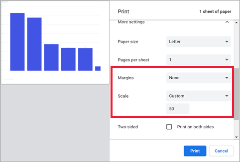

Experiment with your particular browser's settings until you get the look that you like. Some browsers even have options to print background graphics. 

## Print a dashboard
1. Open the dashboard that you'd like to print.
2. In the upper left corner, select **File** and choose **Print this page**.
   
    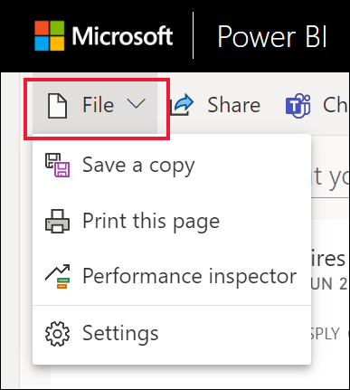

3. The Print window for your browser opens. Choose the settings. For example, if your dashboard is wider than it is long, you may want to change the layout to **Landscape**. Select **Print**.
   
    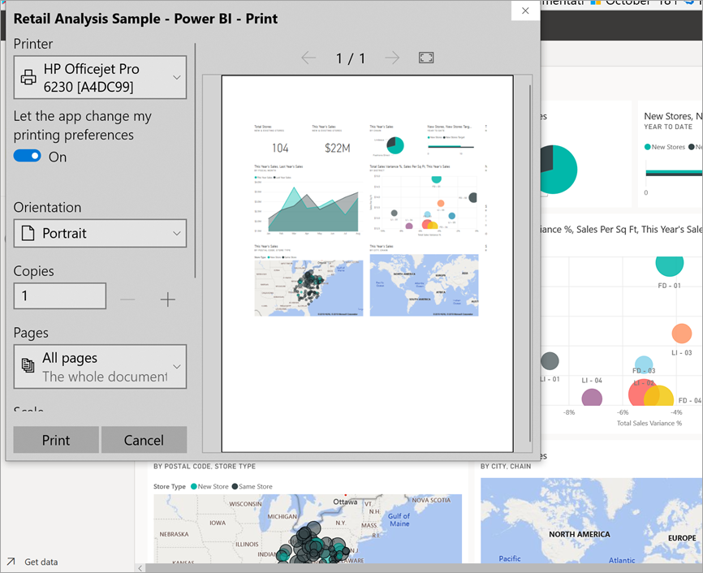

## Print a dashboard tile
1. Open the dashboard in [full screen mode](end-user-focus.md) by selecting the full screen icon  from the upper menu bar.

3. [Open the tile in Focus mode](end-user-focus.md) by hovering to reveal **More options** (...) and choosing **Open in focus mode** or the focus icon .
   
    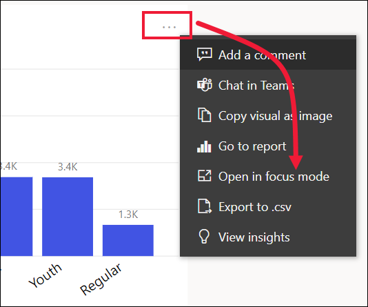

4. Hover over the tile to reveal the Options menu.
   
    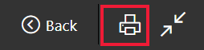

    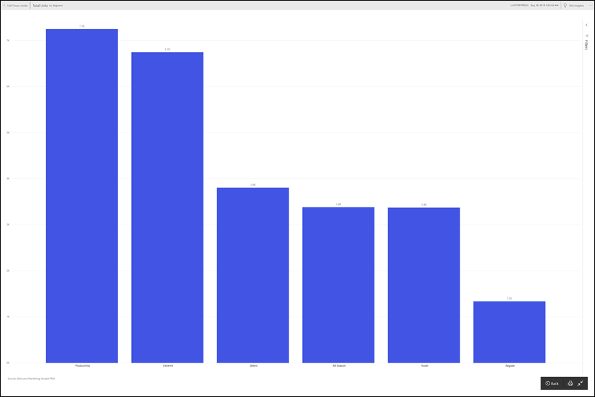

4. Select the Print icon .     

5. The Print window for your browser opens. Choose the settings. For example, if your tile isn't fitting on the page, you may want to change the scale to 75%. Select **Print**.

    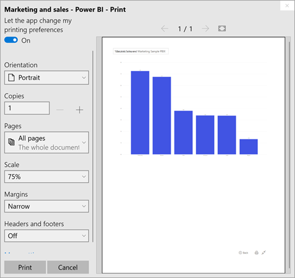 

> [!TIP]
> If you've followed all of these steps and your tile still isn't displaying the way you want it to, try the following.
> 1. Open the Print window and make the changes to the print settings that you believe will result in the best printout. For example, change the layout, margins, and scale. 
> 2. But, instead of printing, select **Cancel**. 
> 3. Go through steps 1-5 again. Your tile will adjust to the new Print window settings and be ready to print.

## Print a report page
Reports can be printed one page at a time.

1. Open the report and select **File** > **Print this page** to print the current report page.
   
    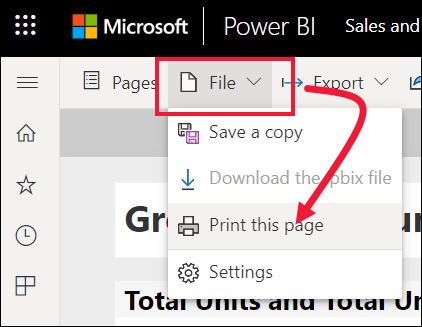
2. The Print window for your browser opens.

3. Follow the printing steps from **Print a dashboard**, above.
   

## Print a report visual
1. [Open the visual in Focus mode](end-user-focus.md) by hovering over the tile and selecting the Focus icon  from the top-right corner.

    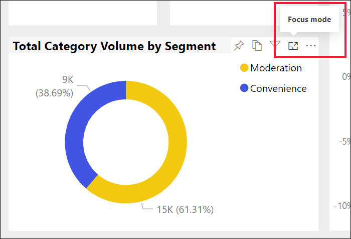

2. From the upper left corner, select **File** > **Print this page** to print the visual.

    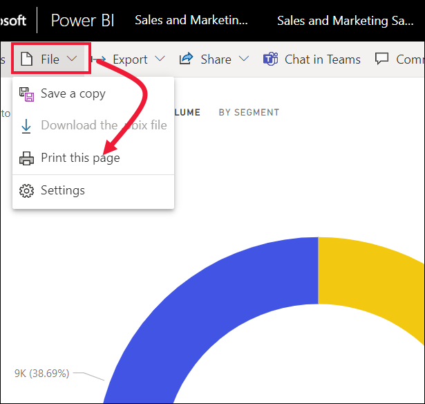

3. Follow the printing steps from **Print a dashboard**, above.

## Considerations and troubleshooting

* Q: I cannot print all the report pages at once.    
* A: That is correct. Report pages can only be printed one page at a time.
* Q: I cannot print to PDF.    
* A: You will only see this option if you've already configured the PDF driver in your browser.    
* Q: What I see when I select **Print** doesn't match what you're showing me here.    
* A: The Print screens vary by browser and software version.
* Q: My printout isn't scaled correctly.  My dashboard doesn't fit on the page. Other scaling and orientation questions.    
* A: We cannot guarantee that the printed copy will be exactly the same as it appears in the Power BI service. Things like scaling, margins, visual details, orientation, and size are not controlled by Power BI. Try adjusting the print settings for your browser. Some of the ones we suggest above are page orientation (portrait or landscape), margin size, and scale. If these don't help, refer to the documentation for your specific browser.      
* Q: When I'm printing from Full screen mode, I don't see the print option when I hover over the visual.   
* A: Go back to the dashboard or report in default view and re-open the visual in Focus mode and then Full screen mode. 

## Next steps
[Share dashboards and reports with colleagues and others](../collaborate-share/service-share-dashboards.md)

More questions? [Try the Power BI Community](https://community.powerbi.com/)
