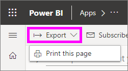
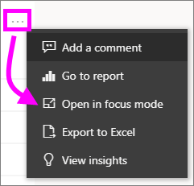
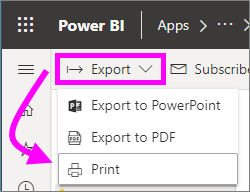

# Printing from the Power BI service
Print an entire dashboard, a dashboard tile, a report page, or a report visual from the Power BI service. Reports can only be printed one page at a time -- you can't print the entire report at once.

   > [!NOTE]
   > The print dialog you see will depend on which browser you are using.
   > 
## Print a dashboard
1. Open the dashboard that you'd like to print.
2. In the upper left corner, select Export and choose **Print this page**.
   
    
3. The Print window for your browser opens. Choose the settings and print destination, and select **Print**.
   

   
    

## Print a dashboard tile
1. Open the dashboard in [full screen mode](end-user-focus.md) by selecting the full screen icon  from the upper menu bar.
3. [Open the tile in Focus mode](end-user-focus.md) by hovering to reveal the ellipses (...) and choosing **Open in focus mode** or the focus icon .
   
    
4. Hover over the tile to reveal the Options menu.
   
    
4. Select the Print icon
     .     
   

## Print a report page
Reports can be printed one page at a time.

1. Open the report and select **Export** > **Print** to print the current report page.
   
    
3. The Print window for your browser opens.
   

## Print a report visual
1. [Open the visual in Focus mode](end-user-focus.md) by hovering over the tile and selecting the Focus icon  from the top-right corner.

2. From the upper left corner, select **Export** > **Print** to print the visual.
    

## Considerations and troubleshooting

* Q: I cannot print all the report pages at once.    
* A: That is correct. Report pages can only be printed one page at a time.
* Q: I cannot print to PDF.    
* A: You will only see this option if you've already configured the PDF driver in your browser.    
* Q: What I see when I select **Print** doesn't match what you're showing me here.    
* A: The Print screens vary by browser and software version.
* Q: My printout isn't scaled correctly.  My dashboard doesn't fit on the page. Other scaling and orientation questions.    
* A: We cannot guarantee that the printed copy will be exactly the same as it appears in the Power BI service. Things like scaling, margins, visual details, orientation, and size are not controlled by Power BI. For help with issues like this, refer to the documentation for your specific browser.      

## Next steps
[Share dashboards and reports with colleagues and others](../service-share-dashboards.md)

More questions? [Try the Power BI Community](http://community.powerbi.com/)

