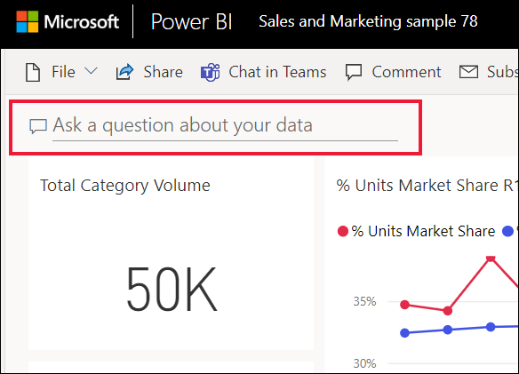
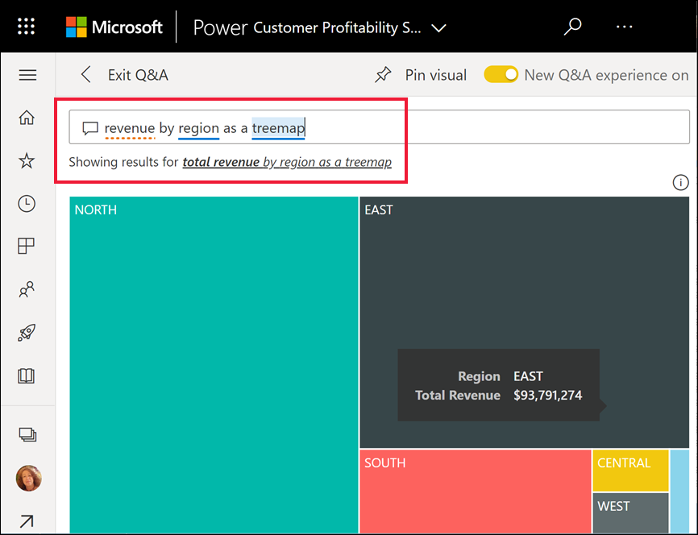
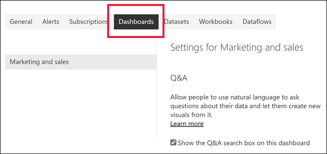
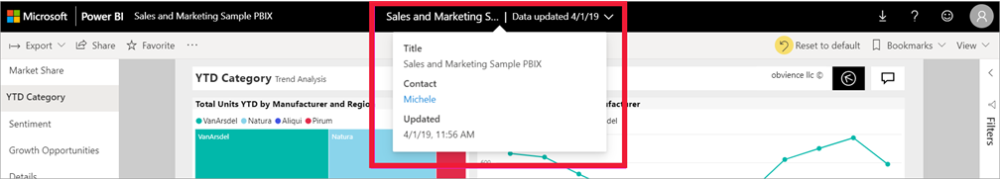

# Q&A for Power BI business users

[!INCLUDE[consumer-appliesto-yyny](../includes/consumer-appliesto-yyny.md)]

## What is Q&A?
Sometimes the fastest way to get an answer from your data is to ask a question using natural language. For example, "what were total sales last year."

Use Q&A to explore your data using intuitive, natural language capabilities and receive answers in the form of charts and graphs. Q&A is different from a search engine -- Q&A only provides results about the data in Power BI.

## Which visualization does Q&A use?
Q&A picks the best chart or graph based on the data being displayed. Sometimes data in the underlying dataset is defined as a certain type or category and this helps Q&A know how to display it. For example, if data is defined as a date type, it is more likely to be displayed as a line chart. Data that is categorized as a city is more likely to be displayed as a map.

You can also tell Q&A which visual to use by adding it to your question. But keep in mind that it may not always be possible for Q&A to display the data using the visual type you requested. Q&A will prompt you with a list of workable visual types.

## Where can I use Q&A?
You'll find Q&A on dashboards in the Power BI service, and at the bottom of the dashboard in Power BI mobile. Unless the designer has given you edit permissions, you'll be able to use Q&A to explore data but won't be able to save any visualizations created with Q&A.

You'll also find Q&A on reports, if the report *designer* added a [Q&A visual](../visuals/power-bi-visualization-q-and-a.md).   

## Q&A on dashboards

**Power BI Q&A** is available with a Pro or Premium license.  [Q&A in the Power BI mobile apps](mobile/mobile-apps-ios-qna.md) and [Q&A with Power BI Embedded](../developer/embedded/qanda.md) are covered in separate articles. At the current time, **Power BI Q&A** only supports answering natural language queries asked in English, although there is a preview available for Spanish that can be enabled by your Power BI administrator.

Asking the question is just the beginning.  Have fun traveling through your data refining or expanding your question, uncovering trust-worthy new information, zeroing in on details and zooming out for a broader view. 
You'll be delighted by the insights and discoveries you make.

The experience is truly interactive…and fast! Powered by an in-memory storage, response is almost instantaneous.

## The Q&A visual in Power BI reports

In Power BI reports, there is a specific type of interactive visual called the Q&A visual. When a report designer adds this visual to a report, report end users can ask natural language questions and create a new report visual that represents the answer to that question. The Q&A visual behaves like other visual in a report, it can be cross-filtered/cross-highlighted and also supports bookmarks and comments. 

You can identify a Q&A visual by its question box across the top. This is where you'll enter or type questions using natural language. The Q&A visual can be used over and over again to ask questions about your data. When you leave the report, the Q&A visual resets to its default. 

## Considerations and troubleshooting

**Question**: I don't see Q&A on this dashboard.    
**Answer 1**: If you don't see a question box, first check your settings. To do this, select the cog icon in the upper right corner of your Power BI toolbar, or from the **More options** (...) dropdown menu.   

Then choose **Settings** > **Dashboards**. Make sure there is a check mark next to **Show the Q&A search box on this dashboard**.    
  

**Answer 2**: Sometimes you won't have access to the settings. If the dashboard owner or your administrator turned Q&A off, check with them to see if it's OK to turn it back on. To look up the owner, select the name of the dashboard from the top menu bar.

    

**Question**: I'm not getting the results I'd like to see when I type a question.    
**Answer**: Select the option to contact the report or dashboard owner. You can do this directly from the Q&A dashboard page or the Q&A visual. Or, you can look up the owner from the Power BI header.  There are many things the owner can do to improve the Q&A results. For example, the owner can rename columns in the dataset to use terms that are easily understood (`CustomerFirstName` instead of `CustFN`). Since the owner knows the dataset really well, they can also come up with helpful questions and add them to the Q&A suggested questions.

## Privacy

Microsoft may use your questions to improve Power BI. Please review the [Microsoft Privacy Statement](https://go.microsoft.com/fwlink/?LinkId=521839) for more information.

## Next steps
Learn how to ask your own natural language questions and create answers in the form of visuals. [Q&A Tutorial](end-user-q-and-a-tutorial.md) 
