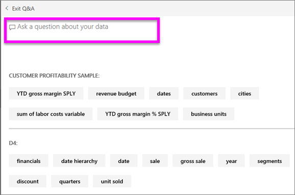
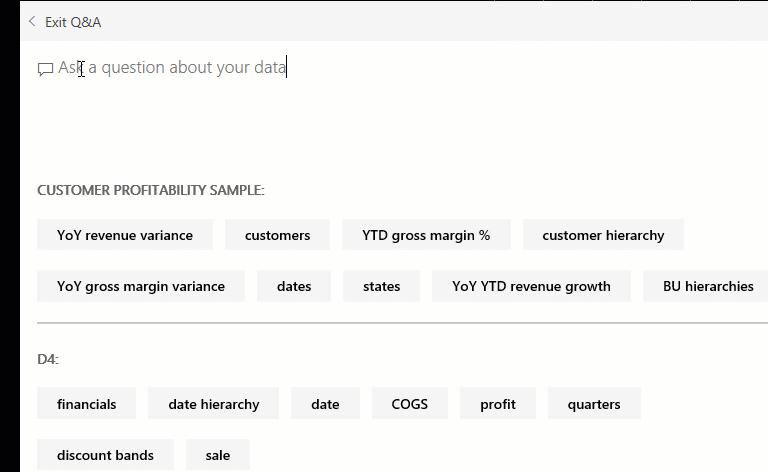
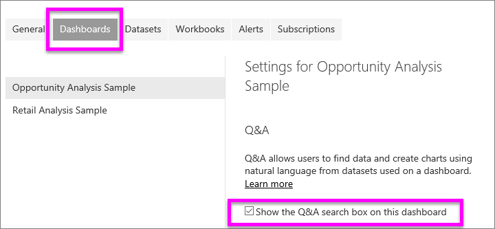

# Q&A for Power BI **consumers**
## What is Q&A?
Sometimes the fastest way to get an answer from your data is to ask a question using natural language. For example, "what were total sales last year."  
Use Q&A to explore your data using intuitive, natural language capabilities and receive answers in the form of charts and graphs. Q&A is different from a search engine -- Q&A only provides results about the data in Power BI.

**Power BI Q&A** only supports answering natural language queries asked in English. There is a preview available for Spanish that can be enabled by your Power BI administrator.

**Power BI Q&A** is available with a Pro or Premium license. 
>

Asking the question is just the beginning.  Have fun traveling through your data refining or expanding your question, uncovering trust-worthy new information, zeroing in on details and zooming out for a broader view. 
You’ll be delighted by the insights and discoveries you make.

The experience is truly interactive…and fast! Powered by an in-memory storage, response is almost instantaneous.

## Where can I use Q&A?
You'll find Q&A on dashboards in Power BI service, at the bottom of the dashboard in Power BI mobile, and above the visualization in Power BI Embedded. 
Unless the designer has given you edit permissions, you'll be able to use Q&A to explore data but won't be able to save any visualizations created with Q&A.

## How does Q&A know how to answer questions?
Q&A looks for answers in all of the datasets associated with the dashboard. If a dataset has a tile on the dashboard, then Q&A will look in that dataset for answers. 

## How do I start?
First, get familiar with the content. Take a look at the visualizations on the dashboard and in the report. Get a feel for the type and range of data that is available to you. Then head back to the dashboard and place 
your cursor in the question box. This opens the Q&A screen.

 

* If the visualizations' axis labels and values include "sales",  "account", "month", and "opportunities", then you can confidently ask questions such as: "Which *account* has the highest *opportunity*, or show *sales* by month 
as a bar chart."

* If you have website performance data in Google Analytics, you can ask Q&A about time spent on a web page, number of unique page visits, and user engagement rates. Or, if you’re querying demographic data, you might ask questions about age and household income by location.

At the bottom of the screen you'll see other helpful items. For each dataset, Q&A shows you keywords and sometimes even shows you some sample or suggested questions. Select any of these to add them to the question box. 

Another way Q&A helps you ask questions is with prompts, auto-complete, and visual cues. 

 

### Which visualization does Q&A use?
Q&A picks the best visualization based on the data being displayed. Sometimes data in the underlying dataset(s) is defined as a certain type or category and this helps Q&A know how to display it. For example, if data is defined as a date type, it is more likely to be displayed as a line chart. Data that is categorized as a city is more likely to be displayed as a map.

You can also tell Q&A which visualization to use by adding it to your question. But keep in mind that it may not always be possible for Q&A to display the data in the visualization type you requested. Q&A will prompt you with a list of workable visualization types.

## Considerations and troubleshooting
**Question**: I don't see Q&A on this dashboard.    
**Answer 1**: If you don't see a question box, first check your settings. To do this, select the cog icon in the upper right corner of your Power BI toolbar.   

Then choose **Settings** > **Dashboards**. Make sure there is a checkmark next to **Show the Q&A search box on this dashboard**.
  

**Answer 2**: Sometimes the dashboard *designer* or your administrator turns Q&A off. Check with them to see if it's OK to turn it back on.   

**Question**: I'm not getting the results I'd like to see when I type a question.    
**Answer**: Talk to the dashboard *designer*. There are many things the designer can do to improve the Q&A results. For example, the designer can rename columns in the dataset to use terms that are easily understood (`CustomerFirstName` instead of `CustFN`). Since the designer knows the dataset really well, the designer can also come up with helpful questions and add them to the Q&A canvas.

## Next steps

