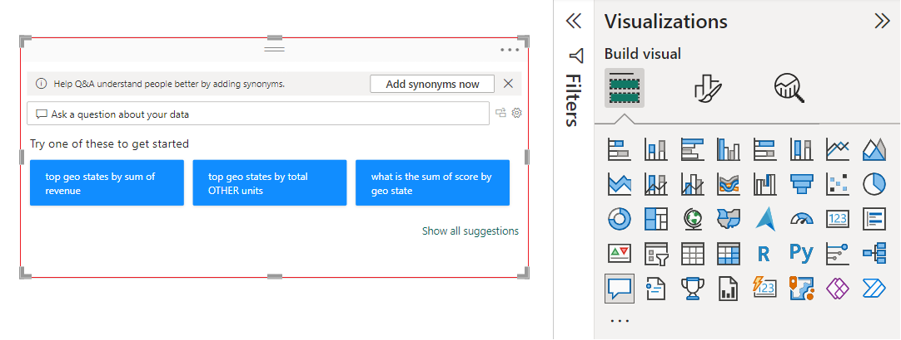
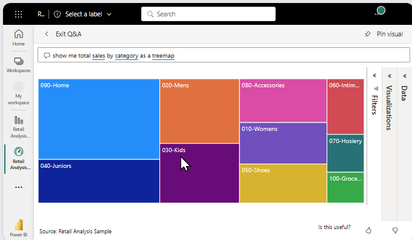
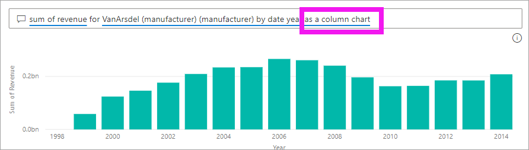

# Q&A for Power BI **consumers**

[!INCLUDE [power-bi-service-new-look-include](../includes/power-bi-service-new-look-include.md)]

## What is Q&A?
Sometimes the fastest way to get an answer from your data is to ask a question using natural language. For example, "what were total sales last year."

Use Q&A to explore your data using intuitive, natural language capabilities and receive answers in the form of charts and graphs. Q&A is different from a search engine -- Q&A only provides results about the data in Power BI.

## Where can I use Q&A?
You'll find Q&A on dashboards in the Power BI service, and at the bottom of the dashboard in Power BI mobile. Unless the designer has given you edit permissions, you'll be able to use Q&A to explore data but won't be able to save any visualizations created with Q&A.

You'll also find Q&A on reports, if the report *designer* added a [Q&A visual](../visuals/power-bi-visualization-q-and-a.md).   

## Q&A on dashboards

**Power BI Q&A** is available with a Pro or Premium license.  [Q&A in the Power BI mobile apps](mobile/mobile-apps-ios-qna.md) and [Q&A with Power BI Embedded](../developer/qanda.md) are covered in separate articles. At the current time, **Power BI Q&A** only supports answering natural language queries asked in English, although there is a preview available for Spanish that can be enabled by your Power BI administrator.

Asking the question is just the beginning.  Have fun traveling through your data refining or expanding your question, uncovering trust-worthy new information, zeroing in on details and zooming out for a broader view. 
You’ll be delighted by the insights and discoveries you make.

The experience is truly interactive…and fast! Powered by an in-memory storage, response is almost instantaneous.

## Use Q&A on a dashboard in the Power BI service
In the Power BI service (app.powerbi.com), a dashboard contains tiles pinned from one or more datasets, so you can ask questions about any of the data contained in any of those datasets. To see what reports and datasets were used to create the dashboard, select **View related** from the menu bar.

## How do I start?
First, get familiar with the content. Take a look at the visuals on the dashboard and in the report. Get a feel for the type and range of data that is available to you. 

For example:

* If a visual's axis labels and values include "sales",  "account", "month", and "opportunities", then you can confidently ask questions such as: "Which *account* has the highest *opportunity*, or show *sales* by month as a bar chart."

* If you have website performance data in Google Analytics, you can ask Q&A about time spent on a web page, number of unique page visits, and user engagement rates. Or, if you’re querying demographic data, you might ask questions about age and household income by location.

Once you're familiar with the data, head back to the dashboard  and place your cursor in the question box. This opens the Q&A screen.

 

Even before you start typing, Q&A displays a new screen with suggestions to help you form your question. You see phrases and questions containing the names of the tables in the underlying datasets and may even see *featured* questions created by the dataset owner.

You can select any of these to add them to the question box and then refine them to find a specific answer. 

Another way Q&A helps you ask questions is with prompts, auto-complete, and visual cues. 

<!--  -->

## The Q&A visual

The Q&A visual allows you to ask natural language questions and get answers in the form of a visual. The Q&A visual behaves like any other visual, it can be cross-filtered/cross-highlighted and also supports bookmarks and comments. 

You can identify a Q&A visual by its question box across the top. This is where you'll enter a question. The Q&A visual can be used over and over again to ask questions about your data. When you leave the report, the Q&A visual resets to its default. 

## Using the Q&A visual
To use the Q&A visual, either select one of the suggested question or type your own natural language question. 

### Create a Q&A visual by using a suggested questions

Here, we've selected **top geo states by total units**. Power BI does its best to select which visual type to use. In this case, it's a map.

But you can tell Power BI which visual type to use by adding it to your natural language query. Keep in mind that not all visual types will work or make sense with your data. For example, this data wouldn't produce a meaningful scatter chart. But it works as a filled map.

### Create a Q&A visual by typing a natural language query

If you're unsure what type of questions to ask or terminology to use, expand **Show all suggestions** or look through the other visuals in the report. This will get you familiar with the terms and content of the  dataset.

Type your question into the Q&A field using natural language. As you type your question, Power BI helps you with autocomplete, suggestions, and feedback.

- A red underline is used for words that Power BI does not recognize. Whenever possible, Power BI will help you define these words. If you see the correct definition, select it from the dropdown.  

    

- If none of the definitions is correct, try another term or select the red underlined word to ask the report owner to add the word.

    

- As you type more of the question, Power BI lets you know if it doesn't understand the question, and tries to help. In the example below, Power BI asks you "Did you mean..." and suggests a different way to word your question using terminology from your dataset. 

    

5. After selecting Power BI's correction, your results display as a line chart. 

    

6. But, you can change the visual to another visual type.  

    

## Which visualization does Q&A use?
Q&A picks the best visualization based on the data being displayed. Sometimes data in the underlying dataset is defined as a certain type or category and this helps Q&A know how to display it. For example, if data is defined as a date type, it is more likely to be displayed as a line chart. Data that is categorized as a city is more likely to be displayed as a map.

You can also tell Q&A which visual to use by adding it to your question. But keep in mind that it may not always be possible for Q&A to display the data in the visual type you requested. Q&A will prompt you with a list of workable visual types.

## Considerations and troubleshooting

**Question**: I don't see Q&A on this dashboard.    
**Answer 1**: If you don't see a question box, first check your settings. To do this, select the cog icon in the upper right corner of your Power BI toolbar.   

Then choose **Settings** > **Dashboards**. Make sure there is a checkmark next to **Show the Q&A search box on this dashboard**.    
  

**Answer 2**: Sometimes you won't have access to the settings. If the dashboard *designer* or your administrator turned Q&A off, check with them to see if it's OK to turn it back on.   

**Question**: I'm not getting the results I'd like to see when I type a question.    
**Answer**: Select the option to contact the report or dashboard owner. You can do this directly from the Q&A dashboard page or the Q&A visual. Or, you can look up the owner from the Power BI header.  There are many things the designer can do to improve the Q&A results. For example, the designer can rename columns in the dataset to use terms that are easily understood (`CustomerFirstName` instead of `CustFN`). Since the designer knows the dataset really well, the designer can also come up with helpful questions and add them to the Q&A canvas.

## Next steps
To learn how a Q&A visual is created and managed by a report *designer*, see [Q&A visual type](../visuals/power-bi-visualization-q-and-a.md).
