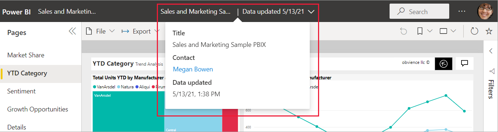

# Q&A for Power BI business users

[!INCLUDE[consumer-appliesto-yyny](../includes/consumer-appliesto-yynn.md)]

## What is Q&A?

Sometimes the fastest way to get an answer from your data is to ask a question using natural language. For example, "show total units by year and product manufacturer."

:::image type="content" source="media/end-user-q-and-a/power-bi-example.png" alt-text="Image showing the Q&A question and resulting line chart.":::

Use Q&A to explore your data using natural language capabilities and receive answers in the form of charts and graphs. Unlike a search engine, Q&A only provides results about the data in Power BI semantic models.

To learn how to use Q&A, see [Explore your data and create visuals using Q&A.](../natural-language/q-and-a-intro.md)

## Which visualizations does Q&A use?

Q&A picks the best visual based on the data. Sometimes data is defined as a certain type or category, which helps Q&A know how to display it. For example, if data is defined as a date type, it's more likely to be displayed as a line chart. Data that is categorized as a city is more likely to be displayed as a map.

If you want a specific type of visual, tell Q&A which one to use by adding it to your question. For example, "show me total sales by category as a treemap." But keep in mind that it isn't always possible for Q&A to display the data using the visual type you requested. Q&A prompts you with a list of workable visual types.

:::image type="content" source="media/end-user-q-and-a/power-bi-treemap.png" alt-text="{alt-text}":::

## Where can I use Q&A?

### Use Q&A on a dashboard

Q&A is available on dashboards in the Power BI service, and at the bottom of the dashboard in Power BI mobile. If the dashboard designer gave you edit permissions, save the visual by [pinning it to your dashboard](../create-reports/service-dashboard-pin-tile-from-q-and-a.md). 

To learn more, see [Use Q&A on a dashboard.](../natural-language/end-user-q-and-a-tutorial.md)

### Use Q&A in a report

Q&A is available in reports if the report designer added a specific type of interactive visual called a [Q&A visual](../visuals/power-bi-visualization-q-and-a.md) or added a [Q&A button](../create-reports/desktop-buttons.md#select-the-action-for-a-button). Ask natural language questions and create new report visuals that represent the answers to your questions. If you have edit permissions for the report, turn the results into a new visual in the report.

To learn more, see [Use Q&A in a report.](../natural-language/power-bi-tutorial-q-and-a.md)

### Use Q&A in mobile apps and embedded reports

Q&A is available in [Power BI iOS apps](mobile/mobile-apps-ios-qna.md) and in [Power BI embedded analytics](../developer/embedded/qanda.md) as well. 

## Considerations and limitations

**Question**: I don't see Q&A on this dashboard.

**Answer 1**: If you don't see a question box, check your settings. Select the **Settings** icon in the upper right corner of your Power BI toolbar.

Choose **Power BI Settings** > **Dashboards**. Highlight the dashboard that doesn't have a Q&A question box. Make sure there's a check mark next to **Show the Q&A search box on this dashboard**.

  

**Answer 2**: Sometimes you don't have access to the settings. If the dashboard owner or your administrator turned Q&A off, check with them to see if it's OK to turn it back on. To look up the owner, select the name of the dashboard from the top menu bar.

**Question**: I'm not getting the results I'd like to see when I type a question.

**Answer**: Select the option to contact the report or dashboard owner. You can find the report or dashboard owner from the Q&A dashboard page or the Q&A visual. Or, you can look up the owner from the Power BI header. There are [many things the owner can do to improve the Q&A results](../natural-language/q-and-a-tooling-intro.md). For example, the owner can rename columns in the semantic model to use terms that are easily understood (`CustomerFirstName` instead of `CustFN`). Since the owner knows the semantic model, they can also come up with helpful questions and add them to the Q&A suggested questions.

## Privacy

Microsoft might use your questions to improve Power BI. For more information about how Microsoft uses your questions, see the [Microsoft Privacy Statement](https://go.microsoft.com/fwlink/?LinkId=521839) for more information.

## Related content

- To learn how to ask your own natural language questions and create answers in the form of visuals, see [Use Q&A on a dashboard](../natural-language/end-user-q-and-a-tutorial.md) or [Use Q&A in a report](../natural-language/power-bi-tutorial-q-and-a.md).

- For tips on forming questions, see [How to ask questions with Q&A](end-user-q-and-a-tips.md).

- If you have edit permissions, learn how to [create a Q&A visual on a dashboard](../create-reports/power-bi-visualization-introduction-to-q-and-a.md) and [add a Q&A visual in a report](../visuals/power-bi-visualization-q-and-a.md).
