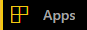
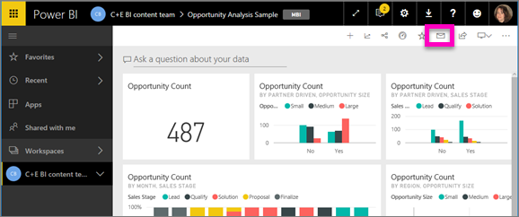

<!-- once the sample aps are live, change this so consumers can follow along -->
# Quickstart: learn about the Power BI capabilities for ***consumers***
In this quickstart, you'll learn how to interact with Power BI to discover data-driven business insights. This article isn't intended to be a deep dive, but rather a quick trip through many of the actions available for Power BI **consumers**.

If you're not signed up for Power BI, [sign up for a free trial](https://app.powerbi.com/signupredirect?pbi_source=web) before you begin.

## Prerequisites
- Power BI service (app.powerbi.com)
<!-- app from AppSource -->

## Reading view
Reading view is available in Power BI service for report *consumers*. When a colleague shares a report with you, Reading view is your way to explore and interact with the report. 

The other Power BI service report mode is [Editing view](../service-interact-with-a-report-in-editing-view.md), which is available to report *designers*.  

Reading view is a powerful and safe way to explore your dashboards and reports. While you slice and dice the dashboards and reports shared with you, the underlying data sets remain intact and unchanged. 

In Reading view you can do things like cross-highlight and cross-filter visuals on a page.  Simply highlight or select a value in one visual and instantly see its impact on the other visuals. Use the Filter pane to add and modify filters on a report page, and change the way values are sorted in a visualization. These are just a few of the *consumer* capabilities in Power BI.  Read on to learn about these and more.

 
### View an app
In Power BI, *apps* bundle related dashboards and reports together, all in one place.

1. Select **Apps**  > **Get apps**. 
   
     
2. In AppSource under **My organization**, search to narrow the results and find the app you're looking for.
   
     
3. Select **Get it now** to add it to your Apps container. 

### View a dashboard
This app opens to a dashboard. A Power BI ***dashboard*** is a single page, often called a canvas, that uses visualizations to tell a story. Because it is limited to one page, a well-designed dashboard contains only the most-important elements of that story.

The visualizations you see on the dashboard are called *tiles* and are *pinned* to the dashboard from reports.

### Subscribe to a dashboard (or report)
It's not necessary to open Power BI to monitor a dashboard.  You can subscribe instead, and Power BI will email you a snapshot of that dashboard on a schedule you set. 

.

1. From the top menubar, select **Subscribe** or select the envelope icon .
   
   

3. Use the yellow slider to turn the subscription on and off.  Optionally, add email message details. 

    In the screenshots below, notice that when you subscribe to a report, you're actually subscribing to a report *page*.  To subscribe to more than one page in a report, select **Add another subscription** and select a different page. 
      
   
   
    Refreshing the report page does not refresh the dataset. Only the dataset owner can manually refresh a dataset. To look up the name of the underlying dataset(s), select **View related** from the top menubar.

### View related content
The **Related content** pane shows you how your Power BI service content -- dashboards, reports, and datasets -- are interconnected. Not only does the pane display the related content, it also allows you take action on the content and easily navigate between the related content.

From a dashboard or report, select **View related** from the top menubar.

### Use Q&A to ask questions using natural language
Sometimes the fastest way to get an answer from your data is to ask a question using natural language. The Q&A question box is available at the top of your dashboard. For example, "show me count of large opportunities by sales stage as a funnel." 

### Favorite a dashboard
When you make content a *favorite*,  you'll be able to access it from the left navigation bar. The left navbar is visible from just about every area of Power BI. Favorites are typically the dashboards, report pages, and apps that you visit most often.

1. Exit Q&A to return to a dashboard.    
2. From the upper right corner of Power BI service, select **Favorite** or the star   icon.
   
   

### Open and view a report and report pages
A report is one or more pages of visuals. Reports are  created by Power BI *report designers* and [shared with *consumers* directly](end-user-shared-with-me.md) or as part of an [app](end-user-apps.md). 

Reports can be opened from a dashboard. Most dashboard tiles are *pinned* from reports. Selecting a tile opens the report that was used to create the tile. 

1. From a dashboard, select a tile. In this example we've selected the "Revenue" column chart tile.

    

2.  The associated report opens. Notice that we're on the "Revenue overview" page. This is the report page that contains the column chart we selected from the dashboard.

    

### Adjust the display dimensions
Reports are viewed on many different devices, with varying screen sizes and aspect ratios.  The default rendering may not be what you want to see on your device.  

1. To adjust, from the top menu bar select **View**.

    

2.  Choose one of the display options. In this example we've chosen **Fit to page**.

        

### Use the report Filters pane
If the report author added filters to a page in a report, you can interact with them and save your changes with the report.

1. Select the **Filters** icon in the upper-right corner.
   
     

2. Select a visual to make it active. You'll see all filters that have been applied to that visual (Visual level filters), across the whole report page (Page level filters), and across the entire report (Report level filters).
   
   

3. Hover over a filter and expand it by selecting the down arrow.
   
   

4. Make changes to the filters and see how the visuals are impacted.  
   
     
     

### See how all the visuals on a page are interconnected
Cross-highlight and cross-filter the related visualizations on a page. The visualizations on a single report page are all "connected" to each other.  What this means is that if you select one or more values in one visualization, other visualizations that use that same value will change based on your selection.

> 
### Display details on a visualization
Hover over visual elements to see the details

### Sort a visualization
Visuals on a report page can be sorted and saved with your changes applied. 

1. Hover over a visual to make it active.    
2. Select the ellipsis (...) to open sorting options.

     

###  Open the **Selection** pane
Easily navigate between the visualizations on the report page. 

1. Select **View > Selection pane** to open the Selection pane. Toggle **Selection pane** to On.

    

2. The Selection pane opens on your report canvas. Select a visual from the list to make it active.

    

### Zoom in on individual visuals
Hover over a visual and select the **Focus mode** icon . When you view a visualization in Focus mode, it expands to fill the entire report canvas as shown below.

To display that same visualization without the distraction of menubars, filter pane, and other chrome -- select the **Full Screen** icon from the top menubar    .

### Show the data used to create a visualization
A Power BI visualization is constructed using data from underlying datasets. If you're interested in seeing behind-the-scenes, Power BI lets you *display* the data that is being used to create the visual. When you select **Show Data**, Power BI displays the data below (or next to) the visualization.

1. In Power BI service, open a report and select a visual.  
2. To display the data behind the visual, select the ellipsis (...) and choose **Show data**.
   
   

This has been a quick overview of just some of the things **consumers** can do with Power BI service.  

## Clean up resources
- If you connected to an app, from the left navbar, select **Apps** to open the Apps content list. Hover over the app to delete, and select the trashcan icon.

- If you imported or connected to a Power BI sample report, from the left navbar, open **My workspace**. Using the tabs at the top, locate the dashboard, report, and dataset, and select the trashcan icon for each.

## Next steps

