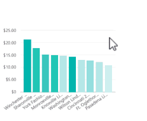

# Quickstart: learn about the Power BI capabilities for ***consumers***
In this quickstart, you will learn how to interact with Power BI to discover data-driven business insights.

If you're not signed up for Power BI, [sign up for a free trial](https://app.powerbi.com/signupredirect?pbi_source=web) before you begin.

## Prerequisites
- Power BI service (app.powerbi.com)
<!-- app from AppSource -->

## Reading view
Reading view is available in Power BI service for report *consumers*. When a colleague shares a report with you), Reading view is your way to explore and interact with the report. 

The other Power BI service report mode is [Editing view](,,/service-interact-with-a-report-in-editing-view.md), which is available to report *designers*.  

Reading view is a powerful and safe way to explore your dashboards and reports. While you slice and dice the dashboards and reports shared with you, the underlying data sets remain intact and unchanged. 

In Reading View you can do things like cross-highlight and cross-filter visuals on a page.  Simply highlight or select a value in one visual and instantly see its impact on the other visuals. Use the Filter pane to add and modify filters on a report page, and change the way values are sorted in a visualization. These are just a few of the *consumer* capabilities in Power BI.  Read on to learn about these and more.

### View an app

### View a dashboard

### Subscribe to a dashboard

### Use Q&A to ask questions using natural language

### Favorite a dashboard

### View related content

### Open and view a report and report pages

Cross-highlight the related visualizations on a page
The visualizations on a single report page are all "connected" to each other.  What this means is that if you select one or more values in one visualization, other visualizations that use that same value will change based on that selection.

> [!NOTE]
> To select more than one element in a visualization, hold down the CTRL key.
> 
> 

Hover over visual elements to see the details

### Use the report Filters pane
If the report author added filters to a page in a report, you can interact with them in Reading View. Changes you make will not be saved with the report.

1. Select the Filter icon in the upper-right corner.
   
     

2. You'll see all filters that have been applied to the visual you have selected (Visual level filters), across the whole report page (Page level filters), and across the entire report (Report level filters).
   
   

3. Hover over a filter and expand it by selecting the down arrow.
   
   

4. Make changes to the filters and see how the visuals are impacted.  
   
   * In this example, we have a Page level filter for **Chain**. Change it to **Fashions Direct** instead of **Lindseys** by removing the checkmark from one and adding it to the other.
     
     
   * Or completely remove filtering on **Chain** by selecting the eraser icon  or by selecting both chain stores.
   * Select the **District** page level filter and switch to **Advanced filtering**. Filter to show only districts that start with **FD** and don't contain the number 4.
     
     

For more information, see [Add a filter to a report](power-bi-report-add-filter.md) and [About filters and highlighting in reports](power-bi-reports-filters-and-highlighting.md).
### Sort a visualization
Select the ellipses (...) to open **Sort by**. Select the dropdown arrow to choose which field to sort by or select the AZ icon to switch between ascending and descending. 

 

### Show the data used to create a visualization

### Use the left navigation bar

## Advanced tasks

### 

## Zoom in on individual visuals
Hover over a visual and select the **Focus mode** icon . When you view a visualization in Focus mode, it expands to fill the entire report canvas as shown below.

To display that same visualization without the distraction of menubars, filter pane, and other chrome -- select the **Full Screen** icon from the top menubar    .

To learn more, see [Focus mode for reports](service-focus-mode.md) and [Full Screen mode for reports](service-fullscreen-mode.md)

## Adjust the display dimensions
Reports are viewed on many different devices, with varying screen sizes and aspect ratios.  The default rendering may not be what you want to see on your device.  To adjust, select **View** and choose:

* Fit to Page: scale content to best fit the page
* Fit to Width: scale content to the width of the page
* Actual Size: display content at full size  

    

  In Reading View, the display option you select is temporary - it is not saved when you close the report.

  To learn more, see [Tutorial: Change display settings in a report](power-bi-change-report-display-settings.md).

##  Open the **Selection** pane
Easily navigate between the visualizations on the report page. Select **View > Selection pane > On** to open the Selection pane.

To learn more, see Report Selection pane.

##    Miscellaneous other interactions
There are just so many ways you can interact with a report in Reading view. Select a link below to learn more.

- 
- 
- 
## Clean up resources

## Next steps

## Report Reading view

 Reading view is your way to explore and interact with the report -- it's a fun and safe way to play with and get to know your data. Reading view is designed for report *consumers*; those who open reports from Apps or who have reports [shared with them](../service-share-dashboards.md). Reading view ensures that every single consumer of a specific report is seeing the same report, the same visualizations, and optionally with the same filters applied.  Consumers can interact with the reports, can change the existing filters (and these changes are saved with the report), but cannot add new filters.

> [!NOTE]
> In certain circumstances, report consumers may see different data because of row level security and data permissions.

## Reading view
In Reading view, Power BI *consumers* have numerous ways to use reports and dashboards to make data-driven business decisions.  This chart lists and links to most of them.  

|Task  | Task  | 
|-------------------------|-------|
|**Reports, as a whole**  | |
| [View a report](end-user-report-open.md) | [Share a report](../service-share-reports.md) |
| [Work with report filters](end-user-report-filter.md.md) |  [Change the way the report displays: full screen, fit to width, phone view, etc...](end-user-display.md) | 
| [Subscribe to a report](end-user-subscribe.md) | [Q&A - ask questions using natural language](end-user-q-and-a.md) | [View Usage metrics ](../service-usage-metrics.md) | | [View related](end-user-related.md) | 
| [Save a report using Save as](../service-report-save.md) |   |
|**Report pages** |

|**Working with report visualizations**|

