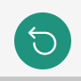
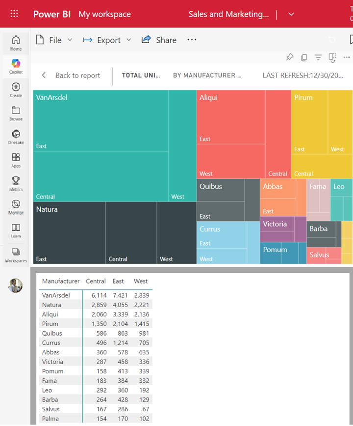

# Interact with reports and dashboards

[!INCLUDE[consumer-appliesto-ynny](../includes/consumer-appliesto-ynny.md)]

This article explains how to interact with the Power BI service to discover data‑driven business insights. It focuses on the everyday tasks and tools available to Power BI **business users** (sometimes called consumers or readers).

> [!NOTE]
> Looking for navigation basics (Home, Browse, Apps, Learning center, workspaces)? Start with [Getting around in the Power BI service](end-user-experience.md). Need help locating content on the Home canvas? See [Find content from Power BI service Home](end-user-home.md).

If you're not signed up for the Power BI service, [sign up for a free trial](https://app.powerbi.com/signupredirect?pbi_source=web) before you begin.

## What is Power BI?

Power BI is a collection of software services, apps, and connectors that work together to turn your unrelated sources of data into coherent, visually immersive, and interactive insights. Your data might be a simple Excel spreadsheet or a collection of data from different data sources. No matter, Power BI lets you easily connect to your data sources, visualize (or discover) what's important, and share that with anyone or everyone you want.

Open the Power BI service, in a browser or on a mobile device. You and your colleagues work from the same trusted apps, dashboards, and reports, that update and refresh automatically, so you're always working with the freshest content.

## Reading view

There are two modes for interacting with reports in the Power BI service: Editing view and Reading view. If you're a *business user*, then you're more likely to use Reading view to consume reports created by others. Editing view is used by report *designers*, who create the reports and share them with you. Reading view is your way to explore and interact with reports created by colleagues.

## Select Editing view and Reading view

Most reports open in Reading view. To switch from Reading view to Editing view, select **Edit** from the action bar. If **Edit** is grayed out, that means that you don't have permissions to edit the report.

:::image type="content" source="media/end-user-reading-view/power-bi-edit.png" alt-text="Screenshot of action bar with the word Edit outlined in red.":::

To switch back to Reading view, select **Reading view** from the action bar.

:::image type="content" source="media/end-user-reading-view/power-bi-reading.png" alt-text="Screenshot showing action bar with the words Reading view outlined in red.":::

Even in Reading view, the content isn't static. You can look for trends, explore insights, ask questions in natural language, set up alerts and subscriptions, and export or focus visuals—across devices.

## At a glance: What you can do here

| Goal | Feature | Where |
|------|---------|-------|
| Navigate & open content | Home, Browse, search | [Getting around](end-user-experience.md) |
| View structured bundles | Apps | [Apps](end-user-apps.md) |
| Explore multi-page visuals | Reports | [Reports](end-user-reports.md) |
| Monitor key metrics | Dashboards & tiles | [Dashboards](end-user-dashboards.md) |
| Ask questions | Q&A | (Dashboard) Q&A box |
| Get proactive updates | Subscriptions & alerts | Dashboard/report menus |
| Narrow data shown | Filters pane, slicers | Report pages |
| Focus or present | Focus mode, Full screen | Visual menu / View menu |
| Reuse insights elsewhere | Export, Analyze in Excel, PowerPoint | Menus / export options |

For definitions of core building blocks (reports, dashboards, apps) see the linked pages above; this article concentrates on interaction techniques.

## Interact in the Power BI service

### Collaborate with colleagues

Skip the email. Add a personal comment or start a conversation with colleagues about a dashboard, right there on that dashboard. The comment feature is just one of the ways you can collaborate with others.

Learn more about [commenting.](end-user-comment.md)

### Subscribe to a dashboard or report

It's not necessary to open Power BI to monitor a dashboard. You can subscribe instead, and Power BI emails you a snapshot of that dashboard on a schedule you set.

 Learn more about [Power BI subscriptions.](/power-bi/collaborate-share/end-user-subscribe)

### Get alerts when your data reaches a threshold

Your data is live, and your visuals update automatically. If you want to get notified when data changes above or below a threshold you set, use data alerts. Alerts work on gauges, KPIs, and cards.
:::image type="content" source="media/end-user-alerts/card-gauge-kpi.png" alt-text="Screenshot showing gauge, kpi, and card.":::

Power BI sends you an email when the value increases or decreases past the limit you set.  
:::image type="content" source="media/end-user-alerts/power-bi-email.png" alt-text="Alert email.":::

Learn more about [Power BI alerts.](end-user-alerts.md)

### Use Q&A to ask questions using natural language

Sometimes the fastest way to get an answer from your data is to ask a question using natural language. The Q&A question box is available at the top of your dashboard. For example, "show me count of large opportunities by sales stage as a funnel."

Learn more about [Power BI Q&A.](end-user-q-and-a.md)

### Display details on a visualization

Visuals are made up of datapoints, and by hovering over a datapoint, you can view the details.

### Adjust the display dimensions

Reports are viewed on many different devices, with varying screen sizes and aspect ratios. The default rendering may not be what you want to see on your device.  

To adjust, from the upper right menu bar select the **View** icon and choose one of the display options.

### See how all the visuals on a page are interconnected

Cross-highlight and cross-filter the related visualizations on a report page. The visualizations on a single report page are all "connected" to each other. What this means is that if you select one or more values in one visualization, other visualizations that use that same value change based on your selection.

Learn more about [visual interactions.](end-user-interactions.md)

### Update the filters used in the report

Open the **Filters** pane to reveal the filters applied to the page, report, and visualization.

:::image type="content" source="media/end-user-reading-view/power-bi-filters.png" alt-text="Screenshot of the Filters pane expanded.":::

If the report has filters applied, they'll display in the **Filters** pane. Make changes to the filters to see the effect on the visuals. Save your changes, or use the  to revert to the default report page state.

### Zoom in on individual visuals

Hover over a visual and select the **Focus mode** icon . When you view a visualization in Focus mode, it expands to fill the entire report canvas.

To display that same visualization without the distraction of menu bars, filter pane, and other chrome--select **Full screen** from the View dropdown.

Learn more about [focus mode and full screen mode.](end-user-focus.md)

### Sort a visualization

Visuals on a report page can be sorted and saved with your changes applied.

Hover over a visual to make it active, and select **More options** (...) to open sorting options.

Learn more about [sorting visuals.](end-user-search-sort.md)

### Show the data used to create a visualization

A Power BI visualization is constructed using data from underlying semantic models. If you're interested in seeing behind-the-scenes, Power BI lets you *display* the data that is being used to create the visual. When you select **Show as a table**, Power BI displays the data below (or next to) the visualization.

With a visual active, select **More options** (...) and choose **Show as a table**.

   

### Export data to Excel

In addition to showing the data that is used to create a visual, you can also export that data and view it in Microsoft Excel. When you export to Excel, you're creating a separate document, a spreadsheet that isn't part of Power BI. Any changes that you make in the Excel file don't impact the data in Power BI. Whether you want to take a closer look at the data, or you want to use the data in another application or for another purpose, Power BI gives you that flexibility. For more information, visit [Export the data that was used to create a visualization](../visuals/power-bi-visualization-export-data.md).

Exporting isn't limited to individual visuals; you can export entire reports to Excel or PowerPoint to share with your colleagues. For more information, see [Analyze in Excel](../collaborate-share/service-analyze-in-excel.md) and [Power BI in PowerPoint](../collaborate-share/service-power-bi-powerpoint-add-in-about.md).

This article is a quick overview of just some of the things *business users* can do with the Power BI service.  

## Clean up resources

- If you connected to an app, from the nav pane, select **Apps** to open the Apps content list. Hover over the app to delete, and select the trashcan icon.

- If you imported or connected to a Power BI sample report, from the nav pane, open **My workspace**. Using the tabs at the top, locate the dashboard, report, and semantic model, and select the trashcan icon for each.

## Related content

- [Power BI for business users](end-user-consumer.md)
