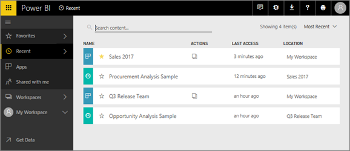
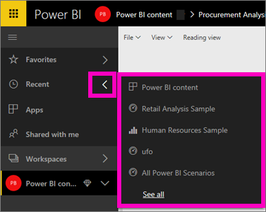
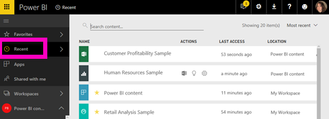

# **Recent** content in Power BI service
Recent content is the last items you visited in Power BI service, up to a maximum of 20 items.  These include: dashboards, reports, apps, and workbooks across all of your workspaces.

Watch Amanda demonstrate how the Power BI service **Recent** content lists are populated, then follow the step-by-step instructions below the video to try it out yourself.

<iframe width="560" height="315" src="https://www.youtube.com/embed/G26dr2PsEpk" frameborder="0" allowfullscreen></iframe>

## Display recent content
To see your five most-recently visited items, from the left navigation, select the arrow to the right of **Recent**.  From here you can select recent content to open it. Only the five most-recent items are listed.

If you have more than five recently-visited items, select **See all** to open the Recent screen (see below). You can also select **Recent**, or the Recent   icon, from the left nav.

From here you can interact with the content as you would on the individual [**Dashboards**](end-user-dashboards.md), [**Reports**](end-user-reports.md), and **Workbooks** tabs, and on the apps <!--[**Apps**](end-user-apps.md)--> screen.

## Next steps
<!--[Power BI service Apps](end-user-apps.md)-->

More questions? [Try the Power BI Community](http://community.powerbi.com/)

