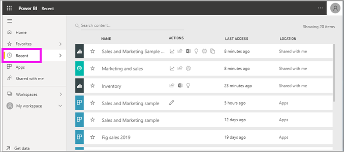
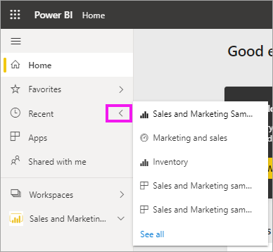
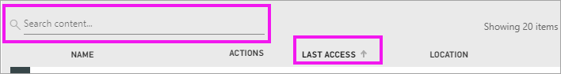

# **Recent** content in the Power BI service
Recent content is the last items you visited in the Power BI service, up to a maximum of 20 items.  These include: dashboards, reports, apps, and workbooks.

Watch Amanda demonstrate how the Power BI service **Recent** content lists are populated, then follow the step-by-step instructions below the video to try it out yourself.

<iframe width="560" height="315" src="https://www.youtube.com/embed/G26dr2PsEpk" frameborder="0" allowfullscreen></iframe>

> [!NOTE]
> This video uses an older version of the Power BI service.

## Display recent content
To see your five most-recently visited items, from the nav pane, select the arrow to the right of **Recent**.  From here you can select recent content to open it. Only the five most-recent items are listed.

If you have more than five recently-visited items, select **See all** to open the Recent screen. You can also select **Recent**, or the Recent   icon, from the nav pane.

## Actions available from the **Recent** content list
The actions available to you will depend on the settings assigned by the content *designer*. Some of your options may include:
* Select the star icon to [favorite a dashboard, report, or app](end-user-favorite.md) .
* Some dashboards and reports can be re-shared  .
* [Open the report in Excel](end-user-export.md)  
* [View insights](end-user-insights.md) that Power BI finds in the data .
* Additionally, if your lists get long, [use the search field and sorting to find what you need](end-user-search-sort.md). To find out if a column can be sorted, hover to see if an arrow appears. In this example, hovering over **Last access** reveals an arrow -- your recent content can be sorted by access date. 

    

## Next steps
[Power BI service apps](end-user-apps.md)

More questions? [Try the Power BI Community](https://community.powerbi.com/)

