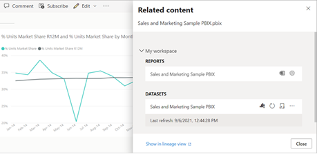
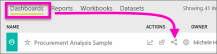
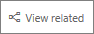
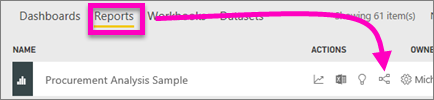
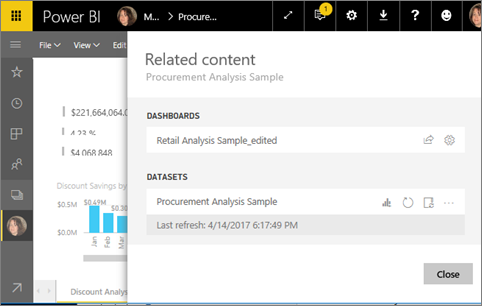
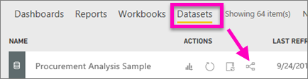
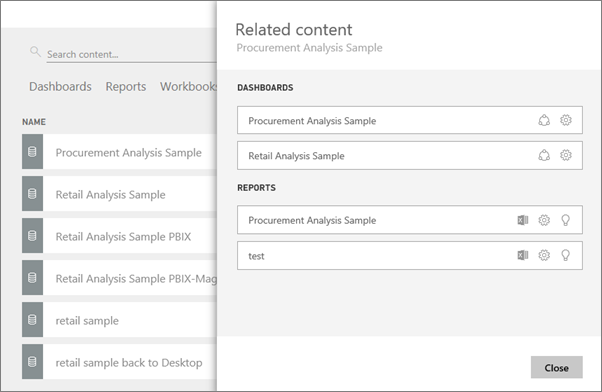

# View related content in Power BI service
The **Related content** pane shows you how your Power BI service content -- dashboards, reports, and datasets -- are interconnected. The Related content pane is also a launching pad for taking action. From here you can refresh, rename, generate insights, and so much more. Select a related report or dashboard, and it opens in your Power BI workspace.   

In Power BI, reports are built on datasets, report visuals are pinned to dashboards, and dashboard visuals link back to reports. But how do you know which dashboards are hosting visuals from your Marketing report? And how do you locate those  dashboards? Is your Procurement dashboard using visuals from more than one dataset? If so, what are they named and how can you open and edit them? Is your HR dataset being used in any reports or dashboards at all? Or, can it be moved without causing any broken links? Questions like these can all be answered on the **Related content** pane.  Not only does the pane display the related content, it also allows you to take action on the content and easily navigate between the related content.

> [!NOTE]
> The related content feature does not work for streaming datasets.
> 
> 

## View related content for a dashboard
Watch Will view related content for a dashboard. Then follow the step-by-step instructions below the video to try it out yourself with the Procurement Analysis sample dataset.

<iframe width="560" height="315" src="https://www.youtube.com/embed/B2vd4MQrz4M#t=3m05s" frameborder="0" allowfullscreen></iframe>

You'll need at least *view* permissions to a dashboard to open the **Related content** pane. In this example, we're using the [Procurement Analysis sample](../sample-procurement.md).

**Method 1**

In a workspace, select the **Dashboards** tab and then select the **View related** icon .

 

**Method 2**

With a dashboard open, select    from the top menubar.

The **Related content** pane opens. It shows all the reports that have visualizations pinned to the dashboard and their associated datasets. For this dashboard, there are visualizations pinned from three different reports and those reports are based on three different datasets.

From here, you can take direct action on the related content.  For example, select a report name to open it.  For a listed report, select an icon to [analyze in Excel](../service-analyze-in-excel.md), [rename](../service-rename.md), or [get insights](end-user-insights.md). For a dataset, select an icon to [create a new report](../service-report-create-new.md), [refresh](../refresh-data.md), rename, [analyze in Excel](../service-analyze-in-excel.md), [get insights](end-user-insights.md), or open the **Settings** window for the dataset.  

## View related content for a report
You'll need at least *view* permissions to a report to open the **Related content** pane. In this example, we're using the [Procurement Analysis sample](../sample-procurement.md).

**Method 1**

In a workspace, select the **Reports** tab and then select the **View related** icon   .

 

**Method 2**

Open the report in [Reading view](end-user-reading-view.md) and select    from the top menubar.

The **Related content** pane opens. It shows the associated dataset and all dashboards that have at least one tile pinned from the report. For this report, there are visualizations pinned to 2 different dashboards.

From here, you can take direct action on the related content.  For example, select a dashboard name to open it.  For any dashboard in the list, select an icon to [share the dashboard with others](../service-share-dashboards.md) or to open the **Settings** window for the dashboard. For the dataset, select an icon to [create a new report](../service-report-create-new.md), [refresh](../refresh-data.md), rename, [analyze in Excel](../service-analyze-in-excel.md), [get insights](end-user-insights.md), or open the **Settings** window for the dataset.  

## View related content for a dataset
You'll need at least *view* permissions to a dataset to open the **Related content** pane. In this example, we're using the [Procurement Analysis sample](../sample-procurement.md).

In a workspace, select the **Datasets** tab and locate the **View related** icon .

Select the icon to open the **Related content** pane.

From here, you can take direct action on the related content. For example, select a dashboard or report name to open it.  For any dashboard in the list, select an icon to [share the dashboard with others](../service-share-dashboards.md) or to open the **Settings** window for the dashboard. For a report, select an icon to [analyze in Excel](../service-analyze-in-excel.md), [rename](../service-rename.md), or [get insights](end-user-insights.md).  

## Limitations and troubleshooting
* If you don't see "View related", look for the icon instead . Select the icon to open the **Related content** pane.
* To open Related content for a report, you need to be in [Reading view](end-user-reading-view.md).
* The Related content feature doesn't work for streaming datasets.

## Next steps
* [Get started with Power BI service](../service-get-started.md)
* More questions? [Try the Power BI Community](http://community.powerbi.com/)

