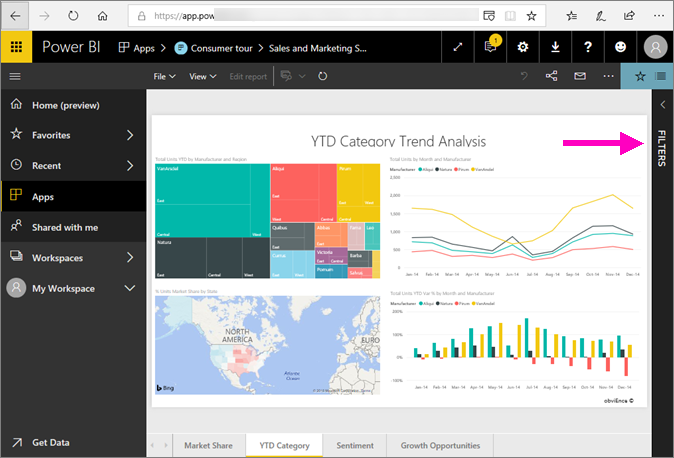
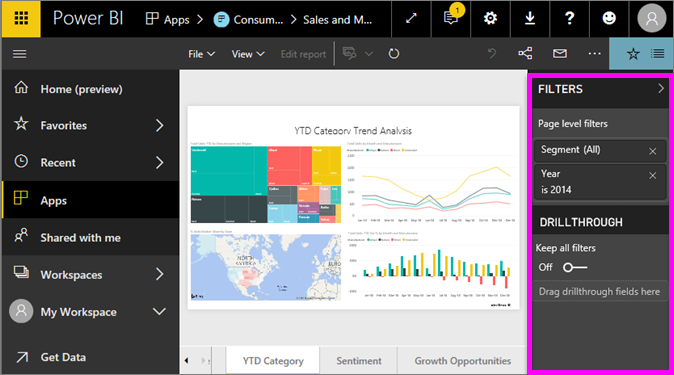
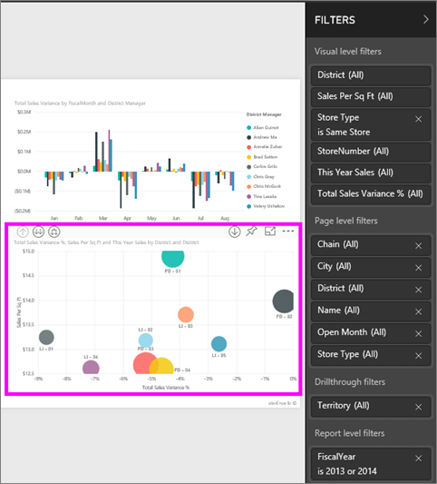
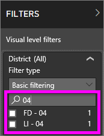
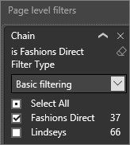
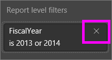

# Take a tour of the report Filters pane
This article takes a look at the report Filters pane in Power BI service.

There are many different ways to filter data in Power BI and we recommend first reading [About filters and highlighting](../power-bi-reports-filters-and-highlighting.md).

## Working with the report Filters pane
When a colleague shares a report with you, be sure to look for the **Filters** pane. Sometimes it's collapsed along the right edge of the report. Select it to expand it.   

The Filters pane contains filters that were added to the report by the report *designer*. *Consumers* like you, can interact with the filters and save your changes, but cannot add new filters to the report. For example, in the screenshot above the designer added two page level filters: Segment and Year. You can interact and change these filters, but you cannot add a third page level filter.

In Power BI service, reports retain any changes you make in the Filters pane, and those changes are carried through to the mobile version of the report. To reset the Filter pane to the designer's defaults, select **Reset to default** from the top menubar.     

## Open the Filters pane
When a report is open, the Filters pane displays along the right side of the report canvas. If you don't see the pane, select the arrow in the top-right corner to expand it.  

In this example, we've selected a visual that has 6 filters. The report page also has filters, listed under the **Page level filters** heading. There is one [Drillthrough filter](../power-bi-report-add-filter.md), and the entire report has a filter too:  **FiscalYear** is 2013 or 2014.

Some of the filters have the word **All** next to them and this means that all values are being included in the filter.  For example, **Chain(All)** in the screenshot above tells us that this report page includes data about all the store chains.  On the other hand, the report level filter of **FiscalYear is 2013 or 2014** tells us that the report only includes data for the fiscal years of 2013 and 2014.

Anyone viewing this report can interact with these filters.

- Search in page, visual, report, and drillthrough filters, to find and select the value you want. 

    

- View the details of the filter by hovering and selecting the arrow next to the filter.
  
   
* Change the filter, for example, change **Lindseys** to **Fashions Direct**.
  
     

* Reset the filters to their original state by selecting **Reset to default** from the top menubar.    
    
    
* Delete the filter by selecting the **x** next to the filter name.
  
    

  Deleting a filter removes it from the list but does not delete the data from the report.  For example, if you delete the **FiscalYear is 2013 or 2014** filter, fiscal year data will still remain in the report but it will no longer be filtered to show only 2013 and 2014; it will show all fiscal years the data contains.  However, once you delete the filter, you won't be able to modify it again since it is removed from the list. A better option is to clear the filter by selecting the eraser icon .
  
  

## Clear a filter
 In either advanced or basic filtering mode, select the eraser icon   to clear the filter. 

## Types of filters: text field filters
### List mode
Ticking a checkbox either selects or deselects the value. The **All** checkbox can be used to toggle the state of all checkboxes on or off. The checkboxes represent all the available values for that field.  As you adjust the filter, the restatement updates to reflect your choices. 

Note how the restatement now says "is Mar, Apr or May".

### Advanced mode
Select **Advanced Filtering** to switch to advanced mode. Use the dropdown controls and text boxes to identify which fields to include. By choosing between **And** and **Or**, you can build complex filter expressions. Select the **Apply Filter** button when you've set the values you want.  

## Types of filters: numeric field filters
### List mode
If the values are finite, selecting the field name displays a list.  See **Text field filters** &gt; **List mode** above for help using checkboxes.   

### Advanced mode
If the values are infinite or represent a range, selecting the field name opens the advanced filter mode. Use the dropdown and text boxes to specify a range of values that you want to see. 

By choosing between **And** and **Or**, you can build complex filter expressions. Select the **Apply Filter** button when you've set the values you want.

## Types of filters: date and time
### List mode
If the values are finite, selecting the field name displays a list.  See **Text field filters** &gt; **List mode** above for help using checkboxes.   

### Advanced mode
If the field values represent date or time, you can specify a start/end time when using Date/Time filters.  

## Next steps
[Learn how and why visuals cross-filter and cross-highlight each other on a report page](end-user-interactions.md)