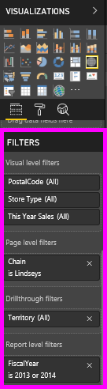
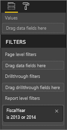
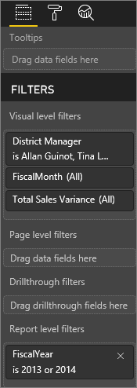
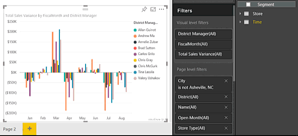
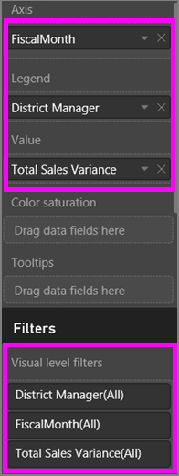
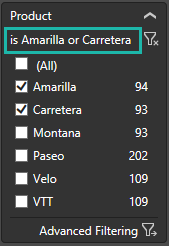
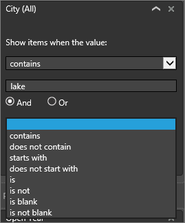

# Take a tour of the report Filters pane
This article takes a deep look at the report Filters pane. You'll see the pane in [Power BI service Editing View and Reading View](end-user-reading-view.md) and in [Power BI Desktop Report view](../desktop-report-view.md).

There are many different ways to filter data in Power BI and we recommend first reading [About filters and highlighting](../power-bi-reports-filters-and-highlighting.md).

## Working with the report Filters pane
In Power BI Desktop, reports are opened in Report view. In Power BI service, reports can be opened in [Editing view or Reading view](end-user-reading-view.md). In Editing view, and in Desktop Report view, report owners can [add filters to a report](../power-bi-report-add-filter.md) and those filters are saved with the report. People viewing the report in Reading view can interact with the filters and save their changes, but cannot add new filters to the report.

In Power BI service, reports retain any changes you make in the Filters pane, and those changes are carried through to the mobile version of the report. To reset the Filter pane to the creator defaults, select **Reset to default** from the top menubar.     

## Open the Filters pane
When a report is open, the Filters pane displays along the right side of the report canvas. If you don't see the pane, select the arrow in the top-right corner to expand it. If you are in Power BI service Reading view, the only pane available on the right side is the Filters pane.

In this example, we've selected a visual that has 6 filters. The report page also has filters, listed under the **Page level filters** heading. There is one [Drillthrough filter](../power-bi-report-add-filter.md), and the entire report has a filter too:  **FiscalYear** is 2013 or 2014.

Some of the filters have the word **All** next to them and this means that all values are being included in the filter.  For example, **Chain(All)** in the screenshot below tells us that this report page includes data about all the store chains.  On the other hand, the report level filter of **FiscalYear is 2013 or 2014** tells us that the report only includes data for the fiscal years of 2013 and 2014.

Anyone viewing this report can interact with these filters.

* View the details of the filter by hovering and selecting the arrow next to the filter.
  
   
* Change the filter, for example, change **Lindseys** to **Fashions Direct**.
  
     

* Reset the filters to their original state by selecting **Reset to default** from the top menubar.    
    
    
* Delete the filter by selecting the **x** next to the filter name.
  
  Deleting a filter removes it from the list but does not delete the data from the report.  For example, if you delete the **FiscalYear is 2013 or 2014** filter, fiscal year data will still remain in the report but it will no longer be filtered to show only 2013 and 2014; it will show all fiscal years the data contains.  However, once you delete the filter, you won't be able to modify it again since it is removed from the list. A better option is to clear the filter by selecting the eraser icon .
  
  

## Filters in Editing View
When a report is open in Desktop or in Power BI service Editing view, the Filters pane displays along the right side of the report canvas in the bottom half of the **Visualization pane**. If you don't see the pane, select the arrow in the top-right corner to expand it.

.  

If no visual is selected in the canvas, then the Filters pane displays just the filters that apply to the entire report page or entire report, and any drillthrough filters (if any have been set). In the example below, no visual is selected and there are no page level or drillthrough filters but there is a report level filter.  

  

If a visual is selected in the canvas, you will also see the filters that apply to just that visual:   

To display options for a particular filter, select the down arrow next to the filter name.  In the example below, the report level filter is set to 2013 and 2014. And this is an example of **basic filtering**.  To display the advanced options, select **Advanced Filtering**.

## Clear a filter
 In either advanced or basic filtering mode, select the eraser icon   to clear the filter. 

## Add a filter
* In Desktop and in Power BI service Editing view, add a filter to a visual, page, drillthrough, or report by selecting a field from the Fields pane and dragging it into the appropriate filter well, where you see the words **Drag fields here**. Once a field has been added as a filter, fine-tune it using the Basic filtering and Advanced filtering controls (described below).

* **Dragging a new field into the Visual level filter area does not add that field to the visual**, but it does allow you to filter the visual with this new field. In the example below, **Chain** is added as a new filter to the visual. Notice that simply adding **Chain** as a filter does not alter the visual until you use the Basic or Advanced filtering controls.

    

* All the fields that are used to create a visualization are also available as filters. First, select a visual to make it active. The fields that are being used in the visual are listed in the Visualizations pane and in the Filters pane under the **Visual level filters** heading.
  
     
  
   Fine-tune any of these fields using the Basic filtering and Advanced filtering controls (described below).

## Types of filters: text field filters
### List mode
Ticking a checkbox either selects or deselects the value. The **All** checkbox can be used to toggle the state of all checkboxes on or off. The checkboxes represent all the available values for that field.  As you adjust the filter, the restatement updates to reflect your choices. 

Note how the restatement now says "is Amarilla or Carretera"

### Advanced mode
Select **Advanced Filtering** to switch to advanced mode. Use the dropdown controls and text boxes to identify which fields to include. By choosing between **And** and **Or**, you can build complex filter expressions. Select the **Apply Filter** button when you've set the values you want.  

## Types of filters: numeric field filters
### List mode
If the values are finite, selecting the field name displays a list.  See **Text field filters** &gt; **List mode** above for help using checkboxes.   

### Advanced mode
If the values are infinite or represent a range, selecting the field name opens the advanced filter mode. Use the dropdown and text boxes to specify a range of values that you want to see. 

By choosing between **And** and **Or**, you can build complex filter expressions. Select the **Apply Filter** button when you've set the values you want.

## Types of filters: date and time
### List mode
If the values are finite, selecting the field name displays a list.  See **Text field filters** &gt; **List mode** above for help using checkboxes.   

### Advanced mode
If the field values represent date or time, you can specify a start/end time when using Date/Time filters.  

## Next steps
[Filters and highlighting in reports](../power-bi-reports-filters-and-highlighting.md)  
[Interact with filters and highlighting in report Reading View](end-user-reading-view.md)  
[Create filters in report Editing View](../power-bi-report-add-filter.md)  
[Change how report visuals cross-filter and cross-highlight each other](end-user-interactions.md)

Read more about [reports in Power BI](end-user-reports.md)  
[Power BI - Basic Concepts](end-user-basic-concepts.md)

More questions? [Try the Power BI Community](http://community.powerbi.com/)

