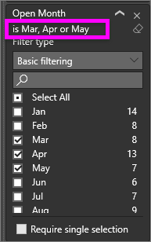
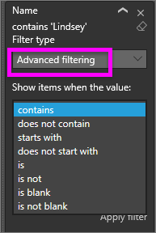
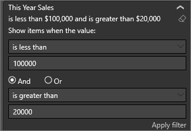

# Take a tour of the report Filters pane

[!INCLUDE[consumer-appliesto-yyny](../includes/consumer-appliesto-yyny.md)]

This article explains how to use the report **Filters** pane in the Power BI service. You can use filters to discover new insights in your data.

There are many different ways to filter data in Power BI. For example, you can filter data by selecting data points on a report visual to filter other visuals on the page&mdash;this is called **cross-filtering** and **cross-highlighting**. For more information, see [How visuals cross-filter each other in a Power BI report](end-user-interactions.md).

 :::image type="content" source="media/end-user-report-filter/power-bi-report.png" alt-text="Screenshot of a report open in the Power BI service with the Filters pane selected.":::

## Work with the report Filters pane

When a colleague shares a report with you, make sure to look for the **Filters** pane. Sometimes it's collapsed along the right edge of the report. Select the Filers pane to expand it.

 :::image type="content" source="media/end-user-report-filter/power-bi-expand-filters-pane.png" alt-text="Screenshot of a report open in the Power BI service with the Filters pane expanded.":::

The **Filters** pane contains filters that the report *designer* adds to the report. *Business users* can interact with the existing filters and save changes. However, they can't add new filters to the report. In the previous example, the designer added three page-level filters: **Segment is All**, **Year is 2014**, and **Region is Central**. You can interact and change these filters, but you can't add a fourth page-level filter.

Some of the filters are shaded, and some aren't. If a filter is shaded, it means a filter has been applied, and some data is excluded. In the following example, the **Region** filter card is shaded and expanded. The **Central** option is the only option selected from the dropdown. Since Region is under the **Filters on this page** heading, all visuals on this page aren't displaying. The data from **West** and **East** regions are excluded.

:::image type="content" source="media/end-user-report-filter/power-bi-filter-region.png" alt-text="Screenshot of the Region filter expanded, and the Central option selected.":::

In the Power BI service, reports keep any changes you make in the **Filters** pane. The service carries those changes through to the mobile version of the report.

To reset the **Filters** pane to the designer's defaults, select the **Reset** icon from the top menu bar.

:::image type="content" source="media/end-user-report-filter/power-bi-reset-icon.png" alt-text="Screenshot of the top menu bar with the Reset to default icon selected.":::

> [!NOTE]
> If you don't see the **Reset to default** option, the report *designer* might have disabled it. The *designer* can lock specific filters so that you can't change them.

## View all the filters for a report page

The **Filters** pane displays all filters added by the designer to the report. The **Filters** pane is also the area where you can view information about the filters and interact with them. You can save changes or use **Reset to default** to revert to the original filter settings.

If there are changes you'd like to save, you can also create a personal bookmark. For more information, see [Bookmarks in the Power BI service](end-user-bookmarks.md).

The **Filters** pane displays and manages several types of report filters: report, report page, and visual.

In the following example, you can see a visual that has three filters: **Manufacturer**, **Month**, and **Total units**. The report page also has filters listed under the **Filters on this page** heading. The entire report has a filter for **Date**, listed under **Filters on all pages**.

:::image type="content" source="media/end-user-report-filter/power-bi-filter-pane.png" alt-text="Screenshot of a report with a visualization and its filters displayed.":::

Some of the filters have **(All)** next to them. **(All)** means all values are being included in the filter. In the previous screenshot, **Segment(All)** tells us this report page includes data about all the product segments.

Anyone with permissions to view this report can interact with these filters.

### View filters applied to a visual

To get a closer look at the filters affecting a specific visual, hover over the visual to reveal the filter icon :::image type="icon" source="media/end-user-report-filter/power-bi-filter-icon.png":::. Select that filter icon to see a pop-up window with all the filters and slicers affecting that visual. The filters in the pop-up window are the same filters displayed on the **Filters** pane, plus any other filters affecting the selected visual.

 :::image type="content" source="media/end-user-report-filter/power-bi-filters-hover.png" alt-text="Screenshot of a pop-up with all the filters numbered to match the corresponding filter in the Filter pane.":::

Types of filters in the pop-up window include:

- Basic filters
- Slicers
- Cross-highlighting
- Cross-filtering
- Advanced filters
- Top N filters
- Relative Date filters
- Sync-slicers
- Include/Exclude filters
- Filters passed through a URL

In this example:

1. **Date** is a filter applied to all pages in this report.

1. **Manufacturer is VanArsdel, Natura, Aliqui, or Pirum** is a filter applied to this visual.

1. **Region is Central** and **Year is 2014** are filters applied to this report page.

1. **Year** is a filter applied on this report page.

### Search in a filter

Sometimes a filter can have a long list of values. Use the search box to find and select the value you want.

:::image type="content" source="media/end-user-report-filter/power-bi-search-filter.png" alt-text="Screenshot of an expanded filter with the search box selected.":::

### Display filter details

To understand a filter, expand it and look at the available values and counts. To expand the filter, select the arrow next to the filter name.
  
:::image type="content" source="media/end-user-report-filter/power-bi-filters-expand.png" alt-text="Screenshot of an expanded filter and the arrow next to the filter name highlighted.":::

### Change filter selections

One way to search for data insights is to interact with the filters. You can change filter selections by using the drop-down arrow next to the field name. Depending on the filter and type of data that Power BI is filtering, your options range from simple selections from a list, to identifying ranges of dates or numbers. See the advanced filter example. Notice the change in the **Total Units YTD** filter on the treemap between 2,000 and 3,000. This change removes Pirum and VanArsdel from the treemap.
  
 :::image type="content" source="media/end-user-report-filter/power-bi-treemap-filter.png" alt-text="Screenshot of a report with the filter that shows the treemap visual selected.":::

> [!TIP]
> To select more than one filter value at a time, hold down the **CTRL** key. Most filters support multi-select.

### Reset filter to default

If you don't want to keep the changes you've made to the filters, select the **Reset** icon from the top menu bar. This selection reverts the filters to their original state, as set by the report designer.

:::image type="content" source="media/end-user-report-filter/power-bi-reset-icon.png" alt-text="Screenshot of the top menu bar with the Reset to default option selected.":::

### Clear a filter

To reset a filter to (All), clear it by selecting the eraser icon next to the filter name.

 :::image type="content" source="media/end-user-report-filter/power-bi-erase.png" alt-text="Screenshot of a report with the Filters pane expanded and the eraser icon selected.":::
  
<!--  too much detail for consumers

## Types of filters: text field filters
### List mode
Ticking a checkbox either selects or deselects the value. The **All** checkbox can be used to toggle the state of all checkboxes on or off. The checkboxes represent all the available values for that field.  As you adjust the filter, the restatement updates to reflect your choices. 

Note how the restatement now says "is Mar, Apr or May".

### Advanced mode
Select **Advanced Filtering** to switch to advanced mode. Use the dropdown controls and text boxes to identify which fields to include. By choosing between **And** and **Or**, you can build complex filter expressions. Select the **Apply Filter** button when you've set the values you want.  

## Types of filters: numeric field filters
### List mode
If the values are finite, selecting the field name displays a list.  See **Text field filters** &gt; **List mode** above for help using checkboxes.   

### Advanced mode
If the values are infinite or represent a range, selecting the field name opens the advanced filter mode. Use the dropdown and text boxes to specify a range of values that you want to see. 

By choosing between **And** and **Or**, you can build complex filter expressions. Select the **Apply Filter** button when you've set the values you want.

## Types of filters: date and time
### List mode
If the values are finite, selecting the field name displays a list.  See **Text field filters** &gt; **List mode** above for help using checkboxes.   

### Advanced mode
If the field values represent date or time, you can specify a start/end time when using Date/Time filters.  

-->

## Related content

- [How visuals cross-filter each other in a Power BI report](end-user-interactions.md)
