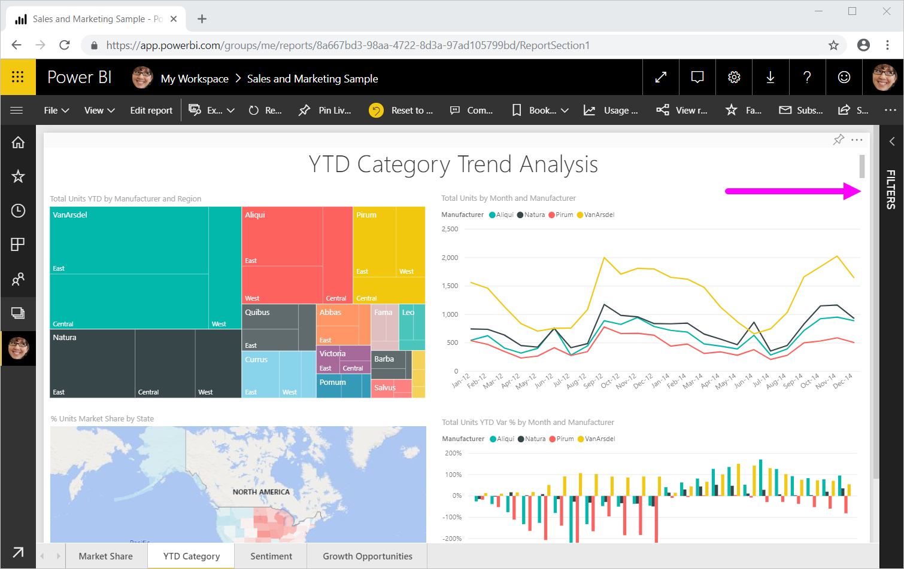
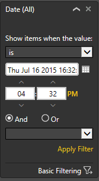

# Take a tour of the report Filters pane

This article takes a look at the report **FILTERS** pane in Power BI service. Use the filters to discover new insights in your data.

There are many different ways to filter data in Power BI. We recommend reading [Filters and highlighting in Power BI reports](../power-bi-reports-filters-and-highlighting.md) first.

## Working with the report Filters pane

When a colleague shares a report with you, be sure to look for the **FILTERS** pane. Sometimes it's collapsed along the right edge of the report. Select it to expand it.

The **FILTERS** pane contains filters that the report *designer* added to the report. *Consumers* like you can interact with the existing filters and save your changes, but you can't add new filters to the report. For example, in the screenshot above the designer added two page level filters: Segment and Year. You can interact and change these filters, but you can't add a third page level filter.

In the Power BI service, reports keep any changes you make in the **Filter** pane. The service carries those changes through to the mobile version of the report. To reset the **Filter** pane to the designer's defaults, select **Reset to default** from the top menu bar.

## View all the filters for a report page

The **FILTERS** pane displays all filters added to the report by the *designer*. The **FILTERS** pane is also the area where you can view information about the filters and interact with them. You can save the changes you make or use the **Reset to default** to revert to the original filter settings.

If there are changes you'd like to save, you can also create a personal bookmark.  For more information, see [What are bookmarks?](end-user-bookmarks.md).

The **Filter** pane displays and manages several types of report filters. They can be applied to a visual, to a report page, and to the entire report.

In this example, we've selected a visual that has two filters. The report page also has filters, listed under the **Filters on this page** heading. And the entire report has a filter for Date.

Some of the filters have **(All)** next to them. **(All)** means all values are being included in the filter. In the screenshot above, **Segment(All)** tells us this report page includes data about all the product segments. If you select the **Region is West** page level filter, the report page only includes data for the West region.

Anyone viewing this report can interact with these filters.

### Search in a filter

Sometimes a filter can have a long list of values. Use the search box to find and select the value you want.

### Display filter details

To understand a filter, take a look at the available values and counts.  View the details of the filter by hovering and selecting the arrow next to the filter name.
  

### Change filter selections

One way to search for data insights is to interact with the filters. You can change filter selections using the dropdown arrow next to the field name.  Depending on the filter and type of data that Power BI is filtering, your options will range from simple selections from a list to identifying ranges of dates or numbers. In the advanced filter below, we've changed the **Total Units YTD** filter on the treemap to be between 2,000 and 3,000. Notice that this change removes Prirum from the treemap.
  

> [!TIP]
> To select more than one filter value at a time, hold down the CTRL key. Most filters support multi-select.

### Reset filter to default

If you want to back out of all changes you've made to the filters, select **Reset to default** from the top menu bar.  This selection reverts the filters to their original state, as set by the report *designer*.

### Clear a filter

If there's just one filter that you'd like to set to **(All)**, clear it by selecting the eraser icon  next to the filter name.
  
<!--  too much detail for consumers

## Types of filters: text field filters
### List mode
Ticking a checkbox either selects or deselects the value. The **All** checkbox can be used to toggle the state of all checkboxes on or off. The checkboxes represent all the available values for that field.  As you adjust the filter, the restatement updates to reflect your choices. 

Note how the restatement now says "is Mar, Apr or May".

### Advanced mode
Select **Advanced Filtering** to switch to advanced mode. Use the dropdown controls and text boxes to identify which fields to include. By choosing between **And** and **Or**, you can build complex filter expressions. Select the **Apply Filter** button when you've set the values you want.  

## Types of filters: numeric field filters
### List mode
If the values are finite, selecting the field name displays a list.  See **Text field filters** &gt; **List mode** above for help using checkboxes.   

### Advanced mode
If the values are infinite or represent a range, selecting the field name opens the advanced filter mode. Use the dropdown and text boxes to specify a range of values that you want to see. 

By choosing between **And** and **Or**, you can build complex filter expressions. Select the **Apply Filter** button when you've set the values you want.

## Types of filters: date and time
### List mode
If the values are finite, selecting the field name displays a list.  See **Text field filters** &gt; **List mode** above for help using checkboxes.   

### Advanced mode
If the field values represent date or time, you can specify a start/end time when using Date/Time filters.  

-->

## Next steps

Learn how and why {visuals cross-filter and cross-highlight each other on a report page](end-user-interactions.md)