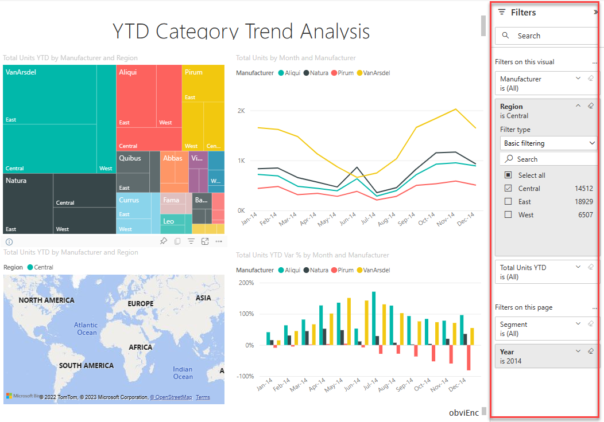
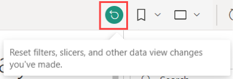
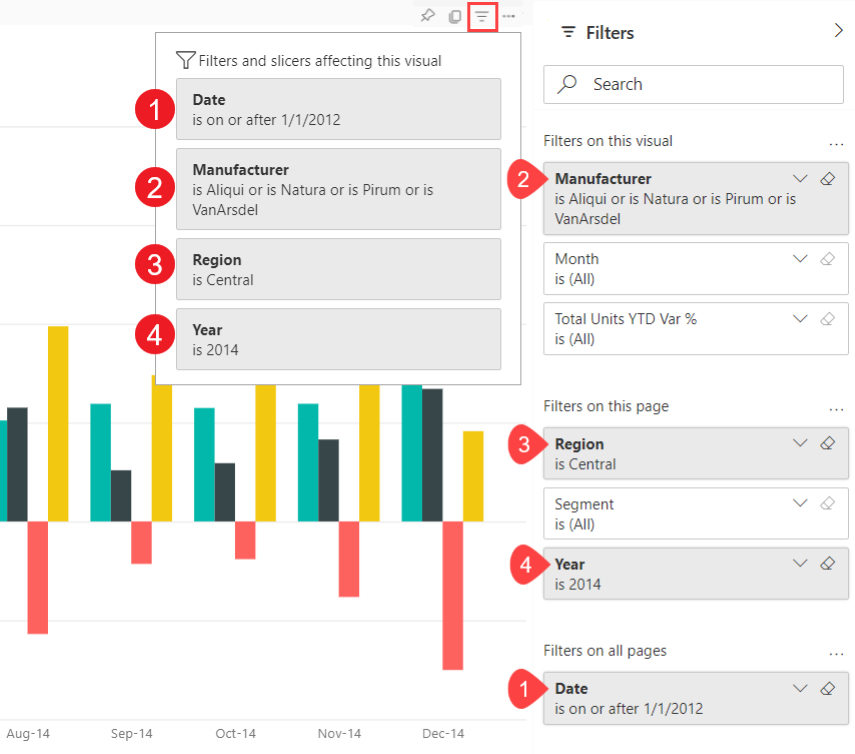

# Take a tour of the report Filters pane

[!INCLUDE[consumer-appliesto-yyny](../includes/consumer-appliesto-yyny.md)]

This article takes a look at the report **Filters** pane in the Power BI service. Use the filters to discover new insights in your data.

There are many different ways to filter data in Power BI. This article explains how to use the **Filters** pane.  You can also filter by selecting data points on a report visual to filter the other visuals on the page -- this is referred to as **cross-filtering** and **cross-highlighting**. For more information about cross-filtering and cross-highlighting, see [How visuals cross-filter each other in a Power BI report](end-user-interactions.md).

## Working with the report Filters pane

When a colleague shares a report with you, be sure to look for the **Filters** pane. Sometimes it's collapsed along the right edge of the report. Select it to expand it.

The **Filters** pane contains filters that the report *designer* added to the report. *Business users* like you can interact with the existing filters and save your changes, but you can't add new filters to the report. For example, in the screenshot above the designer added three page level filters: **Segment is All**, **Year is 2014**, and **Region is Central**. You can interact and change these filters, but you can't add a fourth page level filter.

Some of the filters are shaded, and some are not. If a filter is shaded, that means a filter has been applied and some data is being excluded. For example, the **Region** filter card is shaded, and when you expend the card you see that only **Central** is selected from the dropdown. Since Region is under the **Filters on this page** heading, all visuals on this page are not displaying (excluding) data for the **West** and **East** regions.

In the Power BI service, reports keep any changes you make in the **Filters** pane. The service carries those changes through to the mobile version of the report. 

To reset the **Filters** pane to the designer's defaults, select the **Reset** icon from the upper menu bar.

 

> [!NOTE]
> If you don't see the **Reset to default** option, it may have been disabled by the report *designer*. The *designer* can also lock specific filters so that you can't change them.

## View all the filters for a report page

The **Filters** pane displays all filters added by the designer to the report. The **Filters** pane is also the area where you can view information about the filters and interact with them. Save changes you make or use **Reset to default** to revert to the original filter settings.

If there are changes you'd like to save, you can also create a personal bookmark. For more information, see [What are bookmarks?](end-user-bookmarks.md).

The **Filters** pane displays and manages several types of report filters: report, report page, and visual.

In this example, we've selected a visual that has three filters: **Manufacturer**, **Month**, and **Total units**. The report page also has filters, listed under the **Filters on this page** heading. And, the entire report has a filter for **Date**, listed under **Filters on all pages**.

Some of the filters have **(All)** next to them. **(All)** means all values are being included in the filter. In the screenshot above, **Segment(All)** tells us this report page includes data about all the product segments. 

Anyone with permissions to view this report can interact with these filters.

### View only those filters applied to a visual

To get a closer look at the filters affecting a specific visual, hover over the visual to reveal the filter icon . Select that filter icon to see a pop-up with all the filters, slicers, and so on, affecting that visual. The filters on the pop-up include the same filters displayed on the **Filters** pane, plus any additional filtering affecting the selected visual.

Here are the types of filters this view can display:

- Basic filters
- Slicers
- Cross-highlighting
- Cross-filtering
- Advanced filters
- Top N filters
- Relative Date filters
- Sync-slicers
- Include/Exclude filters
- Filters passed through a URL

In this example:
1. **Included** tells us that the visual has been cross-filtered. What this means is that the states of Alabama and Texas have been selected on one of the other visuals on this report page. In this case, it's the map visual. The selection of those two states has eliminated data for all other states from displaying on the selected bar chart.  

1. **Date** is a filter applied to all pages in this report.

1. **Region is Central** and **Year is 2014** are filters applied to this report page.

4. **Manufacturer is VanArsdel, Natura, Aliqui, or Pirum** is a filter applied to this visual.

### Search in a filter

Sometimes a filter can have a long list of values. Use the search box to find and select the value you want.

### Display filter details

To understand a filter, expand it and take a look at the available values and counts.  To expand the filter, select the arrow next to the filter name.
  

### Change filter selections

One way to search for data insights is to interact with the filters. You can change filter selections using the drop-down arrow next to the field name.  Depending on the filter and type of data that Power BI is filtering, your options will range from simple selections from a list, to identifying ranges of dates or numbers. In the advanced filter below, we've changed the **Total Units YTD** filter on the treemap to be between 2,000 and 3,000. Notice that this change removes Pirum and VanArsdel from the treemap.
  

> [!TIP]
> To select more than one filter value at a time, hold down the CTRL key. Most filters support multi-select.

### Reset filter to default

If you want to back out of all changes you've made to the filters, select the **Reset** icon from the top menu bar.  This selection reverts the filters to their original state, as set by the report designer.

### Clear a filter

To reset a filter to (All), clear it by selecting the eraser icon next to the filter name.

  
<!--  too much detail for consumers

## Types of filters: text field filters
### List mode
Ticking a checkbox either selects or deselects the value. The **All** checkbox can be used to toggle the state of all checkboxes on or off. The checkboxes represent all the available values for that field.  As you adjust the filter, the restatement updates to reflect your choices. 

Note how the restatement now says "is Mar, Apr or May".

### Advanced mode
Select **Advanced Filtering** to switch to advanced mode. Use the dropdown controls and text boxes to identify which fields to include. By choosing between **And** and **Or**, you can build complex filter expressions. Select the **Apply Filter** button when you've set the values you want.  

## Types of filters: numeric field filters
### List mode
If the values are finite, selecting the field name displays a list.  See **Text field filters** &gt; **List mode** above for help using checkboxes.   

### Advanced mode
If the values are infinite or represent a range, selecting the field name opens the advanced filter mode. Use the dropdown and text boxes to specify a range of values that you want to see. 

By choosing between **And** and **Or**, you can build complex filter expressions. Select the **Apply Filter** button when you've set the values you want.

## Types of filters: date and time
### List mode
If the values are finite, selecting the field name displays a list.  See **Text field filters** &gt; **List mode** above for help using checkboxes.   

### Advanced mode
If the field values represent date or time, you can specify a start/end time when using Date/Time filters.  

-->

## Next steps

Learn how and why [visuals cross-filter and cross-highlight each other on a report page](end-user-interactions.md)
