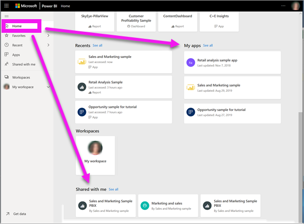
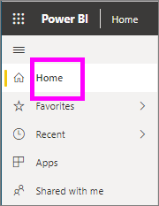
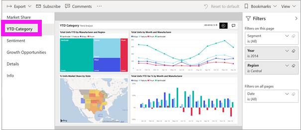
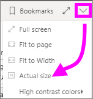
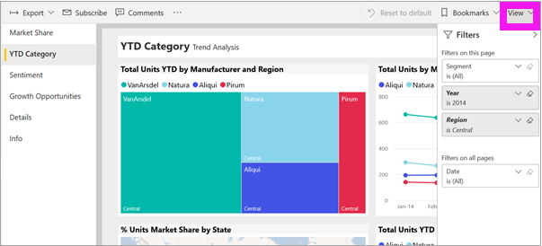
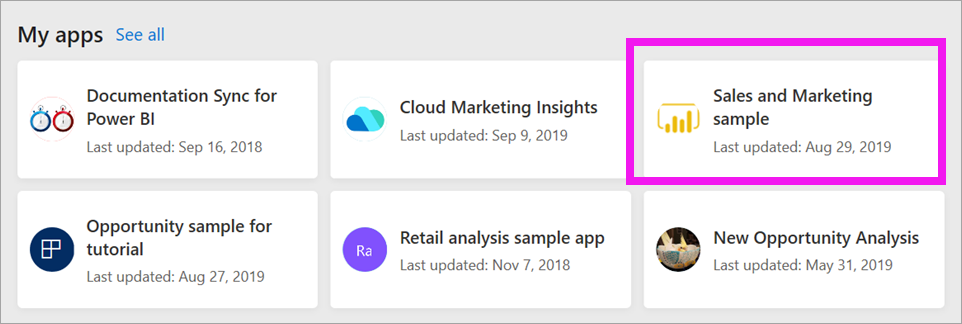
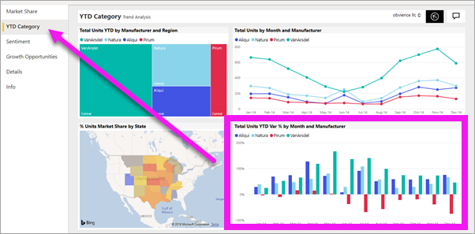

# View a report in the Power BI service for *consumers*

[!INCLUDE [power-bi-service-new-look-include](../includes/power-bi-service-new-look-include.md)]

A report is one or more pages of visuals. Reports are created by Power BI *designers* and [shared with *consumers* directly](end-user-shared-with-me.md) or as part of an [app](end-user-apps.md). 

There are many different ways to open a report and we'll show you two of them: open from Home and open from a dashboard. 

<!-- add art-->

## Open a report from Power BI Home
Let's open a report that's been shared with you directly and then open a report that was shared as part of an app.

   

### Open a report that has been shared with you
Power BI *designers* can share an individual report directly with you via a link in email or by adding it automatically. Content that is shared this way shows up in the **Shared with me** container on your nav pane and in the **Shared with me** section of your Home canvas.

1. Open the Power BI service (app.powerbi.com).

2. From the nav pane, select **Home** to display your Home canvas.  

   
   
3. Scroll down until you see **Shared with me**. Look for the report icon . In this screenshot we have one dashboard and one report named *Sales and marketing sample*. 
   
   

4. Simply select the report *card* to open the report.

   

5. Notice the tabs along the left side.  Each tab represents a report *page*. We currently have the *Growth Opportunity* page open. Select the *YTD Category* tab to open that report page instead. 

   

6. Notice the **Filters** pane along the right side. Filters that have been applied to this report page, or to the entire report, are displayed here.

7. Hovering over a report visual reveals several icons and **More options** (...). To see the filters applied to a specific visual, select the filter icon. Here we've selected the filter icon for the *Total units by rolling period and region* line chart.

   

6. Right now we're seeing the entire report page. To change the display (zoom) of the page, select the View dropdown from the upper right corner and choose **Actual size**.

   

   

### Open a report that is part of an app
If you've received apps from colleagues or from AppSource, those apps are available from Home and from the **Apps** container on your nav pane. An [app](end-user-apps.md) is a bundle of dashboards and reports.

### Prerequisites
To follow along, download the Sales and Marketing app.
1. In your browser, navigate to appsource.microsoft.com.
1. Search for "Sales and Marketing" and select **Microsoft sample - Sales & Marketing**.
1. Select **Get it now** > **Continue** > **Install** to install the app in your Apps container. 

You can open the app from your Apps container or from Home.
1. Go back to Home by selecting **Home** from the nav pane.

7. Scroll down until you see **My Apps**.

   

8. Select your new Sales and marketing app to open it. Depending on the options set by the app *designer*, the app will open either a dashboard or a report. This app opens to a dashboard.  

## Open a report from a dashboard
Reports can be opened from a dashboard. Most dashboard [tiles](end-user-tiles.md) are *pinned* from reports. Selecting a tile opens the report that was used to create the tile. 

1. From the dashboard, select a tile. In this example we've selected the "Total Units YTD..." column chart tile.

    

2.  The associated report opens. Notice that we're on the "YTD Category" page. This is the report page that contains the column chart we selected from the dashboard.

    

> [!NOTE]
> Not all tiles lead to a report. 
>If you select a tile that was [created with Q&A](end-user-q-and-a.md), the Q&A screen will open. 
>If you select a tile that was [created using the dashboard **Add tile** widget](../service-dashboard-add-widget.md), several different things may happen: a video may play, a website open, and more.  

##  Still more ways to open a report
As you get more comfortable navigating the Power BI service, you'll figure out workflows that work best for you. A few other ways to access reports:
- From the nav pane using **Favorites** and **Recent**    
- Using [View related](end-user-related.md)    
- In an email, when someone [shares with you](../service-share-reports.md) or you [set an alert](end-user-alerts.md)    
- From your [Notification center](end-user-notification-center.md)    
- From a workspace
- and more

## Next steps
[Open and view a dashboard](end-user-dashboard-open.md)    
[Report filters](end-user-report-filter.md)

