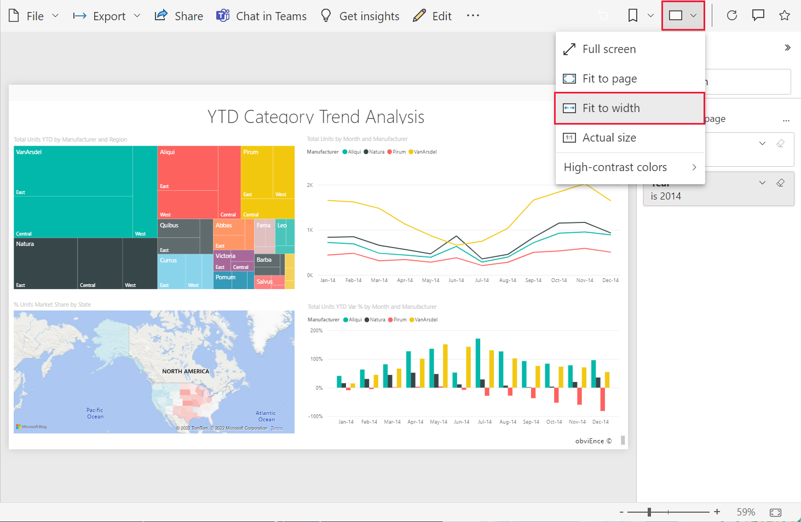

# View a report in the Power BI service for business users

[!INCLUDE[consumer-appliesto-yynn](../includes/consumer-appliesto-yynn.md)]

A Power BI report is a single page or multiple pages of organized visuals. Power BI designers create reports and [share them directly](end-user-shared-with-me.md) with business users, or add them to an [app](end-user-apps.md). To open a report that isn't a Microsoft sample, you need a Power BI Pro license or the report you want to open must be stored in [Premium capacity](end-user-license.md#identify-content-hosted-in-premium-capacity). For more information, see [Licenses and subscriptions for business users](end-user-license.md). You can follow along in this tutorial with a free license.

Explore the following guidance to learn how to open a report from the Browse page or from dashboard.

## Open a report that's been shared with you

Power BI designers can share a report with you by sending an email link or by adding the report to your Power BI content. These reports are located on the **Browse** page under **Shared with me**.

1. Open the Power BI service (app.powerbi.com), and sign in if you're prompted.

    :::image type="content" source="./media/end-user-report-open/power-bi-home-full-screen.png" alt-text="Screenshot showing the Home page of the Power BI service.":::

2. From the navigation pane, select **Browse**, and on the **Browse** page, select **Shared with me**.

    :::image type="content" source="./media/end-user-report-open/power-bi-share.png" alt-text="Screenshot showing the Browse page and Shared with me is outlined.":::

3. The report icon  is displayed next to the report name. Open the **Sales and Market Sample** report.

     :::image type="content" source="./media/end-user-report-open/power-bi-report-sample.png" alt-text="Screenshot showing the Sales and Marketing Sample report from the Shared with me list.":::

4. Notice the tabs along the left side. Each tab represents a report page. Select the **YTD Category** tab to open the **YTD Category Trend Analysis** page.

   

5. Expand the **Filters** pane along the right side. Filters that are applied to this report page, or to the entire report, are displayed here. You can change these filters to see the impact on your visuals and report.

   

6. Hover over a visual to show the actions you can perform. To see the filters applied to a specific visual, select the filter icon.

   

7. To change the display (zoom) of the page, select the **View** dropdown from the upper right corner and choose **Actual size** and then switch to **Fit to width**.

   

   

There are many ways for you to interact with a report to discover insights and make business decisions. Find other articles about Power BI reports in the table of contents on this page.

## Open a report that's in an app

The apps your receive from colleagues are located on the **Home** page and in the **Apps** container on your navigation pane. An [app](end-user-apps.md) is a collection of dashboards and reports that a Power BI designer compiles for you.

To open an app that isn't a Microsoft sample, you need a Power BI Pro license, or the app workspace must be stored in [Premium capacity](end-user-license.md#identify-content-hosted-in-premium-capacity).

You can follow along in this tutorial with a free license.

1. In your browser, navigate to appsource.microsoft.com.
1. Search for "Sales & Marketing" and select **Microsoft sample - Sales & Marketing**. Scroll down to see the search results.
1. Select **Get it now** > **Continue** > **Install** to install the app in your Apps container.

You can now open the app from your **Apps** container or from **Home**.

1. Go back to Home by selecting **Home** from the nav pane.

7. Scroll down and select **My Apps**.

   

8. Select your new *Sales and marketing* app to open it. Depending on the options set by the app *designer*, the app will open either a dashboard or a report. This app opens to a dashboard.  

## Open a report from a dashboard

Reports can be opened from a dashboard. Most dashboard [tiles](end-user-tiles.md) are *pinned* from reports. Selecting a tile opens the report that was used to create the tile.

1. From the dashboard, select a tile. In this example we've selected the *Total Units YTD Var %* column chart tile.

    

2. The associated report opens. Notice that we're on the *YTD Category* page. This is the report page that contains the column chart we selected from the dashboard.

    

> [!NOTE]
> Not all tiles lead to a report.
>If you select a tile that was [created with Q&A](end-user-q-and-a.md), the Q&A screen will open.
>If you select a tile that was [created using the dashboard **Add tile** widget](../create-reports/service-dashboard-add-widget.md), several different things may happen: a video may play, a website open, and more.  

## More ways to open a report

As you get more comfortable navigating the Power BI service, you'll figure out workflows that work best for you. A few other ways to access reports:

- From the nav pane using [Favorites](end-user-favorite.md) and [Recent](end-user-recent.md)
- Using [View related](end-user-related.md)
- In an email, when someone [shares with you](../collaborate-share/service-share-reports.md) or you [set an alert](end-user-alerts.md)
- From your Notification center
- From a workspace
- and more

## Next steps

[Open and view a dashboard](end-user-dashboard-open.md)  
[Report filters](end-user-report-filter.md)
