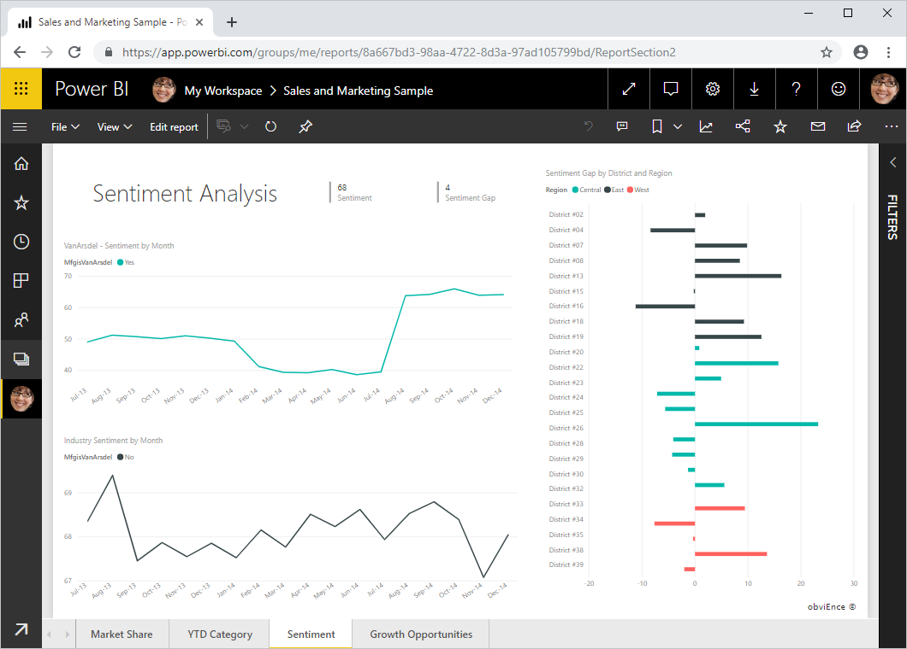
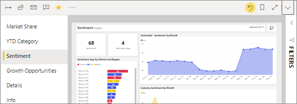
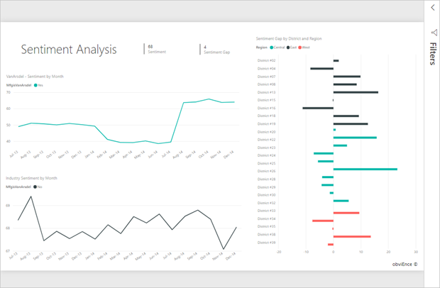

# Change the display of a report page
Reports are viewed on many different devices with varying screen sizes and aspect ratios.  Change the way a report page displays to fit your needs.    

## Explore the View menu
The options in the View menu give you flexibility to display report pages at the size and width you choose.

- Let's say you're viewing a report on a small device and it's hard to see titles and legends.  Select **View** > **Actual size** to increase the size of the report page. Use the scrollbars to move around the report. 

    

- Another option is to fit the report to your screen width by selecting **Fit to width**. This may still require the use of a vertical scrollbar.

  

- If you don't want any scrollbars, but want to make the best use of your screen size.  Select **Fit to Page**.

   

   
- The final option, **Full screen**, displays your report page without menubars and headers. Full screen may be a good choice for small screens where the details are hard to see.  Full screen may also be a good choice when projecting report pages on large screens for people to view but not interact.  

    

When you exit the report, your View settings are not saved, but revert to the default. If it's important to you to save these settings, use [bookmarks](end-user-bookmarks.md). 

## Next steps
[Create reports for Cortana](../service-cortana-answer-cards.md)
