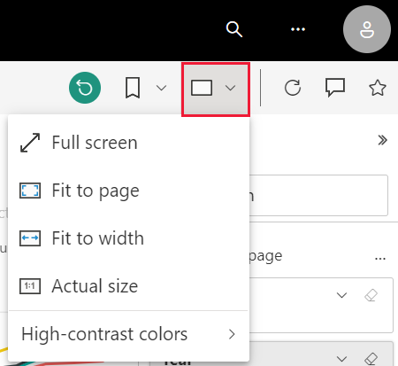
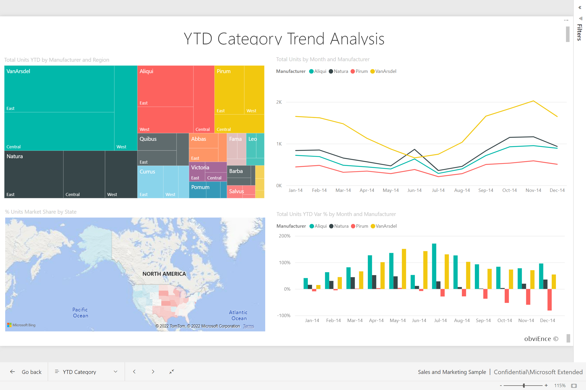

# Change the display of a report page

[!INCLUDE[consumer-appliesto-yyny](../includes/consumer-appliesto-yyny.md)]

People view reports on many different devices with varying screen sizes and aspect ratios. Change the way a report page displays to fit your needs.

## Explore the View menu

The options in the **View** menu give you flexibility to display report pages at the size and width you choose:

- Let's say you're viewing a report on a small device and it's hard to see titles and legends.  Select **View** > **Actual size** to increase the size of the report page. Use the scroll bars to move around the report.

    

- Another option is to fit the report to your screen width by selecting **Fit to width**. Since it's just the width and not the height, you may still need to use the vertical scroll bar.

  

- If you don't want any scroll bars, but want to make the best use of your screen size, select **Fit to Page**.

   

- You can also choose from four **High contrast colors**: High contrast #1, High contrast #2, High contrast black, and High contrast white. It's an accessibility feature that you can use so people who may have impaired vision can see the reports better. The example below is high contrast 1. 

    

- The final option, **Full screen**, displays your report page without menu bars and headers. Full screen may be a good choice for small screens where the details are hard to see.  Full screen may also be a good choice when projecting report pages on large screens for people to view but not interact.  

    

When you exit the report, your **View** settings aren't saved, but revert to the default. If it's important to you to save these settings, use [bookmarks](end-user-bookmarks.md).

## Use your browser to change page display

The zoom controls in your browser increase and decrease the available canvas area. Decreasing the zoom causes the available canvas area to expand, and vice versa. 

Resizing your entire browser is another way to change the display size of your report. 

## Zoom in on a visual
Sometimes it's difficult to see the details in a visual. You can make that visual display bigger, and by itself. For more information, see [Focus mode and Full screen mode](end-user-focus.md)

### A visual in *Focus* mode

### A visual in *Full screen* mode

## Next steps

* [Take a tour of the report Filters pane](end-user-report-filter.md)