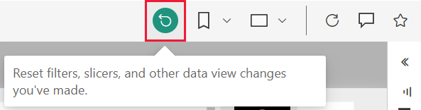

# Reports in Power BI

[!INCLUDE[consumer-appliesto-yynn](../includes/consumer-appliesto-yyn.md)]

A Power BI report is a multi-perspective view into a dataset, with visuals that represent different findings and insights from that dataset.  A report can have a single visual or pages full of visuals. Depending on your job role, you may be someone who *designs* reports. You also may be a *business user* who *consumes* or uses reports. This article is for *business users*.

## The parts of a report

A. This report has four pages (or tabs) and you're currently viewing the **Sentiment** page.    
B. On this page are five different visuals and a page title.    
C. The *Filters* pane shows us one filter applied to all report pages. To collapse the Filters pane, select the arrow (**>**).    
D. The Power BI banner displays the name of the report and the last updated date. Select the arrow to open a menu that also show the name of the report owner.    
E. The action bar contains actions you can take on this report.  For example, you can add a comment, view a bookmark, or export data from the report.  Select **More options** (...) to reveal a list of additional report functionality.    

If you're new to Power BI, you can get a good foundation by reading [Basic concepts for the Power BI service business users](end-user-basic-concepts.md). Reports are available for viewing, sharing, and annotating on mobile devices. For more info, see [Explore reports in the Power BI mobile apps](mobile/mobile-reports-in-the-mobile-apps.md).

## Advantages of reports

Power BI bases a report on a single dataset. Report *designers* create the visuals in a report to represent nuggets of information. The visuals aren't static.  They update as the underlying data changes. You can interact with the visuals and filters as you dig into the data to discover insights and look for answers. Like a dashboard, but more so, a report is highly interactive and highly customizable. The extent of what you can do with a report will depend on the role and permissions assigned by the report *designer*.

### Safely interact with content

As you explore and interact with your content: filtering, slicing, subscribing, and exporting, you can't break the reports. Your work doesn't affect the underlying dataset or the original shared content. This applies to dashboards, reports, and apps.

> [!NOTE]
> Remember, you can't hurt your data. The Power BI service is a great place for you to explore and experiment without worrying that you'll break something.

### Save your changes or revert to the default settings

That doesn't mean you can't save your changes. You can, but those changes only affect your view of the content. To revert to the original default view of the report, select the **Reset** icon.

## Dashboards versus reports

[Dashboards](end-user-dashboards.md) are often confused with reports since they're also canvases filled with visuals. But there are some major differences.  

| **Capability** | **Dashboards** | **Reports** |
| --- | --- | --- |
| Pages |One page |One or more pages |
| Data sources |One or more reports and one or more datasets per dashboard |A single dataset per report |
| Filtering |Can't filter or slice |Many different ways to filter, highlight, and slice |
| Set alerts |Can create alerts to email you when the dashboard meets certain conditions |No |
| Feature |Can set one dashboard as your featured dashboard |Can't create a featured report |
| Can see underlying dataset tables and fields |No. Can export data but can't see the dataset tables and fields in the dashboard itself |Yes. Can see dataset tables and fields and values that you have permissions to see |
| Customization |No  |Can filter, export, view related content, add bookmarks, generate QR codes, analyze in Excel, and more |

<!--| Available in Power BI Desktop |No |Yes, can create and view reports in Desktop |
| Pinning |Can pin existing visuals (tiles) only from current dashboard to your other dashboards |Can pin visuals (as tiles) to any of your dashboards. Can pin entire report pages to any of your dashboards. | -->

## Report designers and report users

Depending on your role, you may be a *designer*, someone who creates reports for your own use or to share with colleagues. You'll want to learn how to create and share reports.

Or you may be a *business user*, someone who receives reports from others. You'll want to learn how to understand and interact with the reports. If you're a report *business user*, these links are for you:

* Start with a [tour of the Power BI service](end-user-basic-concepts.md) so you know where to find reports and report tools.
* Learn how to [open a report](end-user-report-open.md) and all the [interactions available to business users](end-user-reading-view.md).
* Get comfortable with reports by taking a tour of one of our [samples](../create-reports/sample-tutorial-connect-to-the-samples.md).  
* To see which dataset the report is using and which dashboards are displaying visuals from the report (*pins*), see [View related content in the Power BI service](end-user-related.md).

> [!TIP]
> If you didn't find what you're looking for here, use the Table of Contents to the left to browse all *Report* articles.

## Next steps

[Open and view a report](end-user-report-open.md)    
[Dashboards in the Power BI service](end-user-dashboards.md)

