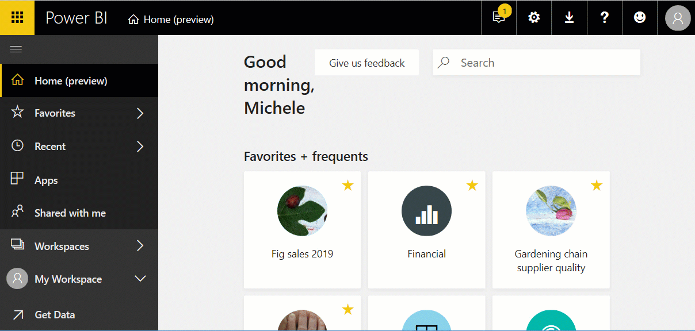
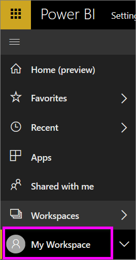
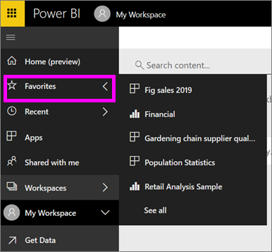

# Navigation: searching, finding, and sorting content in Power BI service
There are many ways to navigate your content in Power BI service. The content is organized within your workspace by type: dashboards, reports, workbooks, and datasets.  And the content is also organized by usage: favorites, recent, apps, shared with me, and featured. For one stop navigation, the Home page organizes content all on one page. These different pathways into your content allow you to quickly find what you need in Power BI service.  

## Navigation within workspaces

Power BI *consumers* typically have only one workspace: **My workspace**. **My workspace** will only have content if you've downloaded Microsoft samples or created or downloaded your own content.  

Within **My workspace**, Power BI service separates your content by type: dashboards, reports, workbooks, and datasets. You'll see this organization when you select a workspace. In this example, **My workspace** contains one dashboards, two reports, no workbook, and two datasets.

________________________________________

## Navigation using the left navbar
The left nav bar classifies your content in ways that make it even easier to find what you need, quickly.  

- Content that is shared with you is available in **Shared with me**.
- Your last-viewed content is available in **Recent**. 
- Your apps can be found by selecting **Apps**.
- **Home** is a single page view of your most important content and suggested content and learning sources.

Additionally, you can tag content as [favorite](end-user-favorite.md) and [featured](end-user-featured.md). Pick the one dashboard that you expect to view most often, and set it as your *featured* dashboard. Each time you open Power BI service, your featured dashboard will display first. Do you have a number of dashboards and apps that you visit often? By setting them as favorites, they'll always be available from your left navbar.

.

## Considerations and troubleshooting
* For datasets, **Sort by** isn't available by owner.

## Next steps
[Power BI - Basic Concepts](end-user-basic-concepts.md)

More questions? [Try the Power BI Community](http://community.powerbi.com/)
