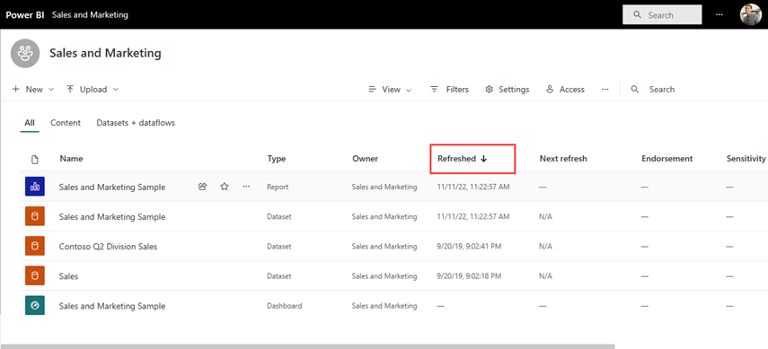

# Navigation for Power BI business users: global search

[!INCLUDE[consumer-appliesto-yyny](../includes/consumer-appliesto-yyny.md)]

When you're new to the Power BI service, you'll have only a few pieces of content (dashboards, reports, apps). But as colleagues begin sharing content with you and you begin downloading apps, you may end up with long lists of content. That's when you'll find searching and sorting extremely helpful.

## Searching for content
 Search is available from almost every part of the Power BI service. Just look for the search box or search icon .

 In the Search field, type all or part of the name of a dashboard, report, workbook, workspace, app, or owner. Power BI searches all of your content. 

  

 In some areas of Power BI, such as workspaces, you'll find two different search fields. The search field in the menu bar searches all of your content while the search field on the workspace canvas searches only that workspace.

  

## Sorting content lists

If you only have a few pieces of content, sorting may not be necessary.  But when you have long lists of dashboards and reports, sorting will help you find what you need. For example, this **Shared with me** content list has 29 items. 

Right now, this content list is sorted alphabetical by name, from Z to A. To change the sort criteria, select the arrow to the right of **Name (A-Z)**.

Sorting is also available in workspaces. In this example, the content is sorted by **Refreshed** date. To set sorting criteria for workspaces, select column headers and select again to change sorting direction. 

Not all columns can be sorted. Hover over the column headings to discover which can be sorted.

## Filtering content lists
Another way to locate content quickly is by using the content list **Filters**. Display the filters by selecting **Filters** from the upper right corner. The filters available will depend on your location in the Power BI service.  The example below is from a **Recent** content list.  It allows you to filter the list by content type.  On a **Shared with me** content list, the **Filters** available include Owner as well as content type.

## Next steps
[Sort visuals in reports](end-user-change-sort.md)

[Sorting data in visuals](end-user-change-sort.md)

More questions? [Try the Power BI Community](https://community.powerbi.com/)
