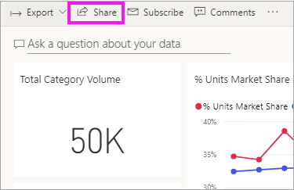
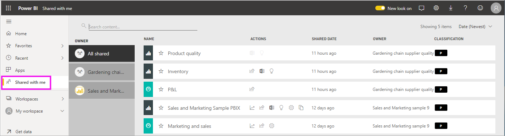
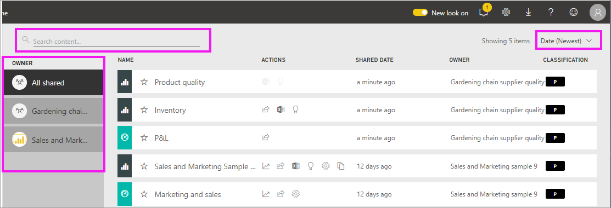

# Display the dashboards and reports that have been shared with me

[!INCLUDE [power-bi-service-new-look-include](../includes/power-bi-service-new-look-include.md)]

When a colleague shares content with you, using the **Share** button, it appears in your **Shared with me** container. The dashboard or report is only available from **Shared with me** and not available from **Apps**.

Watch Amanda explain the **Shared with me** content list and demonstrate how to navigate and filter the list. Then follow the step-by-step instructions below the video to try it out yourself. For you to view dashboards shared with you, you need to have a Power BI Pro license. Read [What is Power BI Premium?](../service-premium-what-is.md) for details.
    

> [!NOTE]
> This video uses an older version of the Power BI service.
    

<iframe width="560" height="315" src="https://www.youtube.com/embed/G26dr2PsEpk" frameborder="0" allowfullscreen></iframe>

## Interact with shared content

You'll have options for interacting with the shared dashboards and  reports, depending on the permissions the *designer* gives you. These include being able to make copies of the dashboard, open the report [in Reading view](end-user-reading-view.md), and re-share with other colleagues.

### Actions available from the **Shared with me** container
The actions available to you will depend on the settings assigned by the content *designer*. Some of your options may include:
* Select the star icon to [favorite a dashboard or report](end-user-favorite.md) .
* Remove a dashboard or report  .
* Some dashboards and reports can be re-shared  .
* [Open the report in Excel](end-user-export.md)  
* [View insights](end-user-insights.md) that Power BI finds in the data .
  
  > [!NOTE]
  > For information about EGRC classifications, select the **Classification** button or [visit Dashboard data classification](../service-data-classification.md).
  > 

## Search and sort shared dashboards
If your content list gets long, you have several options for finding what you need. You can use the search field, sort by date, or you can select from the **Owner** column.    

