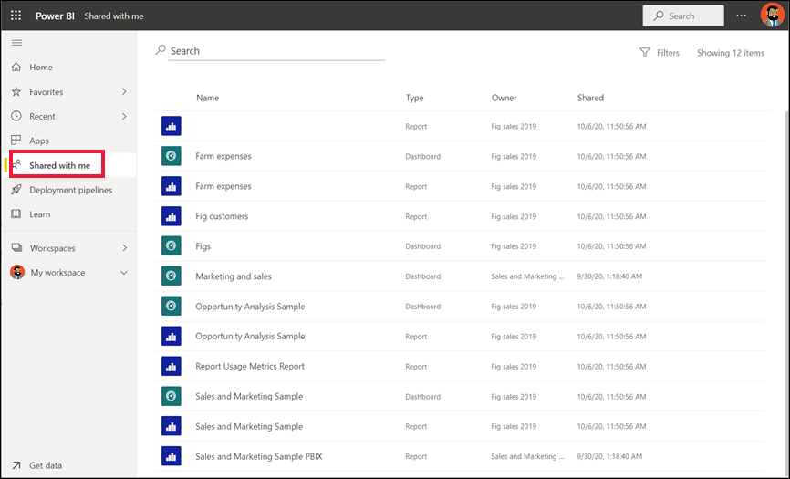
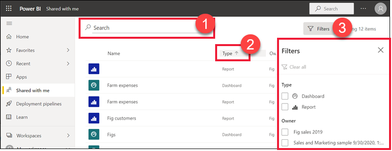

# Display the dashboards and reports that have been shared with me

[!INCLUDE[consumer-appliesto-yyny](../includes/consumer-appliesto-yyny.md)]

When a colleague shares a dashboard or a report with you, it appears in your **Shared with me** container. When a colleague shares an app with you, the app appears in your **Apps** container, and the app's reports and dashboards appear in your **Shared with me** container.   

Watch Amanda explain the **Shared with me** content list and demonstrate how to navigate and filter the list. Then follow the step-by-step instructions below the video to try it out yourself. For you to view dashboards shared with you, you need to have a Power BI Pro or Premium Per User (PPU) license. Read [What is Power BI Premium?](../admin/service-premium-what-is.md) for details.
    

> [!NOTE]
> This video uses an older version of the Power BI service.
    

<iframe width="560" height="315" src="https://www.youtube.com/embed/G26dr2PsEpk" frameborder="0" allowfullscreen></iframe>

## Interact with shared content

You'll have options for interacting with the shared dashboards and reports, depending on the permissions the *designer* gives you. These include being able to make copies of the dashboard, subscribe, open the report [in Reading view](end-user-reading-view.md), and re-share with other colleagues. Select a dashboard or report to open it.

## Search and sort shared dashboards and reports
If your **Shared with me** content list gets long, you have several options for finding what you need. Use the search field (1), sort by one of the columns (2), or use the Filters pane. To open the Filters pane, select **Filters** from the upper right corner.    

