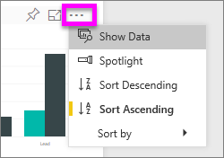
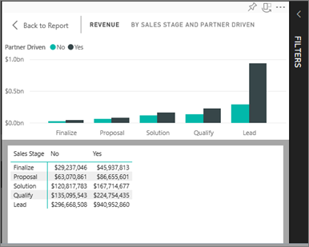
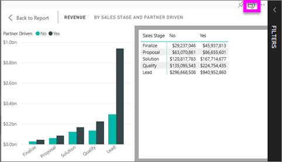

# Show the data that was used to create the visualization
## Show data in Reading view
A Power BI visualization is constructed using data from underlying datasets. If you're interested in seeing behind-the-scenes, Power BI lets you *display* the data that is being used to create the visual. When you select **Show Data**, Power BI displays the data below (or next to) the visualization.

## Using *Show Data* in Power BI service Reading view
1. In Power BI service, open a report (in Reading view) and select a visual.  
2. To display the data behind the visual, select the ellipsis (...) and choose **Show data**.
   
   
3. By default, the data displays below the visual.
   
   

4. To change the orientation, select vertical layout  from the top-right corner of the visualization.
   
   

## Next steps
[Visualizations in Power BI reports](../visuals/power-bi-report-visualizations.md)    
[Power BI reports](end-user-reports.md)    
