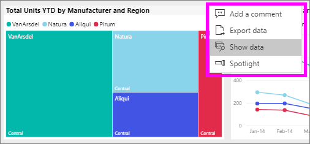
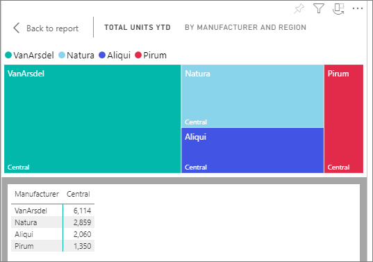
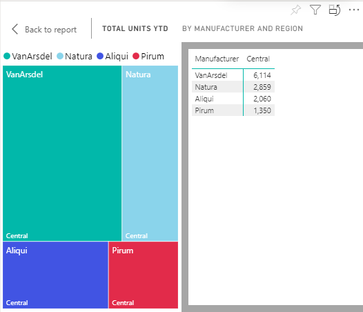

# Show data with Power BI reports

[!INCLUDE [power-bi-service-new-look-include](../includes/power-bi-service-new-look-include.md)]

A Power BI visual is constructed using data from underlying datasets. If you're interested in seeing behind-the-scenes, the Power BI service lets you *display* the data that is being used to create a visual in a report. When you select **Show Data**, Power BI displays the data below (or next to) the visual.

On a dashboard, to see the underlying data, use [Export to Excel](end-user-export.md)

## Show the data being used to create a report visual
1. In the Power BI service, [open a report](end-user-report-open.md) and select a visual.  
2. To display the data behind the visual, select the **More options** (...) and choose **Show data**.
   
   
3. By default, the data displays below the visual.
   
   

4. To change the orientation, select vertical layout  from the top-right corner of the visualization.
   
   

## Next steps
[Visuals in Power BI reports](../visuals/power-bi-report-visualizations.md)    
[Power BI reports](end-user-reports.md)    
