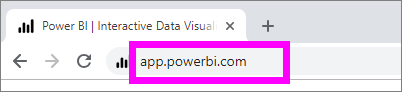
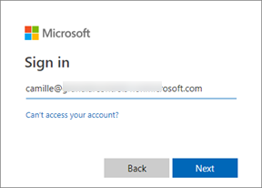
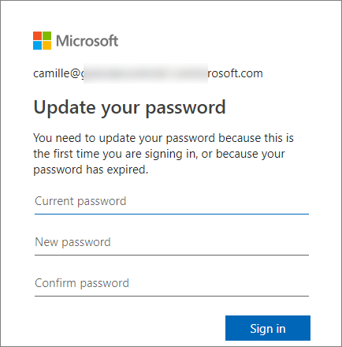
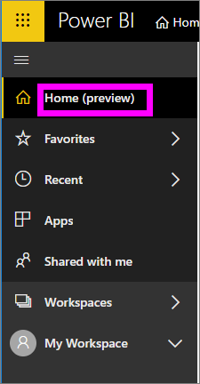
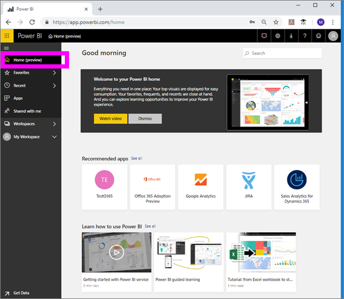
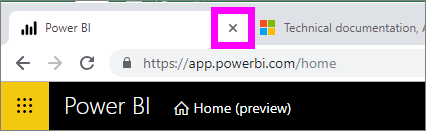
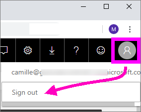

# Sign in to Power BI service

## Power BI accounts
Before you can sign in to Power BI, you'll need an account. There are two ways to get a Power BI account. The first is when your company purchases Power BI licenses for its employees. And the second is when individuals sign up for free trials or personal licenses. This article covers the first scenario.

## Sign in for the first time

### Step one: open a browser
Power BI service runs in a browser.  So step one is to open your favorite browser and type **app.powerbi.com**.

### Step two: type your email address
The first time you sign in, you'll be asked for your email address.  This is the work or school email address that was used to sign up for Power BI.  

Look in your Inbox for an email from your Power BI administrator. Most administrators will send you a welcome email that contains your temporary password. Use this email account for your sign in. 

 
### Step three: create a new password
If your Power BI administrator sent you a temporary password, enter it in the **Current password** field. 
If you haven't received this password in email, contact your Power BI administrator.

Power BI will remember your credentials, and you won't need to enter your username (email address) the next time you sign in. 

### Step four: review your Home page
On your very first visit, Power BI opens your **Home** page. If your **Home** page doesn't open, select it from the left navigation pane. 

On the Home page you'll see all the content that you have permission to use. At first, there may not be much content on your Home page, but don't worry, that will change as you start to use Power BI with your colleagues. 

If you don't want Power BI to open to your Home page, you can [set a **Featured** dashboard or report](end-user-featured.md) to open instead. 

## Safely interact with content
As a ***consumer***, others will share content with you and you'll interact with that content to explore the data and make business decisions.  As you filter, slice, subscribe, export, and resize, don't worry -- your work is not impacting the underlying dataset or the original shared content (dashboards and reports). Power BI is a safe space for you to explore and experiment. 
That doesn't mean you can't save your changes - you can. But those changes only affect **your** view of the content. And reverting to the original default view is as easy as clicking a button.

## Sign out of Power BI service
When you close or sign out of Power BI, your changes are saved so you can pick up right where you left off.

To close Power BI, simply close the browser tab where you are working. 

 

If you share a computer, we recommend signing out each time you close Power BI.  To sign out, from the upper right corner, select your Profile picture, and choose **Sign out**. Otherwise, when you are done, simply close the browser tab.

 

## Trouleshooting and considerations
- If you've signed up for Power BI as an individual, sign in with the email address you used to sign up.

- If you use Power BI with more than one account, you will be prompted to select an account from a list, and enter a password, when signing in. 

## Next steps
[View a Power BI app](end-user-app-view.md)
