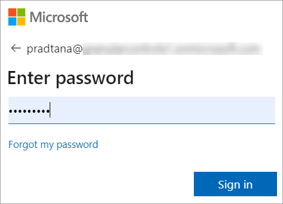
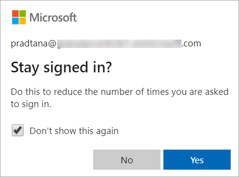
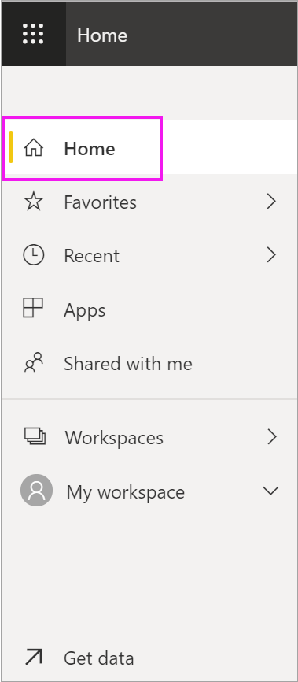
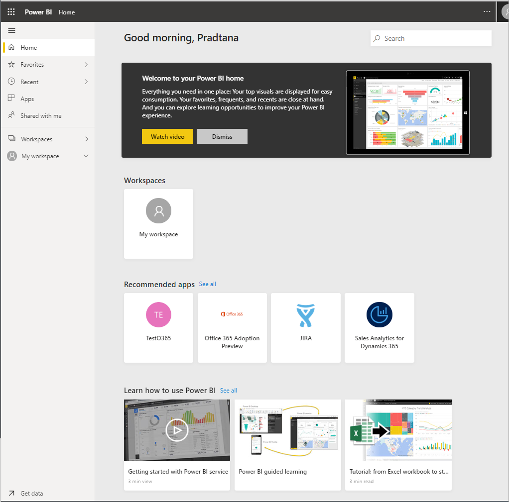

# Sign in to Power BI service

## Power BI accounts
Before you can sign in to Power BI, you'll need an account. There are two ways to get a Power BI account. The first is when your company purchases Power BI licenses for its employees. And the second is when individuals sign up for free trials or personal licenses. This article covers the first scenario.

## Sign in for the first time

### Step 1: open a browser
The Power BI service runs in a browser.  So step one is to open your favorite browser and type **app.powerbi.com**.

### Step 2: type your email address
The first time you sign in, you'll be asked for your email address.  This email address is the work or school account that was used to sign up for Power BI.  

Look in your Inbox for an email from your Power BI administrator. Most administrators will send you a welcome email that contains your temporary password. Use this email account for your sign-in. 

 
### Step 3: create a new password
If your Power BI administrator sent you a temporary password, enter it in the **Current password** field. 
If you haven't received any password in email, contact your Power BI administrator.

If you want Power BI to remember your credentials, select **Yes**. 

### Step 4: review your Home landing page
On your first visit, Power BI opens your **Home** landing page. If **Home** doesn't open, select it from the nav pane. 

On Home, you'll see all the content that you have permission to use. At first, there may not be much content, but don't worry, that will change as you start to use Power BI with your colleagues. 

If you don't want Power BI to open to Home, you can [set a **Featured** dashboard or report](end-user-featured.md) to open instead. 

## Safely interact with content
As a ***consumer***, others will share content with you and you'll interact with that content to explore the data and make business decisions.  As you filter, slice, subscribe, export, and resize, don't worry -- your work is not impacting the underlying dataset or the original shared content (dashboards and reports). Power BI is a safe space for you to explore and experiment. 
That doesn't mean you can't save your changes - you can. But those changes only affect **your** view of the content. And reverting to the original default view is as easy as clicking a button.

## Sign out of Power BI service
When you close or sign out of Power BI, your changes are saved so you can pick up right where you left off.

To close Power BI, close the browser tab where you are working. 

 

If you share a computer, we recommend signing out each time you close Power BI.  To sign out, from the upper right corner, select your Profile picture, and choose **Sign out**. Otherwise, when you are done, close the browser tab.

 

## Troubleshooting and considerations
- If you've signed up for Power BI as an individual, sign in with the email address you used to sign up.

- Some people use Power BI with more than one account. If so, when signing in you will be prompted to select an account from a list. 

## Next steps
[View a Power BI app](end-user-app-view.md)
