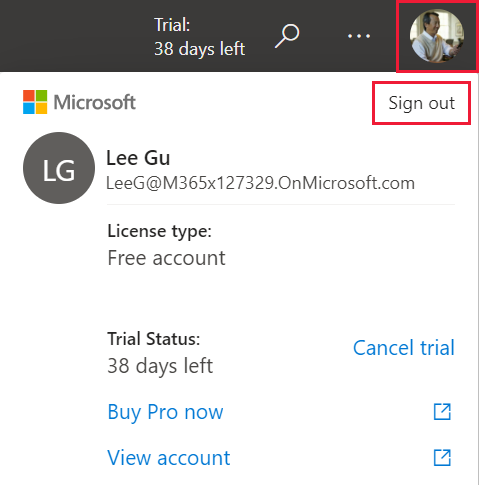

# Sign in to Power BI service

[!INCLUDE[consumer-appliesto-yynn](../includes/consumer-appliesto-yynn.md)]

## Power BI accounts
Before you can sign in to Power BI, you'll need an account. There are two ways to get a Power BI account. The first is when your organization purchases Power BI licenses for its employees. And the second is when [individuals sign up for free trials or personal licenses](../fundamentals/service-self-service-signup-for-power-bi.md). This article covers the first scenario.

## Sign in for the first time

### Step 1: open the Power BI service
The Power BI service runs in a browser. 

- If you've received an email from a colleague, with a link to a dashboard or report, select the link to **Open this report** or **Open this dashboard**.

        

- Otherwise, open your favorite browser and type **app.powerbi.com**.

        

### Step 2: type your email address
The first time you sign in, Microsoft asks if you already have a Microsoft 365 account. Select **SIGN IN**.

Enter your password. This is your Microsoft 365 account password. It is the same email and password that you use for other Microsoft products, such as Outlook and Office.  Depending on how your account is set up, you may also be prompted to enter a code sent to your email or mobile device.   

Sometimes, your global administrator will assign you a license and send you an email with this information. Look in your Inbox for a welcome email and follow the instructions to sign in for the first time. Use this same email account for your sign-in. 
 
### Step 3: Review the terms and conditions
Review the terms and conditions, and if you agree, select the checkbox and choose **Start**.

### Step 4: review your Home landing page
On your first visit, Power BI opens your **Home** landing page. If **Home** doesn't open, select it from the nav pane. 

On Home, you'll see all the content that you have permission to use. At first, there may not be much content, but don't worry, that will change as you start to use Power BI with your colleagues. Remember that report that your colleague shared with you via email? It's on your Home landing page under the heading **Shared with me**.

If you don't want Power BI to open to Home, you can [set a **Featured** dashboard or report](end-user-featured.md) to open instead. 

## Safely interact with content
As a ***business user***, others will share content with you and you'll interact with that content to explore the data and make business decisions.  As you filter, slice, subscribe, export, and resize, don't worry -- your work is not impacting the underlying dataset or the original shared content (dashboards and reports). Power BI is a safe space for you to explore and experiment. 
That doesn't mean you can't save your changes - you can. But those changes only affect **your** view of the content. And reverting to the original default view is as easy as clicking a button.

## Sign out of the Power BI service
When you close or sign out of the Power BI service, your changes are saved so you can pick up right where you left off.

To close Power BI, close the browser tab where you are working. 

 

If you share a computer, we recommend signing out each time you close Power BI.  To sign out, from the upper right corner, select your Profile picture, and choose **Sign out**.  

 

## Troubleshooting
- If you've signed up for Power BI as an individual, sign in with the email address you used to sign up.

- Some people use Power BI with more than one account. If so, when signing in, you will be prompted to select an account from a list. 

## Next steps
[View a Power BI app](end-user-app-view.md)
