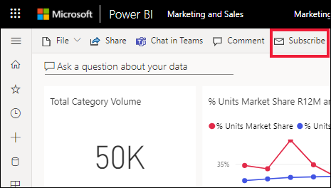
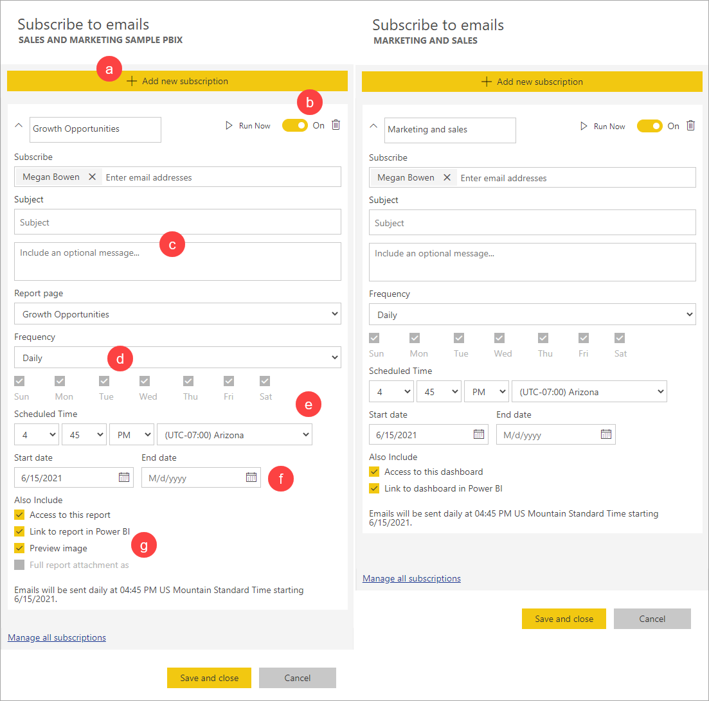
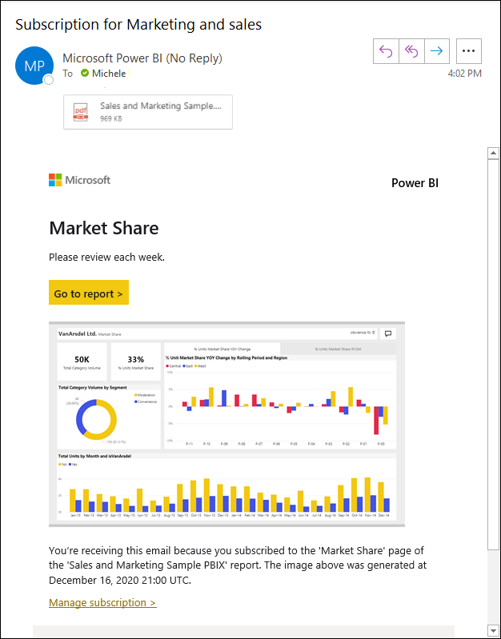
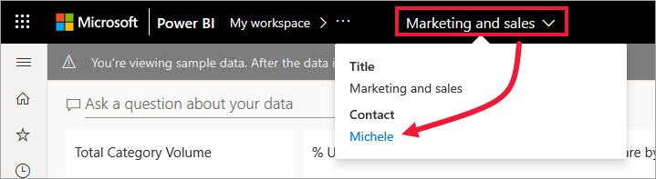
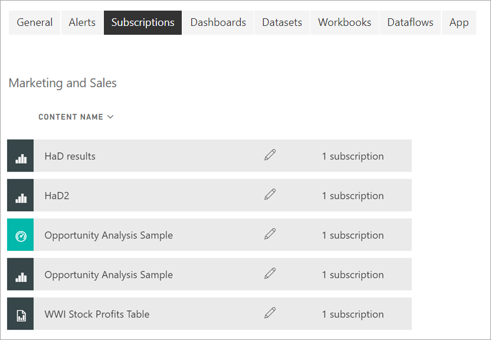

# Subscribe to a report or dashboard in the Power BI service 

[!INCLUDE[consumer-appliesto-ynny](../includes/consumer-appliesto-ynny.md)]

It's never been easier to stay up-to-date on your most important dashboards and reports. Subscribe to report pages and dashboards that matter most to you, and Power BI will email a snapshot to your inbox. You tell Power BI how often you want to receive the emails: daily, weekly, or when the data refresh. You can even set a specific time for Power BI to send the emails or have it run now.  In all, you can set up to 24 different subscriptions per report or dashboard.

The email and snapshot will use the language set in Power BI settings (see [Supported languages and countries/regions for Power BI](../fundamentals/supported-languages-countries-regions.md)). If no language is defined, Power BI uses English as a fallback. To see or set your language preference, select the cog icon  > **Settings > General > Language**. 

When you receive the email, it includes a link to "go to report or dashboard". On mobile devices with Power BI apps installed, selecting this link launches the app (as opposed to the default action of opening the report or dashboard on the Power BI website).

## Requirements
**Creating** a subscription for yourself requires a *Power BI Pro* or *Premium per user* [license](end-user-license.md). You can also create a subscription for yourself if the report or dashboard resides in a Premium workspace and you have been given access to that workspace. If you are unable to create a subscription, contact your Power BI administrator or IT help desk. 

**Subscribing others** is only available to the dashboard or report owners who have a *Power BI Pro* or *Premium Per User (PPU)* license.

**Subscribing to paginated reports** is a little different. See [Subscribe to a paginated report in the Power BI service](paginated-reports-subscriptions.md) for details. 

## Subscribe to a dashboard or a report page
Whether you're subscribing to a dashboard or to a report, the process is similar. The same button allows you to subscribe to the Power BI service dashboards and reports.
 
.

1. Open the dashboard or report.
2. From the top menu bar, select **Subscribe** or select the envelope icon .    
1. Select **Add new subscription**.
   

   
    
    The screen on the left appears when you're on a report page and select **Subscribe**. The screen on the right appears when you're on a dashboard and select **Subscribe**. 
    
    a. To subscribe to more than one page in a report: Either select **Add new subscription** and select a different page from the dropdown near the top, or select the **Full report attachment as** checkbox under **Also include**. 

    b. Use the yellow slider to turn the subscription on and off.  Setting the slider to **Off** doesn't delete the subscription. To delete the subscription, select the trashcan icon.

    c. Add at least one email address and, optionally, add a subject and email message details. 

    d. Select a **Frequency** for your subscription.  You may choose Daily, Weekly, or After data refresh (Daily).  To receive the subscription email only on certain days, select **Weekly** and choose which days you'd like to receive it.  For example, if you'd like to receive the subscription email only on workdays, select **Weekly** for your frequency and un-check the boxes for Sat and Sun. If you select 
    **Monthly**, enter the day(s) of the month you wish to receive the subscription mail.   

    e. If you choose Daily, Hourly, Monthly, or Weekly, you can also choose a Scheduled Time for the subscription. You can have it run on the hour, or at 15, 30, or 45 minutes past. Select morning (AM) or afternoon/evening (PM). You can also specify the time zone. If you choose Hourly, select the Scheduled Time you want the subscription to start, and it will run every hour after that.  

    f. Schedule the start and end date by entering dates in the date fields. By default, the start time for your subscription will be the date you create it and the end date will be one year later. You can change it to any date in the future (up to the year 9999) at any time before the subscription ends. When a subscription reaches an end date, it stops until you re-enable it.  You will receive notification(s) before the scheduled end date to ask if you'd like to extend it.     

    g. Select one or more of the checkboxes.
    - Give recipients permission to open and view the report or dashboard.
    - Select **Go to report/dashboard** to add a "Go to report" link to the body of the email.
    - Add a thumbnail preview of the report page to the body of the email.
    - Add the full report as an attachment instead of only a single report page and select either PDF or PowerPoint. The size of the attachment is limited to no more than 20 pages and less than 25 MB. The attachment respects all privacy labels for the report. 
    
    h. To review your subscription and test it out, select **Run now**.  This sends the email to you right away. 

3. If everything looks good, select **Save and close** to save the subscription. You will receive an email and snapshot of the dashboard or report on the schedule you set. All subscriptions that have the frequency set to **After data refresh** will only send an email after the first scheduled refresh on that day.
   
   
   
    You will be able to refresh the report page but not the dataset. Only the dataset owner can manually refresh a dataset. To look up the owner name of the underlying dataset(s), open the report and select the dropdown from the menu bar.
   
    

## Manage your subscriptions
Only you can manage the subscriptions you create. Select **Subscribe** again and choose **Manage all subscriptions** from the bottom left corner (see screenshots  above). The subscriptions for the current workspace display. For help understanding workspaces, see [Workspaces in Power BI](end-user-workspaces.md). 

A subscription will end if the Pro or Premium Per User (PPU) license expires, the dashboard or report is deleted by the owner, or the user account used to create the subscription is deleted.

## Considerations and troubleshooting
* To avoid subscription emails going to your spam folder, add the Power BI email alias (no-reply-powerbi@microsoft.com) to your contacts. If you're using Microsoft Outlook, right-click the alias and select **Add to Outlook contacts**. 
* Dashboards with over 25 pinned tiles, or four pinned live report pages, may not render fully in subscription e-mails sent to users. We suggest that you contact the dashboard designer and ask them to reduce pinned tiles to less than 25 and pinned live reports to less than four to ensure that the email renders correctly.  
* For dashboard email subscriptions, if any tiles have row level security (RLS) applied, those tiles will not display.  
* If the links in your email (to the content) stop working, it may be that the content was deleted. In the email, beneath the screenshot, you can look to see if you subscribed yourself or if someone else subscribed you. If someone else, ask that co-worker to either cancel the emails or re-subscribe you.
* For dashboard subscriptions, certain types of tiles aren't yet supported. These include: streaming tiles, video tiles, custom web content tiles. 
* Report page subscriptions are tied to the name of the report page. If you subscribe to a report page, and it gets renamed, you will have to re-create your subscription.
* If you aren't able to use the subscription feature, contact your system administrator or IT help desk. Your organization may have disabled this feature or a maximum subscriber limit may have been reached.  
* Email subscriptions do not support most [custom visuals](../developer/visuals/power-bi-custom-visuals.md).  The exception is those Power BI custom visuals that have been [certified](../developer/visuals/power-bi-custom-visuals-certified.md).    
* Email subscriptions are sent with the report's default filter and slicer states. Any changes to the defaults that you make after subscribing don't show up in the email. 
* Paginated reports do allow you to set parameter values per subscription. See [Subscribe to a paginated report in the Power BI service](paginated-reports-subscriptions.md) for details.
* Email subscriptions do not support R-powered Power BI visuals at this time.  
* Subscriptions don't currently support bookmarks.
* Subscriptions may fail on dashboards or reports with extremely large images due to email size limits.    
* Power BI automatically pauses refresh on datasets associated with dashboards and reports that haven't been visited in more than two months.  However, if you add a subscription to a dashboard or report, it won't pause even if it goes unvisited.
* Keep in mind that like other BI products, the time you set your subscription for is when the subscription begins processing.  Once the report processing is complete, then the subscription is queued and sent to the e-mail recipients.  While we strive to process and deliver all subscriptions as quickly as possible, there are times at peak demand when you may see a longer delay due to the number of subscriptions that can be sent at once.  For the majority of customers, they shouldn’t see a delay of more than 15 minutes to process and send their reports, though it may take up to 30 minutes for certain times and tenants that have significant usage.  We never expect any delay in delivery to be more than 60 minutes from the time the subscription is scheduled.  If any customer experiences a delay of that length, they should first ensure that the address no-reply-powerbi@microsoft.com is on your safe sender list and isn't blocked by your e-mail provider.  If the email isn't being blocked, they should contact their Power BI administrator or IT help desk for assistance.
* The full report attachment feature is available for reports that meet the following three conditions. Any existing subscriptions with full reports as attachments that do not meet these conditions are disabled and you will receive an email explaining the error.
    - They're in an upgraded workspace with [Power BI Premium or Premium Per User](../admin/service-premium-what-is.md). 
    - The report has fewer than 20 pages.
    - The attachment file is under 25 MB in size.

## Next steps

[Search for and sort content](end-user-search-sort.md)
