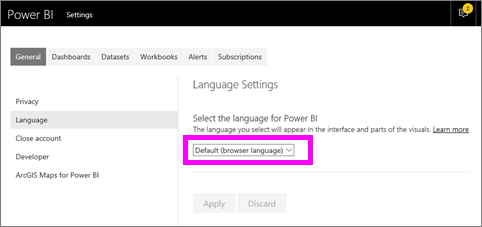
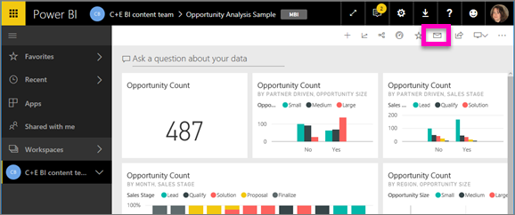
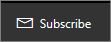
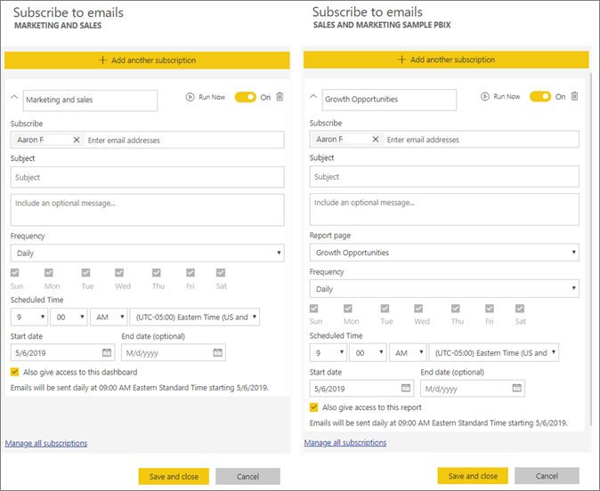
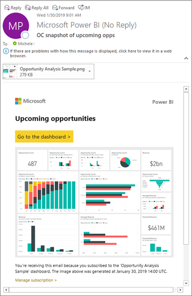
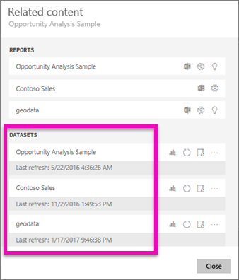
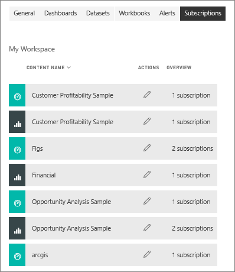

# Subscribe to a report or dashboard in Power BI service 
It's never been easier to stay up-to-date on your most important dashboards and reports. Subscribe to report pages, and dashboards that matter most to you, and Power BI will email a snapshot to your inbox. You tell Power BI how often you want to receive the emails: daily, weekly, or when the data refresh. You can even set a specific time for Power BI to send the emails or have it run now.  

The email and snapshot will use the language set in Power BI settings (see [Supported languages and countries/regions for Power BI](../supported-languages-countries-regions.md)). If no language is defined, Power BI uses the language according to the locale setting in your current browser. To see or set your language preference, select the cog icon  > **Settings > General > Language**. 

When you receive the email it includes a link to "go to report or dashboard". On mobile devices with Power BI apps installed, selecting this link launches the app (as opposed to the default action of opening the report or dashboard on the Power BI website).

## Requirements
**Creating** a subscription is a Power BI Pro feature.   

## Subscribe to a dashboard or a report page
Whether you're subscribing to a dashboard or report, the process is similar. The same button allows you to subscribe to Power BI service dashboards and reports.
 
.

1. Open the dashboard or report.
2. From the top menu bar, select **Subscribe** or select the envelope icon .
   
   

   
    
    The screen on the left appears when you're on a dashboard and select **Subscribe**. The screen on the right appears when you're on a report page and select **Subscribe**. To subscribe to more than one page in a report, select **Add another subscription** and select a different page. 

4. Use the yellow slider to turn the subscription on and off.  Setting the slider to Off doesn't delete the subscription. To delete the subscription, select the trashcan icon.

4. Your email address is automatically added to the **Subscribe** field. To subscribe others in your organization, add their email addresses here as well. 

5. Optionally, add email message details. 

5. Select a **Frequency** for your subscription.  You may choose Daily, Weekly, or After data refresh (Daily).  To receive the subscription email only on certain days, select **Weekly** and choose which days you'd like to receive it.  For example, if you'd like to receive the subscription email only on workdays, select **Weekly** for your frequency and uncheck the boxes for Sat and Sun.   

6. Schedule the time the email is sent by selecting Daily or Weekly for your frequency, and entering a **Scheduled** **Time** for the subscription.  This time is when the subscription job starts. It may take up a few minutes before the e-mail is delivered to your inbox in certain scenarios.    

7. Schedule the start and end date by entering dates in the date fields. By default, the start time for your subscription will be the date you create it and the end date will be one year later. When a subscription reaches an end date, it stops until you re-enable it.  You will receive notification(s) before the scheduled end date to ask if you'd like to extend it.     

8. To review your subscription and test it out, select **Run now**.  This sends the email to you right away. 

8. If everything looks good, select **Save and close** to save the subscription. You and your subscribed colleagues receive an email and snapshot of the dashboard or report on the schedule you set. All subscriptions that have the frequency set to **After data refresh** will only send an email after the first scheduled refresh on that day.
   
   
   
    Refreshing the report page does not refresh the dataset. Only the dataset owner can manually refresh a dataset. To look up the owner name of the underlying dataset(s), select **View related** from the top menubar or look up the original subscription email.
   
    

## Manage your subscriptions
Only you can manage the subscriptions you create. Select **Subscribe** again and choose **Manage all subscriptions** from the bottom left corner (see screenshots  above). 

A subscription will end if the Pro license expires, the dashboard or report is deleted by the owner, or the user account used to create the subscription is deleted.

## Considerations and troubleshooting
* Dashboards with more than 25 pinned tiles, or four pinned live report pages, may not render fully in subscription e-mails sent to users. We suggest that you contact the dashboard designer and ask them to reduce pinned tiles to less than 25 and pinned live reports to less than four to ensure that the email renders correctly.  
* For dashboard email subscriptions, if any tiles have row level security (RLS) applied, those tiles will not display.  For report email subscriptions, if the dataset uses RLS, you will not be able to create a subscription.
* Report page subscriptions are tied to the name of the report page. If you subscribe to a report page, and it gets renamed, you will have to re-create your subscription.
* If you aren't able to use the subscription feature, contact your system administrator. Your organization may have disabled this feature for authentication or other reasons.  
* Email subscriptions do not support most [custom visuals](../power-bi-custom-visuals.md).  The exception is those custom visuals that have been [certified](../power-bi-custom-visuals-certified.md).  
* Email subscriptions do not support R-powered custom visuals at this time.  
* For dashboard subscriptions specifically, certain types of tiles are not yet supported.  These include: streaming tiles, video tiles, custom web content tiles.     
* Subscriptions may fail on dashboards or reports with extremely large images due to email size limits.    
* Power BI automatically pauses refresh on datasets associated with dashboards and reports that have not been visited in more than two months.  However, if you add a subscription to a dashboard or report, it will not be paused even if it goes unvisited.
* On rare occasions, e-mail subscriptions may take longer than fifteen minutes to be delivered to their recipients.  If this happens, we recommend running your data refresh and e-mail subscription at different times to ensure timely delivery.  If the issue persists, please contact support.

## Next steps

[Search for and sort content](end-user-search-sort.md)
