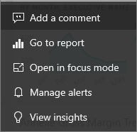
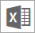

# Dashboard tiles in Power BI
A tile is a snapshot of your data, pinned to the dashboard by a *designer*. A tile can be created from a report, dataset, dashboard, the Q&A question box, Excel, SQL Server Reporting Services (SSRS), and more.  This screenshot shows many different tiles pinned to a dashboard.

Besides tiles pinned from reports, *designers* can add standalone tiles directly on the dashboard using **Add tile**. Standalone tiles include: text boxes, images, videos, streaming data, and web content.

Need help understanding the building blocks that make up Power BI?  See [Power BI - Basic Concepts](end-user-basic-concepts.md).

## Interacting with tiles on a dashboard

1. Hover over the tile to display the ellipses.
   
    
2. Select the ellipses to open the tile action menu. The options available vary by visual type and method used to create the tile. Here are a few examples of what you may see.

    - tile created using Q&A
   
        ./media/end-user-tiles/power-bi-menu1.png)

    - tile created from a workbook
   
        

    - tile created from a report
   
        
   
    From here you can:
   
   * [Open the report that was used to create this tile ](end-user-reports.md)   
   
   * [Open the Q&A question that was used to create the tile ](end-user-reports.md)   
   

   * [Open the workbook that was used to create this tile ](end-user-reports.md)   
    * [View the tile in focus mode ](end-user-focus.md)   
     * [Run insights ](end-user-insights.md) 
    * [Add a comment and start a discussion](end-user-comment.md)  

3. To close the action menu, select a blank area in the canvas.

### Select (click) a tile
When you select a tile, what happens next depends on how the tile was created and if it has a [custom link](../service-dashboard-edit-tile.md). If it has a custom link, selecting the tile takes you to that link. Otherwise, selecting the tile takes you to the report, Excel Online workbook, SSRS report that is on-premises, or Q&A question that was used to create the tile.

> [!NOTE]
> The exception to this is video tiles created directly on the dashboard using **Add tile**. Selecting a video tile (that was created this way) causes the video to play right there on the dashboard.   
> 
> 

## Considerations and troubleshooting
* If the report that was used to create the visualization was not saved, then selecting the tile produces no action.
* If the tile was created from a workbook in Excel Online, and you do not have at least Read permissions for that workbook, selecting the tile will not open the workbook in Excel Online.
* For tiles created directly on the dashboard using **Add tile**, if a custom hyperlink has been set, selecting the title, subtitle, and or tile will open that URL.  Otherwise, by default, selecting one of these tiles created directly on the dashboard for an image, web code, or text box produces no action.
* If you don't have permission to the report within SSRS, selecting a tile created from SSRS will produce a page indicating you don't have access (rsAccessDenied).
* If you don't have access to the network where the SSRS server is located, selecting a tile created from SSRS will product a page that will indicate it cannot locate the server (HTTP 404). Your device needs to have network access to the report server to view the report.
* If the original visualization used to create the tile changes, the tile doesn't change.  For example, if the *designer* pinned a line chart from a report and then changed the line chart to a bar chart, the dashboard tile continues to show a line chart. The data refreshes, but the visualization type does not.

## Next steps
[Data refresh](../refresh-data.md)

[Power BI - Basic Concepts](end-user-basic-concepts.md)
