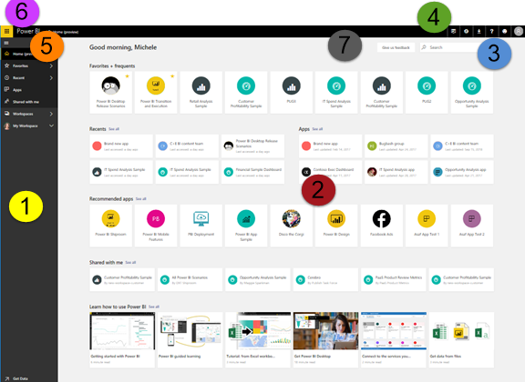
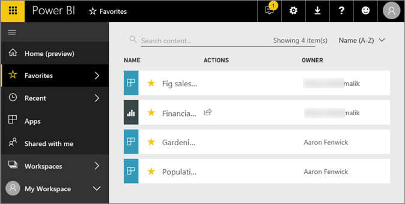
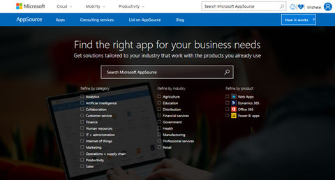

# Overview - Getting around in Power BI service

Now that you know the [basics of Power BI service for consumers](consuming.md), let's take a look around **Power BI service**. Most *consumers* spend all of their time in Power BI service, viewing and interacting with content created by others (**consuming** experience). In this overview you'll learn your way around Power BI service.

## Prerequisites

- Read [Power BI service basic concepts](end-user-basic-concepts.md)

## Open Power BI service
Most Power BI consumers get Power BI service because 1) their company buys licenses and 2) an administrator assigns those license to the employees.

### Open Power BI service for the first time

To get started, simply open a browser and type **app.powerbi.com**. If this is your first time signing in, and you need help, see [sign in to Power BI service](end-user-signin.md). The very first time you open Power BI service, you'll see something like this.

Because this is your first time signing in, and you don't yet have any data, you see the Welcome screen. Once your colleagues start sharing content with you, Power BI will open, by default, to your [Home screen](#Home) or to a [dashboard or report that you choose](#favorite).  

Since most of the information on the welcome screen is aimed toward *designers*, let's move on. For information on getting data, see [Get data](data.md).

### Open Power BI service once you have content shared with you
Let's skip ahead. Your colleagues are now [sharing content with you](content.md).  You have dashboards and reports and when you log in to Power BI, you see a Home page full of content. It's a busy page, so let's break it down.

   

### Home page
Think of your Home page as an overview of all the other areas in your left navigation pane (navpane). On your Home page you see your favorites, most recents, used most, apps, shared, and more -- all on one screen.  From here you can open content without using the navpane. Although the Home page is very informative and interactive, Aanother option for viewing and navigating your content is to use the left navpane. There you'll find more granular information and controls.  

The main features of your Power BI service Home (Preview) UI are the following:

1. navigation pane (left navpane)
2. Home page canvas
3. Search box
4. icon buttons, including help, notifications, and feedback
5. **Power BI** button for featured content
6. Office 365 app launcher
7. Feedback button

## 1. **Left navigation pane** (left nav)
Use the navigation pane to locate and move between your content: dashboards, reports, and apps.  Sometimes the left navpane will be a quicker way to get to content. The navpane organizes your content into: **Favorites**, **Recent**, **Apps**, and **Shared with me**. To see the most-recent content in these sections, select the arrow (to the right of the heading). To open one of these content sections, select the heading.  For example, to see  the **Favorites** content screen, select the word **Favorites**.

  

-  Expand and collapse the navpane with this icon .
* Open or manage your favorite content by selecting **Favorites**.
* View and open your most-recently visited content by selecting **Recent**
* View, open, or delete an app by selecting **Apps**.
* Did a colleague share non-app content with you? Select **Shared with me** to search and sort that content to find what you need.
* Power BI consumers don't typically use workspaces, but for more information see [Workspaces in Power BI service](../service-collaborate-power-bi-workspace.md)  

Single-click

* an icon or heading to open a content screen
* an arrowright (>) to open a flyout menu for Favorites, Recent, and Workspaces.

### 2. **Canvas**
The canvas can contain a variety of content, depending on our selection.  In this example we've selected **Home** from the left navpane, so our canvas fills with our Home page.

### 3. **Q&A question box**
One way to explore your data is to ask a question and let Power BI Q&A give you an answer, in the form of a visualization. Q&A can be used to add content to a dashboard or report.

Q&A looks for an answer in the dataset(s) connected to the dashboard.  A connected dataset is one that has at least one tile pinned to that dashboard.

As soon as you start to type your question, Q&A takes you to the Q&A page. As you type, Q&A helps you ask the right question and find the best answer with rephrasings, autofill, suggestions, and more. When you have a visualization (answer) you like, pin it to your dashboard. For more information, see [Q&A in Power BI](power-bi-q-and-a.md).

### 4. **Icon buttons**
The icons in the upper right corner are your resource for settings, notifications, downloads, getting help, and providing feedback to the Power BI team. Select the double arrow to open the dashboard in **Full screen** mode.  

### 5. **Dashboard title** (navigation path aka breadcrumbs)
It's not always easy to figure out which workspace and dashboard are active, so Power BI creates a navigation path for you.  In this example we see the workspace (My workspace) and the dashboard title (Retail Analysis Sample).  If we opened a report, the name of the report would be appended to the end of the navigation path.  Each section of the path is an active hyperlink.  

Notice the "C" icon after the dashboard title. This dashboard has a [data classification tag](service-data-classification.md) of "confidential." The tag identifies the sensitivity and security level of the data. If your Admin has turned on data classifcation, every dashboard will have a default tag set. Dashboard owners should change the tag to match their dashboard's proper security level.

### 6. **Office 365 app launcher**
With the app launcher, all your Office 365 apps are easily available with one click. From here you can quickly launch your email, documents, calendar, and more.

### 7. **Power BI home**
Selecting this opens your [featured dashboard](service-dashboard-featured.md) (if you've set one), otherwise it opens the last dashboard you viewed.

   

### 8. **Labeled icon buttons**
This area of the screen contains additional options for interacting with the content (in this case, with the dashboard).  Besides the labeled icons you can see, selecting the ellipses reveals options for duplicating, printing, refreshing the dashboard and more.

   

Our Home page blah blah.

## The left navigation pane

<insert gif>

1. Select **Favorites** to see all dashboards, report pages, and apps that have been marked as favorites. To unfavorite content, select the yellow arrow.

    <image of unfavoriting>

   For each row on the Favorites page, we see Actions, Owner, and Classification. If our content can be edited or shared, we'll see icons in the Actions area. We see that ABC owns the ABC dashboard and by hovering over the **C** icon, we see that the dashboard has a privacy rating of Confidential. If we wanted to open a dashboard, report, or app from here, all we'd need to do is select the name.

2. Select **Recent** to see dashboards, reports, and apps that we've visited recently. The content is displayed with most recent listed first.  

<image of recents>

    We'd like to see the content sorted alphabetically. Select **Most recent** and choose a different sort order.

    

    Notice the column for **Location**. blah blah

4. Select **Apps** to see all apps that have been shared with us.

    

    When we hover over the ABC app, we see creation date, owner, and any actions we can take.  For example, here we can mark the app as a favorite or delete it. Select an app tile to open it.

    

5. Select **Shared with me** to see all dashboards and reports that have been shared with us. Content that appears here has been shared by abcde.

    

    Let's see all content shared with us by PERSONA.

    Select the name to open it.

## About workspaces
blah blah blah

## View content (dashboards, reports, workbooks, datasets, workspaces, apps)
Another way our content is organized is by ***workspace***. New users start off with one workspace:  **My workspace**. Once colleagues share content with us, we may end up with more workspaces. IS THIS TRUE?

**My Workspace** stores all the content that we own. Think of it as our personal sandbox or work area for our own content. We can share content from My Workspace with colleagues. Within **My Workspace**, our content is organized into 4 tabs: Dashboards, Reports, Workbooks, and Datasets. DO CONTENT THAT IS PART OF AN APP SHOW UP HERE?

When we select a workspace from the left navigation pane (left navpane), the tabs for the associated content (dashboards, reports, workbooks, datasets) fill the Power BI canvas to the right. As a Power BI *end user*, it's not unusual for **My Workspace** to be empty.

Within those tabs (aka *content views*), you'll see information about the content as well as actions you can take with that content.  For example, from the Dashboards tab you can open a dashboard, share, delete, search, create new content, sort, and much more.

Open the dashboard by selecting the dashboard name.

## Favorite a dashboard and a report
**Favorites** lets you quickly access content that is most important to you.  

1. With the dashboard open, select **Favorite** from the upper right corner.

   

   **Favorite** changes to **Unfavorite** and the star icon becomes yellow.

   

2. To display a list of all the content that you have added as favorites, in the left navpane, select the arrow to the right of **Favorites**. Because the left navpane is a permanent feature of Power BI service, you have access to this list from anywhere in Power BI service.

    

    We have only one favorite so far. Favorites can be dashboards, reports, or apps.  

1. Another way to mark either a dashboard or report as a favorite is from the **Dashboards** or **Reports** workspace tab.  Open the **Reports** tab, and select the star icon to the left of the report name.

   

3. Open the **Favorites** *pane*, by selecting **Favorites** from the left navpane or by selecting the star icon .

   

   You now have two favorites, one a dashboard and one a report. From here you can open, search, unfavorite, or share content with colleagues.

4. Select the report name to open it in the report editor.

    

To learn more, see [Favorites](end-user-favorite.md)

## Locate your most recent content

1. Similar to Favorites, quickly see your most recently accessed content from anywhere in Power BI service by selecting the arrow next to **Recent** in the left navpane.

   

    From the flyout, select content to open it.

2. Sometimes you don't want to open recent content, but want to view information or take other action, such as sharing, running Insights, or exporting to Excel. In cases like thes, open the **Recents** pane by selecting **Recent** or its icon from the left navpane. If you had more than one workspace, this list would include content from across all of your workspaces.

   

To learn more, see [Recents in Power BI](end-user-recent.md)

### Search and sort content
The content view makes it easier to search, filter and sort your content. To search for a dashboard, report or workbook, type in the search area. Power BI filters to only the content that has your search string as part of the name.

Since you only have one sample, searching and sorting isn't necessary.  But when you have long lists of dashboards, reports, workbooks, and datasets, you'll find searching and sorting extremely helpful.

You can also sort the content by name or owner.  

To learn more, see [Power BI navigation: search, sort, filter](service-navigation-search-filter-sort.md)

## Clean up resources
After you finish this quickstart, you can delete the Retail Analysis sample dashboard, report, and dataset, if you wish.

1. Open the Power BI service (app.powerbi.com) and sign in.    
2. In the left navigation pane, select **Workspaces > My Workspace**.  
    Notice the yellow star indicating it's a favorite?    
3. On the **Dashboards** tab, select the garbage can **Delete** icon next to the Retail Analysis dashboard.    

    

4. Select the **Reports** tab and do the same for the Retail Analysis report.
1. Select the **Datasets** tab and do the same for the Retail Analysis dataset.

Dashboards are composed of [tiles](service-dashboard-tiles.md).  Tiles are created in report Editing view, Q&A, other dashboards, and can be pinned from Excel, SSRS, and more. A special type of tile called a [widget](service-dashboard-add-widget.md) is added directly onto the dashboard. The tiles that appear on a dashboard were specifically put there by a report creator/owner.  The act of adding a tile to a dashboard is called *pinning*.

For more information, see **Dashboards** (above).

## Next steps

> [!div class="nextstepaction"]
> [Reading view and Editing view in Power BI service](./service-reading-view-and-editing-view.md)
