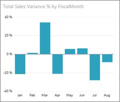
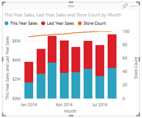
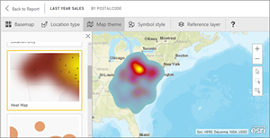
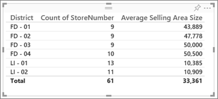

# Visual types in Power BI

[!INCLUDE[consumer-appliesto-yynn](../includes/consumer-appliesto-yynn.md)]

Visuals (also known as *charts* and *visualizations*) are picture representations of your data. Some common examples are column charts, maps, scatter charts, and radial gauges. You'll find visuals in reports, dashboards, and Q&A.

The visuals described on this page are the ones that are packaged with Power BI. These are the visual types you'll encounter most often. This page gives you a quick overview of these pre-packaged visuals. For in-depth information about any of these visuals, see the [Power BI report *designer* documentation on visual types](../visuals/power-bi-visualization-types-for-reports-and-q-and-a.md).

Visuals that are not automatically included with Power BI are referred to as *custom visuals*. Custom visuals can be imported into Power BI from external websites such as Microsoft AppSource or from internal sources such as your organizational store. Importing custom visuals requires edit permissions to the report. To learn about these add-in visuals, visit [where to find Power BI visuals](../developer/visuals/power-bi-custom-visuals.md).

## List of visuals available in Power BI

All of these visuals can be found in Power BI dashboards and reports, and [specified in Q&A](end-user-q-and-a.md). To learn how to interact with visuals, see [Interact with visuals in reports, dashboards, and apps](end-user-visualizations.md)

## A

### Area charts: basic (layered) and stacked

The basic area chart is based on the line chart with the area between the axis and line filled in. Area charts emphasize the magnitude of change over time, and can be used to draw attention to the total value across a trend. For example, data that represents profit over time can be plotted in an area chart to emphasize the total profit.

## B

### Bar and column charts

 

Bar charts are the standard for looking at a specific value across different categories.

## C

### Cards: Single number

Single number cards display a single fact, a single data point. Sometimes a single number is the most important thing you want to track in your Power BI dashboard or report, such as total sales, market share year over year, or total opportunities.  

### Cards: Multi row

Multi row cards display one or more data points, one per row.

### Combo charts

A combo chart combines a column chart and a line chart. Combining the two charts into one lets you make a quicker comparison of the data. Combo charts can have one or two Y axes, so be sure to look closely. 

Combo charts are a great choice:

- when you have a line chart and a column chart with the same X axis.
- to compare multiple measures with different value ranges
- to illustrate the correlation between two measures in one visual
- to check whether one measure meets the target which is defined by another measure
- to conserve canvas space

## D    
### Decomposition tree

The decomposition tree visual lets you visualize data across multiple dimensions. It automatically aggregates data and enables drilling down into your dimensions in any order. It is also an artificial intelligence (AI) visualization, so you can ask it to find the next dimension to drill down into based on certain criteria. This makes it a valuable tool for ad hoc exploration and conducting root cause analysis.

### Doughnut charts

Doughnut charts are similar to pie charts.  They show the relationship of parts to a whole. The only difference is that the center is blank and allows space for a label or icon.

## F
### Funnel charts

Funnels help visualize a process that has stages, and items flow sequentially from one stage to the next.  One example is a sales process that starts with leads and ends with purchase fulfillment.

For example, a sales funnel that tracks customers through stages: Lead > Qualified Lead > Prospect > Contract > Close. At a glance, the shape of the funnel conveys the health of the process you're tracking.
Each funnel stage represents a percentage of the total. So, in most cases, a funnel chart is shaped like a funnel -- with the first stage being the largest, and each subsequent stage smaller than its predecessor. A pear-shaped funnel is also useful -- it can identify a problem in the process. But typically, the first stage, the "intake" stage, is the largest.

## G
### Gauge charts

A radial gauge chart has a circular arc and displays a single value that measures progress toward a goal/KPI. The goal, or target value, is represented by the line (needle). Progress toward that goal is represented by the shading. And the value that represents that progress is shown in bold inside the arc. All possible values are spread evenly along the arc, from the minimum (left-most value) to the maximum (right-most value).

In the example above, we are a car retailer, tracking our Sales team's average sales per month. Our goal is 140 and represented by the black needle. The minimum possible average sales is 0 and we've set the maximum as 200. The blue shading shows that we're currently averaging approximately 120 sales this month. Luckily, we still have another week to reach our goal.

Radial gauges are a great choice to:
- show progress toward a goal
- represent a percentile measure, like a KPI
- show the health of a single measure
- display information that can be quickly scanned and understood

## K
 ### Key influencers chart

A key influencer chart displays the major contributors to a selected result or value.

Key influencers are a great choice to help you understand the factors that influence a key metric. For example, *what influences customers to place a second order *or* why were sales so high last June*. 

### KPIs

A Key Performance Indicator (KPI) is a visual cue that communicates the amount of progress made toward a measurable goal. 

KPIs are a great choice:
- to measure progress (what am I ahead or behind on?)
- to measure distance to a goal (how far ahead or behind am I?)

## L
### Line charts

Line charts emphasize the overall shape of an entire series of values, usually over time.

## M
### Maps: Basic maps

Use a basic map to associate both categorical and quantitative information with spatial locations.

### Maps: ArcGIS maps

The combination of ArcGIS maps and Power BI takes mapping beyond the presentation of points on a map to a whole new level. The available options for base maps, location types, themes, symbol styles, and reference layers creates gorgeous informative map visuals. The combination of authoritative data layers (such as census data) on a map with spatial analysis conveys a deeper understanding of the data in your visual.

### Maps: Filled maps (Choropleth)

A filled map uses shading or tinting or patterns to display how a value differs in proportion across a geography or region. Quickly display these relative differences with shading that ranges from light (less-frequent/lower) to dark (more-frequent/more).

### Maps: Shape maps

Shape maps compare regions on a map using color. A shape map can't show precise geographical locations of data points on a map. Instead, its main purpose is to show relative comparisons of regions on a map by coloring them differently.

### Matrix

The matrix visual is a type of table visual (see "Table" below) that supports a stepped layout. Often, report designers include matrixes in reports and dashboards to allow users to select one or more element (rows, columns, cells) in the matrix to cross-highlight other visuals on a report page.  

## P
### Pie charts

Pie charts show the relationship of parts to a whole. 

### Power Apps visual

Report designers can create a Power App and embed it into a Power BI report. *Business users* can interact with that visual within the Power BI report. 

## Q
### Q&A visual

>[!TIP]
>Similar to the [Q&A experience on dashboards](../create-reports/power-bi-tutorial-q-and-a.md), the Q&A visual lets you ask questions about your data using natural language. 

For more information, see [Q&A visuals in Power BI](../visuals/power-bi-visualization-types-for-reports-and-q-and-a.md).

## R
### Ribbon chart

Ribbon charts show which data category has the highest rank (largest value). Ribbon charts are effective at showing rank change, with the highest range (value) always displayed on top for each time period.

## S
### Scatter, bubble, and dot plot charts

A scatter chart always has two value axes to show one set of numerical data along a horizontal axis and another set of numerical values along a vertical axis. The chart displays points at the intersection of an x and y numerical value, combining these values into single data points. These data points may be distributed evenly or unevenly across the horizontal axis, depending on the data.

A bubble chart replaces data points with bubbles, with the bubble size representing an additional dimension of the data.

A dot plot chart is similar to a bubble chart and scatter chart except that it can plot numerical or categorical data along the X axis. This example happens to use squares instead of circles and plots sales along the X axis.

### Scatter-high density

By definition, high-density data is sampled to create visuals reasonably quickly that are responsive to interactivity. High-density sampling uses an algorithm that eliminates overlapping points, and ensures that all points in the data set are represented in the visual. It doesn't just plot a representative sample of the data.  

This ensures the best combination of responsiveness, representation, and clear preservation of important points in the overall data set.

### Slicers

A slicer is a standalone chart that can be used to filter the other visuals on the page. Slicers come in many different formats (category, range, date, etc.) and can be formatted to allow selection of only one, many, or all of the available values. 

Slicers are a great choice to:
- display commonly-used or important filters on the report canvas for easier access
- make it easier to see the current filtered state without having to open a drop-down list
- filter by columns that are unneeded and hidden in the data tables
- create more focused reports by putting slicers next to important visuals

### Smart narrative

The Smart narrative adds text to reports to point out trends, key takeaways, and add explanations and context. The text helps users to understand the data and identify the important findings quickly.

### Standalone images

A standalone image is a graphic that has been added to a report or dashboard. 

## T
### Tables

A table is a grid that contains related data in a logical series of rows and columns. It may also contain headers and a row for totals. Tables work well with quantitative comparisons where you are looking at many values for a single category. For example, this table displays five different measures for Category.

Tables are a great choice:
- to see and compare detailed data and exact values (instead of visual representations)
- to display data in a tabular format
- to display numerical data by categories

### Tree maps

Tree maps are charts of colored rectangles, with size representing value.  They can be hierarchical, with rectangles nested within the main rectangles. The space inside each rectangle is allocated based on the value being measured. And the rectangles are arranged in size from top left (largest) to bottom right (smallest).

Tree maps are a great choice:
- to display large amounts of hierarchical data
- when a bar chart can't effectively handle the large number of values
- to show the proportions between each part and the whole
- to show the pattern of the distribution of the measure across each level of categories in the hierarchy
- to show attributes using size and color coding
- to spot patterns, outliers, most-important contributors, and exceptions

## W
### Waterfall charts

A waterfall chart shows a running total as values are added or subtracted. It's useful for understanding how an initial value (for example, net income) is affected by a series of positive and negative changes.

The columns are color coded so you can quickly tell increases and decreases. The initial and the final value columns often start on the horizontal axis, while the intermediate values are floating columns. Because of this "look", waterfall charts are also called bridge charts.

Waterfall charts are a great choice:

- when you have changes for the measure across time or across different categories
- to audit the major changes contributing to the total value
- to plot your company's annual profit by showing various sources of revenue and arrive at the total profit (or loss).
- to illustrate the beginning and the ending headcount for your company in a year
- to visualize how much money you make and spend each month, and the running balance for your account.

## Tell Q&A which visual to use

When typing natural language queries with Power BI Q&A, you can specify the visual type in your query.  For example:

"***sales by state as a tree map***"

## Next steps

[Interact with visuals in reports, dashboards, and apps](end-user-visualizations.md)    
[The right visual reference from sqlbi.com](https://www.sqlbi.com/wp-content/uploads/videotrainings/dashboarddesign/visuals-reference-may2017-A3.pdf)
