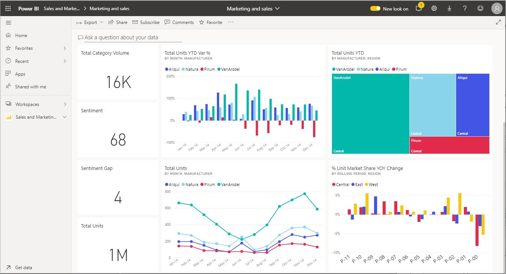
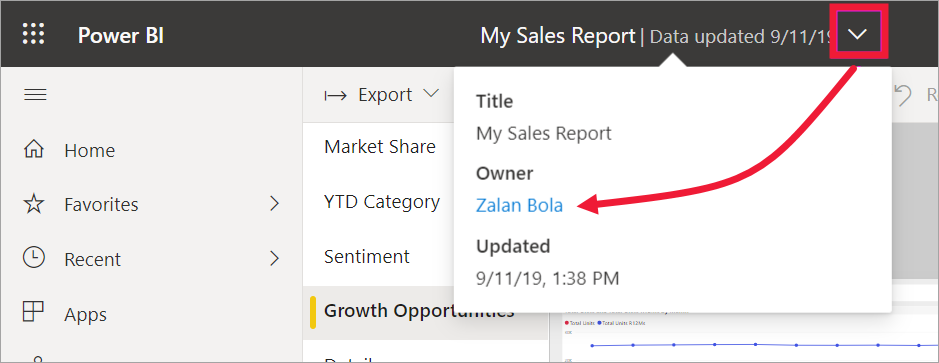

# Interact with visuals in reports, dashboards, and apps

[!INCLUDE[consumer-appliesto-ynny](../includes/consumer-appliesto-ynny.md)]

At its most basic, a ***visualization*** (or *visual*), is a type of chart built by Power BI *designers* using the data in reports and datasets. 

Visuals are found on dashboards, in reports, and can be created on-the-fly using Power BI Q&A. When a designer creates a visual in a report, they can *pin* that visual to a dashboard. A [visual on a dashboard is called a *tile*](end-user-tiles.md). This dashboard has eight tiles. 

> [!TIP]
> We recommend first reading the overview topic [Power BI basic concepts for *business users*](end-user-basic-concepts.md) before reading this more-detailed content.

## What can I do with visuals?

Visuals are created by report and dashboard *designers* and shared with colleagues. The designer assigns different permissions to their colleagues, depending on how the colleague is going to use the report or dashboard. For example, a *developer* may be assigned different permissions than a *business user*. 

The most common tasks for a *business user* are listed in the table below, with links to step-by-step instructions. *Business users* have many options for interacting with visuals to uncover insights and make data-driven business decisions.  

For many of these options, your administrator or the *designer* can disable your ability to see or use these features. And some of these features only work on specific visual types.  If you have any questions, contact your administrator or the owner of the report or dashboard. To find the owner, select the dashboard or report dropdown. 

> [!IMPORTANT]
> But first, a word about Q&A. Q&A is Power BI's natural language search tool. You type a question using natural language and Q&A answers the question in the form of a visual. Q&A is a way business users can create their own visuals on the fly. However, the visuals you create with Q&A cannot be saved. But, if there's something specific you want to learn from the data, and the designer didn't include it in a report or on a dashboard, Q&A is a great option. To learn more about Q&A, see [Q&A for business users](end-user-q-and-a.md).

|Task  |On a dashboard  |In a report  | In Q&A
|---------|---------|---------|--------|
|[Add comments to a visual for yourself or start a conversation with colleagues about the visual](end-user-comment.md).     |  yes       |   yes      |  no  |
|[Open and explore the report where the visual was created](end-user-tiles.md).     |    yes     |   na      |  no |
|[View a list of the filters and slicers that are affecting the visual](end-user-report-filter.md).     |    if you open in focus mode     |   yes      |  no |
|[Open and explore a visual in Q&A (if the *designer* used Q&A to create the visual)](end-user-q-and-a.md).     |   yes      |   na      |  na  |
|[Create a visual in Q&A (for exploration, you won't be able to save it)](end-user-q-and-a.md).     |   yes      |   if designer has added Q&A to the report      |  yes  |
|[Ask Power BI to look for interesting facts or trends](end-user-insights.md) in the visual's data for you.  These automatically generated visuals are called *insights*.     |    yes, for tiles    |  no       | no   |
|[View just one visual at a time using *focus* mode](end-user-focus.md).     | yes, for tiles        |   yes, for visuals      | na  |
|[Look up the last time the visual was refreshed](end-user-fresh.md).     |  yes       |    yes     | na  |
|[View just one visual at a time, without borders or nav panes, using *full screen* mode](end-user-focus.md).     |   yes      |  yes       | by default  |
|[Print](end-user-print.md).     |  yes       |   yes      | no  |
|[Dig into the visual by adding and modifying visual filters.](end-user-report-filter.md)     |    no     |   yes      | no  |
|Hover over a visual to reveal additional details and tooltips.     |    yes     |   yes      | yes  |
|[Cross-filter and cross-highlight other visuals on the page.](end-user-interactions.md)    |   no      |   yes      | na  |
|[Show the data used to create the visual](end-user-show-data.md).     |  no       |   yes      | no  |
| [Change the way the visual is sorted](end-user-change-sort.md). | no  | yes  | can change sort by rewording the question  |
| [Add a spotlight to a visual](end-user-spotlight.md). | no  | yes  |  no |
| [Export to Excel.](end-user-export.md) | yes | yes | no|
| [Create an alert](end-user-alerts.md) to notify you when a value exceeds a threshold you've set.  | yes  | no  | no |
| [Cross filter and cross highlight the other visuals on the page](end-user-report-filter.md).  | no      | yes  | na |
| [Drill a visual that has a hierarchy](end-user-drill.md).  | no  | yes   | no |

## Next steps
Back to [Basic concepts for business users](end-user-basic-concepts.md)    
[Select a visual to open a report](end-user-report-open.md)    
[Types of visuals available in Power BI](end-user-visual-type.md)