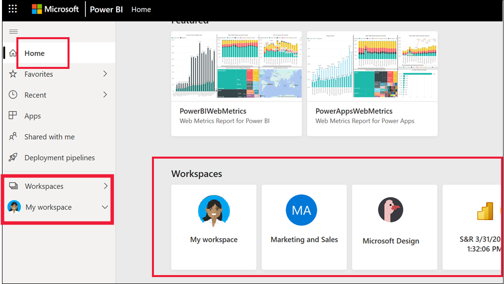
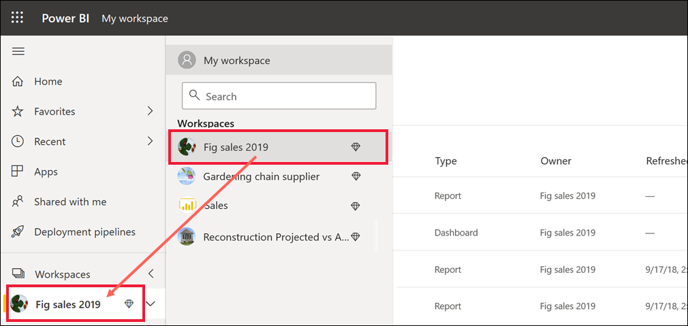
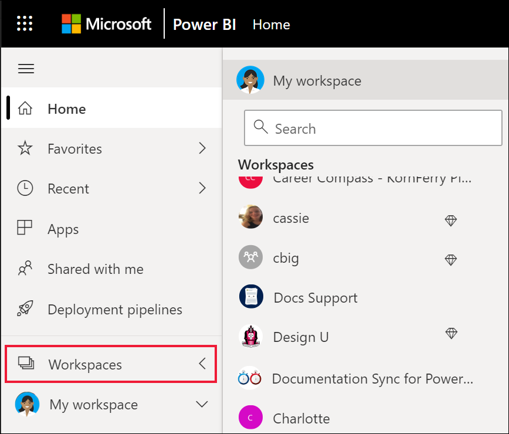

# Collaborate in workspaces

 *Workspaces* are places to collaborate with colleagues on specific content. Workspaces are created by Power BI *designers* to hold collections of dashboards and reports. The designer can then share the workspace with colleagues. Designers can also bundle a collection of dashboards and reports into an *app* and distribute it to the entire community, to their organization, or to specific people or groups. Certain types of apps, called *template apps*, create a workspace when the app is installed. [Learn more about apps](end-user-apps.md). 

 Everyone using the Power BI service also has a **My workspace**.  My workspace is your personal sandbox where you can create content for yourself.

 You can see your workspaces in Power BI by selecting **Workspaces** from your navigation pane.

 

## Types of workspaces
**My Workspace** stores all the content that you own and create. Think of it as your personal sandbox or work area for your own content. For many Power BI *business users*, **My workspace** remains empty because your job doesn't involve creating new content. *Business users*, by definition, consume data created by others and use that data to make business decisions. If you find that you are creating content, consider reading [the Power BI articles for designers](../create-reports/index.yml) instead.

**Workspaces** contain all the content for a specific app. When a *designer* creates an app, they bundle together all the content that is necessary for that app to be utilized. Content may include dashboards, reports, and datasets. Not every app will contain these three pieces of content. An app may contain only one dashboard, or three of each content type, or even twenty reports. It all depends on what the *designer* includes in the app. Commonly, app workspaces shared with *business users* don't include the datasets.

The **Customer Profitability** workspace below contains a dashboard, a report, a workbook, and a dataset.

## Permissions in the workspaces

Access permissions determine what you can do in a workspace, so teams can collaborate.  When granting access to a new workspace, *designers* add individuals or groups to one of the workspace roles: **Viewer**, **Member**, **Contributor**, or **Admin**. 

As a Power BI *business user*, you'll typically interact in workspaces using the **Viewer** role. But a *designer* could also assign you to the **Member** or **Contributor** role. The Viewer role lets you view and interact with content (dashboards, reports, apps) created by others and shared with you. And because the Viewer role can't access the underlying dataset, it's a safe way to interact with content and not have to worry that you'll "hurt" the underlying data.

For a detailed list of what you can do as a *business user* with the Viewer role, see [Power BI features for business users](end-user-features.md).

### Workspace permissions and roles

Here are the capabilities of the four roles: Admins, Members, Contributors, and Viewers. All of these capabilities, except *view and interact with an item*, require a Power BI Pro or Premium Per User (PPU) license.

[!INCLUDE[power-bi-workspace-roles-table](../includes/power-bi-workspace-roles-table.md)]

## Licensing, workspaces, and capacity
Licensing also plays a part in determining what you can and can't do in a workspace. Many features require the user to have a Power BI *Pro* or *Premium Per User (PPU)* license or for the workspace to be stored in Premium capacity. 

Often, *business users* work with a free license. [Learn more about licensing](end-user-license.md). If the content isn't stored in Premium capacity, the business user won't have access.

If the workspace is stored in Premium capacity, *business users* will be able to view and interact with the content in that workspace. A diamond icon identifies the workspaces that are stored in Premium capacity.

To learn more, see [Which license do I have?](end-user-license.md).

## Next steps
* [Apps in Power BI](end-user-apps.md)    

* Questions? [Try asking the Power BI Community](https://community.powerbi.com/)

