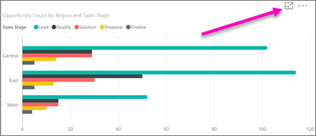

# Annotate and share a tile, report, or visual in Power BI mobile apps
Applies to:

|  |  |  |  |
|:--- |:--- |:--- |:--- |
| iPhones |iPads |Android phones |Android tablets |

You can annotate and share a snapshot of a tile, report, or visual from the Power BI mobile app for iOS and Android devices. Your recipients see it exactly as it was when you sent the mail, plus a link. You can send snapshots of tiles to anyone — not just colleagues in the same email domain. You can add annotations — lines, text, or stamps — before you share it.

*A report with annotations*

The mail with the snapshot of the tile, report, or visual also includes a link to the actual object on the Power BI service ([https://powerbi.com](https://powerbi.com)). Your recipients can click the link and go straight to that tile, report, or visual, if you and they have Power BI Pro licenses, or the content is in a [Premium capacity](../../enterprise/service-premium-what-is.md), and you've already shared the item with them. 

You can [share a tile from the Power BI mobile app for Windows 10 devices](mobile-windows-10-phone-app-get-started.md), too, but not annotate it.

## Open a tile for annotating
1. Tap the tile to open it in focus mode.
2. Tap the annotate icon  in the upper-right corner of the tile.
3. You're ready to [annotate and share the tile](mobile-annotate-and-share-a-tile-from-the-mobile-apps.md#annotate-and-share-the-tile-report-or-visual).

## Open a report for annotating
1. Open a report. 
2. Tap the annotate icon  in the upper-right corner of the report.
3. You're ready to [annotate and share the report](mobile-annotate-and-share-a-tile-from-the-mobile-apps.md#annotate-and-share-the-tile-report-or-visual).

## Open a visual for annotating
1. In a report, tap a visual, then tap the expand icon to open it in focus mode. 
   
    
2. Tap the annotate icon  in the upper-right corner of the visual.
3. You're ready to [annotate and share the visual](mobile-annotate-and-share-a-tile-from-the-mobile-apps.md#annotate-and-share-the-tile-report-or-visual).

## Annotate and share the tile, report, or visual
1. Here's how you annotate:  
   
   
   
   *The annotation bar in iPhones and iPads*
   
   
   
   *The annotation bar in Android devices*
   
   * To draw lines of different colors and thicknesses, tap the squiggly-line icon, choose a width and color, and draw.  
   * To type comments, tap the **AA**, choose the text size and color, and type.  
   * To paste stamps (like emoticons) on the tile, tap the smiley face, choose a color, and tap where you want them.   
2. After annotating, tap **Share** in the upper-right corner.
3. Open your mail app, type the recipients' names, and modify the message, if you want.  
   
   
   
   The mail has an image, and a link to the specific tile, report, or visual. 
4. Tap **Send**.

## Related content

* [Share a dashboard from the Power BI mobile apps](mobile-share-dashboard-from-the-mobile-apps.md)
* Questions? [Try asking the Power BI Community](https://community.powerbi.com/)
