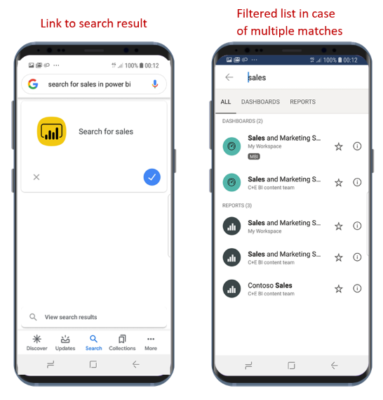

# Find and access your content with Google Search

Applies to:

|  |  |
|:--- |:--- |
| Android phones |Android tablets |

You can use Google Search to find and open the Power BI mobile app right to the report or dashboard you are looking for. You don't have to navigate through the app.

If you want to open a specific item and you're not sure where to look for it, you can use Google Search to find the item.

## Search using Google Search

In the Google search box, search using the form ***search for &lt;search item&gt; in power bi***. For example, **search for sales in power bi**.

* If only one match is found, the Power BI mobile app will open the item you were looking for.
* If more than one match is found, Power BI will open to the search screen, filtered according to your request.

## Next steps
* [Use Android app Shortcuts in the Power BI Android app](mobile-app-quick-access-shortcuts.md)
* [iOS Device Search (Spotlight) integration with the Power BI Mobile iOS App](mobile-apps-ios-search-integration.md)
* [Favorites in the Power BI mobile apps](mobile-apps-favorites.md)
