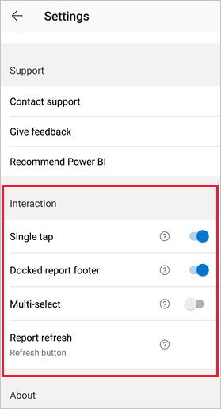
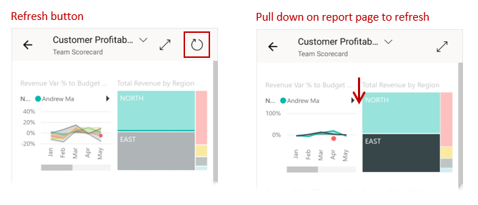
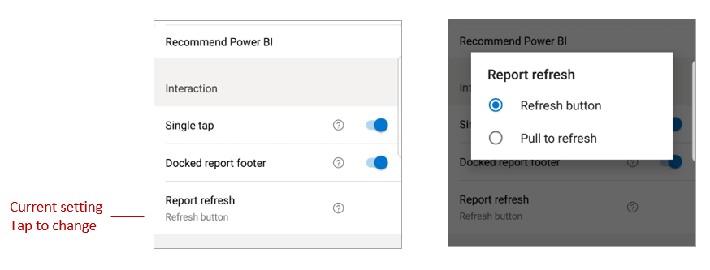

# Configure report interaction settings

## Overview

The Power BI mobile app has a number of configurable "interaction" settings that enable you to control how you interact with your data, and to define how some elements in the Power BI mobile app behave. Currently there are settings for
* [Single versus double tap interaction on report visuals](#single-tap)
* [Docked versus dynamic report footer](#docked-report-footer-android-phones) (Android)
* [Button-initiated report refresh versus pull-to-refresh](#report-refresh-android-phones) (Android)

To get to the interaction settings, tap your profile picture to open the [side panel](./mobile-apps-home-page.md#header), choose **Settings**, and find the **Interaction** section.

>[!NOTE]
>Interaction settings for the refresh button and for docking the report footer do not currently have an effect on Report Server reports. This will change with the January 2020 Report Server release.

## Interaction settings

### Single tap
When you download the Power BI mobile app, it is set for single tap interaction. This means that when you tap in a visual to do some action, such as selecting a slicer item, cross highlighting, clicking on a link or button, etc., the tap both selects the visual and performs the action you wanted.

If you prefer, you can switch off single tap interaction. You then have double-tap interaction. With double tap interaction, you first tap on a visual to select it, and then tap again in the visual to perform your desired action.

### Docked report footer (Android phones)

The docked report footer setting determines whether the report footer remains docked (i.e. fixed and always visible) at the bottom of the report, or hides and reappears based on your actions in the report, such as scrolling. By default the docked report footer setting is on, meaning that the report footer is docked and always visible at the bottom of the report. Switch the setting to off if you prefer a dynamic report footer that appears and disappears, depending on your actions on the report.

### Report refresh (Android phones)

The report refresh setting defines how you initiate report refreshes. You can choose either to have a refresh button on all report headers, or to use the pull-to-refresh action (pulling down slightly from top to bottom) on the report page to refresh the report. The figure below illustrates the two alternatives. 

On Android phones a refresh button is added by default.

To change the report refresh setting, go to the report refresh item in the interaction settings. The current setting is shown. Tap the value to open a pop-up where you can choose a new value.

## Remote configuration

Interactions can also be configured remotely by an administrator using an MDM tool with an app configuration file. In this way it is possible to standardize the report interaction experience across the organization or for specific groups of users in the organization. See [Configure interaction using mobile device management](./mobile-app-configuration.md) for detail.

## Next steps
* [Interacting with reports](./mobile-reports-in-the-mobile-apps.md#interact-with-reports)
* [Configure interaction using mobile device management](./mobile-app-configuration.md)
